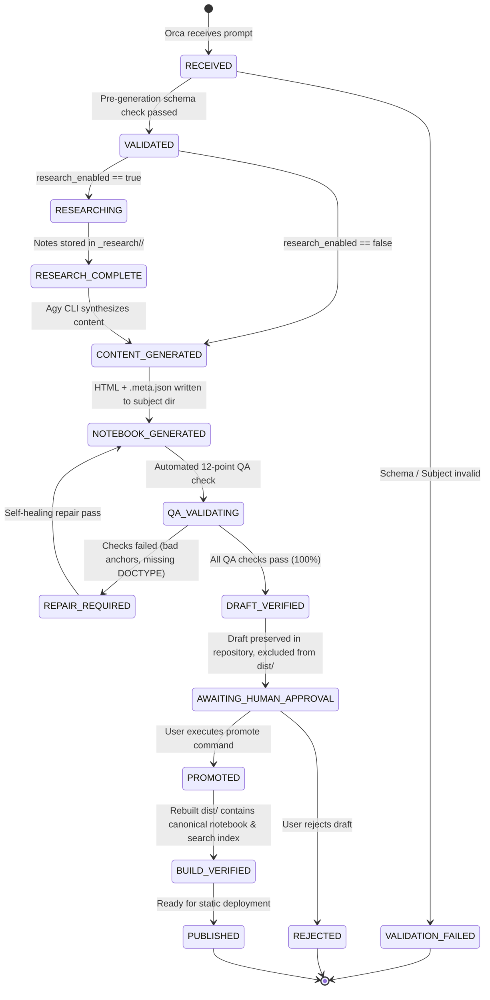

# Brain Knowledge Hub — Agent Task Contract & Lifecycle Specification

## Canonical Orchestration Interface between Orca, Agy CLI, and Knowledge Hub

### 1. Overview & Purpose

The **Brain Knowledge Hub Agent Contract** defines the formal, machine-readable JSON interface governing how orchestrator agents (such as **Orca**) and worker execution agents (such as **Agy CLI**) interact with the knowledge publishing engine located at `D:\Brain\05_Knowledge`.

This contract guarantees:
1. **Type Safety & Determinism**: All tasks conform to a well-defined JSON schema before any filesystem operations begin.
2. **Draft Isolation**: Created notebooks default strictly to `draft` status, preventing unapproved material from entering static builds (`dist/`) or public search indexes.
3. **Machine Parsability**: When queried with `--json`, the pipeline returns structured JSON on `stdout`, isolating human diagnostic logs to `stderr`.
4. **Transparent Governance**: Promotion from draft to published requires explicit human approval.

---

### 2. The Task Contract Schema

All tasks submitted to the pipeline must conform to the following JSON schema:

```json
{
  "$schema": "https://json-schema.org/draft/2020-12/schema",
  "title": "BrainKnowledgeHubTaskContract",
  "type": "object",
  "required": ["task_id", "operation", "topic", "subject"],
  "properties": {
    "task_id": {
      "type": "string",
      "description": "Unique task identifier generated by the orchestrator (e.g. task_20261004_eoq01).",
      "pattern": "^[a-zA-Z0-9_-]+$"
    },
    "operation": {
      "type": "string",
      "description": "The specific pipeline operation to execute.",
      "enum": ["create_notebook", "validate_notebook", "promote_notebook"]
    },
    "topic": {
      "type": "string",
      "description": "Primary academic or operational topic title (e.g. 'Working Capital Management').",
      "minLength": 3
    },
    "subject": {
      "type": "string",
      "description": "One of the 9 canonical subject divisions.",
      "enum": [
        "AI",
        "Analytics",
        "Business",
        "Finance",
        "General",
        "Management",
        "Operations",
        "Placement_Interview",
        "Technology"
      ]
    },
    "category": {
      "type": "string",
      "description": "Subdomain or discipline category within the subject (e.g. 'Corporate Finance', 'Inventory')."
    },
    "destination_subfolder": {
      "type": "string",
      "description": "Optional subfolder relative to the subject directory (e.g. 'Cost_Accounting')."
    },
    "slug": {
      "type": "string",
      "description": "Explicit lowercase URL-safe slug. If omitted, derived automatically from topic.",
      "pattern": "^[a-z0-9]+(-[a-z0-9]+)*$"
    },
    "audience": {
      "type": "string",
      "description": "Target audience profile (e.g. 'MBA Students', 'Operations Analysts').",
      "default": "Graduate & Professional Students"
    },
    "academic_level": {
      "type": "string",
      "description": "Academic rigor and depth classification.",
      "enum": ["foundational", "undergraduate", "graduate", "executive", "research"],
      "default": "graduate"
    },
    "depth": {
      "type": "string",
      "description": "Scope of coverage.",
      "enum": ["summary", "modular", "comprehensive", "exhaustive"],
      "default": "comprehensive"
    },
    "research_enabled": {
      "type": "boolean",
      "description": "Indicates whether autonomous deep research should precede notebook generation.",
      "default": false
    },
    "research_provider": {
      "type": ["string", "null"],
      "description": "Research backend provider. Required if research_enabled is true.",
      "enum": [null, "openresearch", "local_corpus"],
      "default": null
    },
    "desired_features": {
      "type": "array",
      "items": { "type": "string" },
      "description": "Requested interactive widgets (e.g. 'formulas', 'blueprints', 'timers', 'cards').",
      "default": ["blueprints", "formulas", "timers", "cards"]
    },
    "source_files": {
      "type": "array",
      "items": { "type": "string" },
      "description": "Relative paths to local source documents used in drafting."
    },
    "source_urls": {
      "type": "array",
      "items": { "type": "string" },
      "description": "External reference URLs or literature citations."
    },
    "publication_status": {
      "type": "string",
      "description": "Initial publication status. Must always be 'draft' for agent generation.",
      "enum": ["draft", "published"],
      "default": "draft"
    },
    "author": {
      "type": "string",
      "description": "Creator attribution string recorded in notebook metadata.",
      "default": "Orca / Agy CLI"
    },
    "force": {
      "type": "boolean",
      "description": "Whether to overwrite existing notebook files if collisions occur.",
      "default": false
    }
  }
}
```

---

### 3. Detailed Field Specifications

| Field Name | Type | Presence | Default Value | Allowed Values / Constraints | Validation Behavior |
| :--- | :--- | :--- | :--- | :--- | :--- |
| `task_id` | String | **Required** | None | Alphanumeric, underscores, hyphens | Rejects empty or special characters with `SCHEMA_VALIDATION_FAILED` |
| `operation` | String | **Required** | `"create_notebook"` | `"create_notebook"`, `"validate_notebook"`, `"promote_notebook"` | Rejects unsupported verbs with `SCHEMA_VALIDATION_FAILED` |
| `topic` | String | **Required** | None | Minimum 3 characters | Rejects missing/empty topics with `MISSING_REQUIRED_FIELD` |
| `subject` | String | **Required** | None | One of 9 canonical subjects | Case-insensitive matching with aliases; rejects non-canonical with `SUBJECT_NOT_CANONICAL` |
| `category` | String | Optional | Derived from subject | Any valid string | Injected into companion `.meta.json` |
| `destination_subfolder`| String | Optional | None | Subfolder name within subject root | Sanitized to prevent path traversal (`..` stripped) |
| `slug` | String | Optional | Derived from topic | Lowercase alphanumeric, hyphen-delimited | Validated against `^[a-z0-9]+(-[a-z0-9]+)*$`; rejects invalid with `SLUG_INVALID_FORMAT` |
| `audience` | String | Optional | `"Graduate & Professional"` | Free-form description | Injected into notebook metadata |
| `academic_level` | String | Optional | `"graduate"` | `"foundational"`, `"undergraduate"`, `"graduate"`, `"executive"`, `"research"` | Enforced enum |
| `depth` | String | Optional | `"comprehensive"` | `"summary"`, `"modular"`, `"comprehensive"`, `"exhaustive"` | Enforced enum |
| `research_enabled` | Boolean | Optional | `false` | `true`, `false` | Must be a valid boolean |
| `research_provider`| String/Null| Optional | `null` | `null`, `"openresearch"`, `"local_corpus"` | If `research_enabled: true` and provider is `null`, rejects with `MISSING_RESEARCH_PROVIDER` |
| `desired_features` | Array | Optional | Standard modules | Array of strings | Injected into template module generator |
| `source_files` | Array | Optional | `[]` | Array of file paths | Paths verified during intake |
| `source_urls` | Array | Optional | `[]` | Array of URLs | URLs formatted into bibliography |
| `publication_status`| String | Optional | `"draft"` | `"draft"` (Strictly required for creation) | Overriding to `"published"` produces `WARNING_RESTRICTED_STATUS` |
| `author` | String | Optional | `"Orca / Agy CLI"` | Attribution text | Recorded in `<meta name="author">` and `.meta.json` |
| `force` | Boolean | Optional | `false` | `true`, `false` | If `false` and file exists, aborts with `FILE_ALREADY_EXISTS` |

---

### 4. Agent Lifecycle State Machine

The complete lifecycle for agent-orchestrated content production traverses the following states:



#### Lifecycle State Definitions:

1. **`RECEIVED`**: Task payload ingested by Orca or pipeline CLI.
2. **`VALIDATED`**: Task schema, canonical subject, and slug format verified without collisions.
3. **`RESEARCHING`**: Research adapter invoked; working notes assembled in `_research/<task_id>/`.
4. **`CONTENT_GENERATED`**: Academic sections, formulas, diagrams, and numerical models prepared.
5. **`NOTEBOOK_GENERATED`**: Standalone HTML notebook and companion `.meta.json` written to target directory on disk.
6. **`QA_VALIDATING`**: Automated 12-point QA validator tests structure, anchors, metadata, and draft isolation.
7. **`DRAFT_VERIFIED`**: Notebook passes all QA assertions; safely present in source of truth, excluded from `dist/`.
8. **`AWAITING_HUMAN_APPROVAL`**: Notebook presented to the human owner for academic review and sign-off.
9. **`PROMOTED`**: Explicit promotion command transforms status to `published`.
10. **`BUILD_VERIFIED`**: Static publishing engine verifies canonical path (`/<subject>/<slug>/index.html`) and search index entries.
11. **`PUBLISHED`**: Canonical notebook ready for GitHub/Cloudflare static deployment.

---

### 5. Machine-Readable Response Payloads

When invoked with `--json`, the pipeline guarantees pure JSON output on `stdout`.

#### 5.1 Success Response (`create_notebook`):
```json
{
  "task_id": "task_20261004_eoq01",
  "status": "success",
  "operation": "create_notebook",
  "dry_run": false,
  "output_files": {
    "notebook_html": "D:\\Brain\\05_Knowledge\\Finance\\Working_Capital_Management_Notebook.html",
    "metadata_json": "D:\\Brain\\05_Knowledge\\Finance\\Working_Capital_Management_Notebook.meta.json"
  },
  "notebook": {
    "title": "Working Capital Management",
    "subject": "Finance",
    "slug": "working-capital-management",
    "status": "draft",
    "read_time_minutes": 35
  },
  "validation_results": {
    "valid": true,
    "checks_passed": 14,
    "checks_failed": 0
  },
  "warnings": [],
  "errors": [],
  "publication_status": "draft",
  "timestamp": "2026-10-04T01:45:00.000Z"
}
```

#### 5.2 Dry-Run Response (`--dry-run`):
```json
{
  "task_id": "task_20261004_eoq01",
  "status": "success",
  "operation": "create_notebook",
  "dry_run": true,
  "predicted_paths": {
    "target_dir": "D:\\Brain\\05_Knowledge\\Finance",
    "html_file": "D:\\Brain\\05_Knowledge\\Finance\\Working_Capital_Management_Notebook.html",
    "meta_file": "D:\\Brain\\05_Knowledge\\Finance\\Working_Capital_Management_Notebook.meta.json",
    "canonical_url": "/finance/working-capital-management/"
  },
  "resolved_parameters": {
    "subject": "Finance",
    "subject_folder": "Finance",
    "slug": "working-capital-management",
    "publication_status": "draft"
  },
  "collisions_detected": [],
  "schema_valid": true,
  "ready_for_execution": true,
  "timestamp": "2026-10-04T01:45:00.000Z"
}
```

#### 5.3 Error Response:
```json
{
  "task_id": "task_20261004_eoq01",
  "status": "error",
  "error_code": "SUBJECT_NOT_CANONICAL",
  "message": "Invalid subject 'QuantumPhysics'. Must be one of: AI, Analytics, Business, Finance, General, Management, Operations, Placement_Interview, Technology",
  "details": {
    "supplied_subject": "QuantumPhysics",
    "allowed_canonical_subjects": [
      "AI",
      "Analytics",
      "Business",
      "Finance",
      "General",
      "Management",
      "Operations",
      "Placement_Interview",
      "Technology"
    ]
  },
  "timestamp": "2026-10-04T01:45:00.000Z"
}
```

---

### 6. Standard Error Codes Reference

| Error Code | HTTP-Equivalent | Description |
| :--- | :--- | :--- |
| `SCHEMA_VALIDATION_FAILED` | 400 Bad Request | Payload failed fundamental JSON structure or regex patterns |
| `MISSING_REQUIRED_FIELD` | 400 Bad Request | A required field (`task_id`, `operation`, `topic`, `subject`) was omitted |
| `SUBJECT_NOT_CANONICAL` | 422 Unprocessable | Subject cannot be mapped to any of the 9 canonical directories |
| `SLUG_INVALID_FORMAT` | 422 Unprocessable | Slug violates lowercase alphanumeric hyphen syntax |
| `SLUG_COLLISION_DETECTED` | 409 Conflict | Slug already in use by another notebook in the repository |
| `FILE_ALREADY_EXISTS` | 409 Conflict | Target HTML file exists and `force: false` |
| `MISSING_RESEARCH_PROVIDER`| 422 Unprocessable | `research_enabled` is true, but `research_provider` is null or invalid |
| `TEMPLATE_NOT_FOUND` | 500 Internal | Master notebook template missing from `_templates/` |
| `QA_VALIDATION_FAILED` | 422 Unprocessable | Generated HTML notebook failed one or more 12-point QA assertions |
| `PROMOTION_DENIED` | 403 Forbidden | Automated promotion attempted without validation or approval |

---

### 7. Topic Boundary Check & Multi-Notebook Decomposition

#### 7.1 Objective
Prevent uncontrolled notebook proliferation and silent scope expansion. Before drafting begins, the orchestrator/agent evaluates whether the requested knowledge topic constitutes a single coherent notebook or decomposes into multiple substantial standalone curricula.

#### 7.2 Decision Protocol
1. **Single Coherent Topic**:
   - The topic possesses a focused conceptual perimeter (e.g., *Economic Order Quantity*, *Capital Budgeting*, *ERP Business Applications*).
   - Even if long (e.g., 16 modules, extensive problem sets), the topic remains fundamentally unified.
   - **Action**: Proceed with normal single-notebook generation.
2. **Decomposable Composite Topic**:
   - The topic naturally consists of multiple independently useful disciplines (e.g., *Supply Chain Management*, *Business Analytics*, *Corporate Finance*).
   - **Action**: The agent must **HALT** and present structured options to the user before generating any files:
     - **Option A**: One comprehensive master notebook containing all subtopics.
     - **Option B**: Separate standalone notebooks for each major subtopic.
     - **Option C**: One master overview notebook linking to separate child notebooks.

