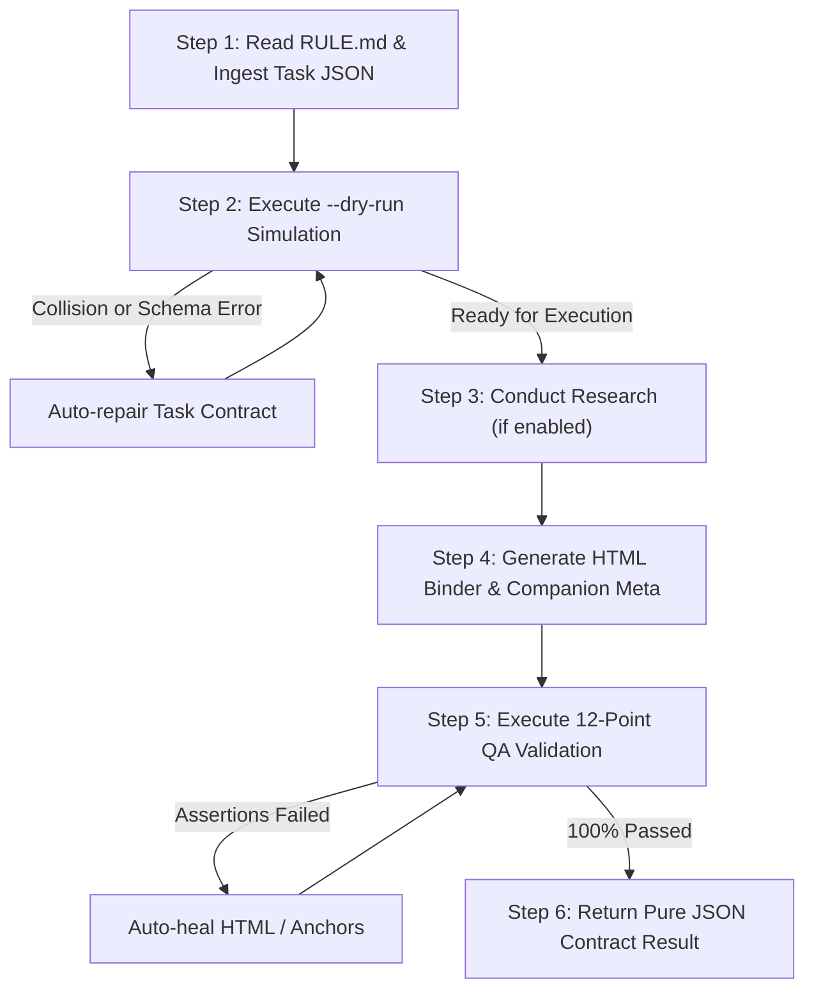

# Brain Knowledge Hub — Agy CLI Operational Handbook

## Worker Execution Handbook for Notebook Generation & Quality Assurance

### 1. Architectural Role & Responsibilities

**Agy CLI** functions as the specialized **Execution Worker Agent** within the Brain Knowledge Hub.

While Orca plans and interfaces with the user, Agy CLI performs the hands-on engineering work:
1. **Reading & Adhering to Governance**: Consistently consulting `RULE.md` to uphold repository standards.
2. **Deterministic File & Path Handling**: Using the pipeline resolver to target the canonical 9 subject folders.
3. **High-Rigor Academic Drafting**: Generating responsive, interactive HTML binder notebooks that adhere to the visual and functional standards established by `ERP_Exam_Notebook.html`.
4. **Pre-Execution Dry-Run Simulation**: Always verifying paths and slug collisions before modifying disk contents.
5. **Quality Assurance Validation**: Running the 12-point QA validation suite and auto-healing markup errors if detected.
6. **Strict Draft Isolation**: Ensuring that newly created content remains in `draft` mode and is never published without human intervention.

---

### 2. Operational Rules & Constraints (from `RULE.md`)

Before taking any action, Agy CLI must verify compliance with the core invariants:

- **Source of Truth Rule**: `D:\Brain\05_Knowledge` is the canonical source of truth. `Website/dist/` is ephemeral build output. Never edit files in `Website/dist/` directly.
- **Canonical Subject Structure**: All notebooks must reside in one of the 9 canonical directories:
  `AI/`, `Analytics/`, `Business/`, `Finance/`, `General/`, `Management/`, `Operations/`, `Placement_Interview/`, `Technology/`.
- **URL-Safe Slugs**: Notebook slugs must be strictly lowercase alphanumeric with single hyphens (`^[a-z0-9]+(-[a-z0-9]+)*$`).
- **Master Notebook Preservation**: Never edit, rename, move, or overwrite `ERP_Exam_Notebook.html` or existing published notebooks.
- **Draft Isolation Guarantee**: All new notebooks must have `"status": "draft"` in companion metadata. Drafts must never appear in `dist/` or `search-index.json`.

---

### 3. Step-by-Step Execution Checklist for Agy CLI

When delegated a notebook creation task by Orca or a human operator, Agy CLI executes this 6-step checklist:



---

### 4. Technical Standards: Emulating `ERP_Exam_Notebook.html`

To ensure parity with the canonical `ERP_Exam_Notebook.html`, generated notebooks must provide:

#### 4.1 Binder Layout & Navigation:
- **Responsive Viewport**: `<meta name="viewport" content="width=device-width, initial-scale=1.0">`.
- **Sidebar Binder Structure**: `<aside class="side" id="sidebar">` containing tab switches (`Study Sheets`, `Formula Cheat Sheet`, `Exam Blueprint`).
- **Internal Navigation**: `<nav id="navLinks">` containing `<a href="#secN" data-id="secN">` links matching `<section id="secN">` elements exactly.
- **Progress Bar**: `<div class="bar" id="progressBar"></div>` at the top of the viewport.

#### 4.2 Module Styling Classes:
Agy CLI should utilize the standard CSS components embedded in the master template:
- `.blueprint`: Technical diagrams and architectural schemas.
- `.card`: Core definitions and conceptual axioms.
- `.sticky.blue`: Learning objectives and critical executive takeaways.
- `.sticky.yellow`: Exam traps, boundary conditions, and sensitivity warnings.
- `.timer-box.timer`: Section pacing stopwatch widgets (`data-dur="1200"`).
- `.kpi-card`: Quantitative metrics and ratios.

#### 4.3 Clean Typography & Tables:
- Clean monospaced code snippets using `<pre><code>`.
- Analytical formulas styled with LaTeX-like Unicode formatting or KaTeX classes.
- Responsive HTML tables with styled headers (`th`) and zebra striping.

---

### 5. Standard Operational Commands

#### 5.1 Dry-Run Simulation:
```bash
node Website/scripts/pipeline/index.js create --task task.json --dry-run --json
```

#### 5.2 Live Draft Creation:
```bash
node Website/scripts/pipeline/index.js create --task task.json --json
```

#### 5.3 Validating a Notebook:
```bash
node Website/scripts/pipeline/index.js validate --file "Finance/Working_Capital_Management_Notebook.html" --json
```

#### 5.4 Promoting to Published (Requires Explicit Human Sign-Off):
```bash
node Website/scripts/pipeline/index.js publish --file "Finance/Working_Capital_Management_Notebook.html" --json
```

---

### 6. Self-Healing & Automated Repair Protocols

If QA validation fails, Agy CLI must inspect `errors` and perform targeted self-healing:

| QA Assertion Failed | Root Cause | Self-Healing Repair Action |
| :--- | :--- | :--- |
| `[Internal Anchors]` Nav link `#sec2` does not match | Mismatch between sidebar anchor `href="#sec2"` and section `<section id="...">` | Re-align section IDs to match nav items sequentially (`sec1`, `sec2`, `sec3`). |
| `[HTML Structure]` Missing DOCTYPE or viewport | Truncated template replacement | Re-inject standard `<!DOCTYPE html>` and `<meta name="viewport">` headers. |
| `[Required Metadata Fields]` Missing companion metadata | `.meta.json` file missing or unparsed | Re-serialize companion `.meta.json` matching `AGENT_CONTRACT.md` schema. |
| `[Draft Search Isolation]` Draft present in `dist/` | Metadata status field was set to `published` | Revert `"status": "draft"` in `.meta.json` and re-run validation. |

---

### 7. Verifying Draft Isolation

To ensure that drafts never leak to the public site, Agy CLI verifies that:
1. `Website/dist/<subject>/<slug>/index.html` does **NOT** exist.
2. `Website/dist/data/search-index.json` does **NOT** contain an entry with the draft's slug.
3. Running `npm test --prefix Website` succeeds with 52 passing assertions.
