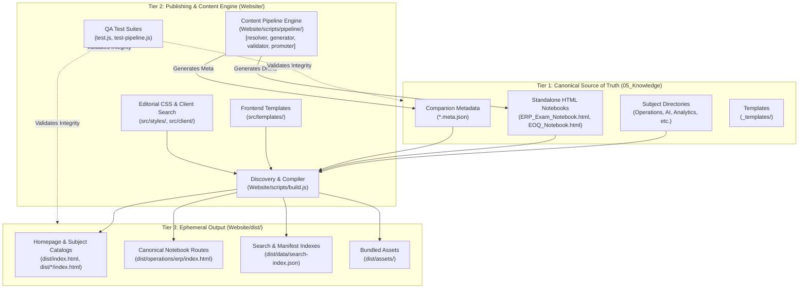

# Brain Knowledge Hub — System Architecture & Target Topology

This document details the architectural boundaries, runtime data flows, and the future multi-agent orchestration roadmap for the **Brain Knowledge Hub**.

---

## 1. Multi-Agent Orchestration Topology (Future Target)

The system is designed to seamlessly support future agentic content generation and autonomous publishing via **Orca**, **Agy CLI**, and **OpenResearch**.

> [!IMPORTANT]
> **Implementation Status**: This topology is an **architectural target**. The specialized agents and orchestration pipelines are not yet instantiated in this phase. The current implementation establishes the deterministic interfaces, templates, and validation tests required for agents to safely operate.

### Orchestration Workflow Diagram

```
                                 +-----------------------+
                                 |         USER          |
                                 +-----------+-----------+
                                             |
                                             v
                                 +-----------------------+
                                 |   ORCA ORCHESTRATOR   |
                                 +-----------+-----------+
                                             |
                   +-------------------------+-------------------------+
                   |                                                   |
                   v                                                   v
        +---------------------+                             +---------------------+
        |   RESEARCH AGENT    |                             |    CONTENT AGENT    |
        +----------+----------+                             +----------+----------+
                   |                                                   |
                   v                                                   v
        +---------------------+                             +---------------------+
        |    OpenResearch     |                             |       Agy CLI       |
        |  (Deep Literature)  |                             | (Synthesis & Logic) |
        +----------+----------+                             +----------+----------+
                   |                                                   |
                   +-------------------------+-------------------------+
                                             |
                                             v
                                 +-----------------------+
                                 |       QA AGENT        |
                                 | (validator.js & Tests)|
                                 +-----------+-----------+
                                             |
                                             v
                                 +-----------------------+
                                 |  STANDALONE NOTEBOOK  |
                                 |  (HTML + .meta.json)  |
                                 +-----------+-----------+
                                             |
                                             v
                                 +-----------------------+
                                 |     STATIC BUILD      |
                                 |  (Website/scripts/)   |
                                 +-----------+-----------+
                                             |
                                             v
                                 +-----------------------+
                                 |   GITHUB REPOSITORY   |
                                 |  (srivatsacool/...)   |
                                 +-----------+-----------+
                                             |
                                             v
                                 +-----------------------+
                                 |   CLOUDFLARE PAGES    |
                                 | (Global Edge Network) |
                                 +-----------------------+
```

---

## 2. Structural Three-Tier Architecture

To eliminate source corruption and guarantee 100% reproducibility, the repository strictly isolates the three layers:



---

## 3. Notebook Preservation & Portal Injection Pipeline

A core architectural invariant is that **standalone HTML notebooks must never be altered in place**. They remain independently readable in any browser, offline, or from disk.

When `build.js` executes:
1. **Source Read**: The notebook source (e.g. `D:\Brain\05_Knowledge\ERP_Exam_Notebook.html`) is loaded as an immutable string.
2. **Metadata Harvest**: Inlined meta tags, `<title>`, and companion `.meta.json` files are parsed into a normalized schema.
3. **Portal Return Injection**: A lightweight, non-destructive navigation bar is injected immediately following `<body ...>`:
   ```html
   <!-- BRAIN KNOWLEDGE HUB PORTAL NAVIGATION BAR -->
   <div id="hub-portal-bar">
     <a href="../../operations/">&larr; Return to Operations</a>
     <a href="../../">Library Catalog</a>
     <span>ERP Business Applications [OPERATIONS]</span>
   </div>
   ```
4. **Canonical Route Emission**: The resulting HTML is written to:
   `Website/dist/<subject-slug>/<notebook-slug>/index.html`
   All original stylesheets, script handlers, SVG graphics, print styles, and study countdown timers remain completely operational.

---

## 4. Client-Side Search Engine Architecture

Search operates on a zero-server, privacy-preserving static architecture:

```
[Build Phase]
  Source HTML Notebooks ──► Headings & Snippet Extraction ──► dist/data/search-index.json (10KB)

[Browser Runtime]
  User Presses 'Ctrl+K' ──► Loads search-index.json ──► Multi-Token Fuzzy Matcher ──► Highlighting (<mark>) ──► Instant Jump
```

### Ranking & Scoring Heuristic:
- **Title Match**: 50 points
- **Tag Match**: 30 points
- **Heading (`h1`, `h2`, `h3`) Match**: 20 points
- **Description Match**: 15 points
- **Subject Category Match**: 10 points
- **Body Content Snippet Match**: 5 points

The search engine features sub-millisecond query execution, keyboard navigation (`↑`, `↓`, `Enter`, `Esc`), and contextual snippet extraction with match highlighting.

---

## 5. Content Pipeline Architecture (`Website/scripts/pipeline/`)

The content creation subsystem provides a deterministic 5-part architecture:

1. **Resolver (`resolver.js`)**: Maps inputs to one of the canonical 9 subjects (`AI`, `Analytics`, `Business`, `Finance`, `General`, `Management`, `Operations`, `Placement_Interview`, `Technology`), ensures lowercase URL-safe slugs, and prevents slug collisions.
2. **Generator (`generator.js`)**: Takes structured topics and sections, injects them into `_templates/notebook-template.html`, and generates valid companion `<name>.meta.json`.
3. **Validator (`validator.js`)**: Runs a 12-point automated QA check verifying HTML structure, viewport, schema, internal section anchors, UI components, and draft isolation.
4. **Promoter (`promoter.js`)**: Safeguards production by requiring a 100% pass on validation before toggling status from `"draft"` to `"published"`, rebuilding the site, and verifying edge output.
5. **Unified CLI (`index.js`)**: Provides unified commands (`create`, `validate`, `publish`, `build`) emitting machine-readable JSON for Orca / Agy CLI or formatted console output for humans.

---

## 6. OpenResearch Subsystem Adapter (Future Target)

The adapter pattern allows seamless literature integration without coupling the core repository:

```
[Orca Orchestrator]
       │ (research_enabled: true)
       ▼
[OpenResearchAdapter (Local orx CLI)]
       │ Executes `orx reproduce-paper` or arXiv literature query
       ▼
[Isolated Worktree Session]
       │ Emits intermediate research notes & citation graph
       ▼
[_research/<topic>/citations.json]
       │ Ingested by Content Agent
       ▼
[Content Pipeline]
       Emits HTML Notebook with verified bibliography & "source": "external-literature"
```

---

## 9. Agent Integration Architecture (Phase 4)

The knowledge hub provides a deterministic, machine-readable interface for autonomous agents:
- **Orchestration**: Orca creates structured task contracts conforming to [AGENT_CONTRACT.md](file:///D:/Brain/05_Knowledge/AGENT_CONTRACT.md).
- **Execution**: Agy CLI executes pipeline commands following [AGY_INTEGRATION.md](file:///D:/Brain/05_Knowledge/AGY_INTEGRATION.md).
- **Safety Boundary**: All agent-generated notebooks are restricted to `draft` status. Promotion to `published` requires human authorization.
- **Pure JSON Communication**: `--json` ensures pure machine-readable JSON on `stdout`, isolating diagnostic traces to `stderr`.
- **Pre-Execution Simulation**: `--dry-run` validates schema, paths, and collision detection without filesystem side-effects.

---

## 10. Head Agent Orchestration Architecture (Phase 5)

Phase 5 elevates **Orca** to the Head Knowledge Agent, coordinating the multi-agent topology:
- **Conversational & Command Layer**: Natural-language prompts and `/knowledge` commands are parsed by [`Website/scripts/pipeline/orca-agent.js`](file:///D:/Brain/05_Knowledge/Website/scripts/pipeline/orca-agent.js).
- **Knowledge-Aware Inspection**: Scans repository metadata to prevent duplicate creation and preserve existing knowledge.
- **Ten-Step Task Planning**: Produces an explicit plan covering destination resolution, dry-run simulation, content synthesis, QA validation, and status reporting.
- **Controlled In-Place Updates**: Modifies sections within existing notebooks without destructive regeneration.
- **Human Approval Enforcement**: Strictly blocks autonomous promotion to `published`, Git commits/pushes, and Cloudflare deployments without explicit human authorization.
- **Detailed Workflow**: Documented in [ORCA_KNOWLEDGE_WORKFLOW.md](file:///D:/Brain/05_Knowledge/ORCA_KNOWLEDGE_WORKFLOW.md).


