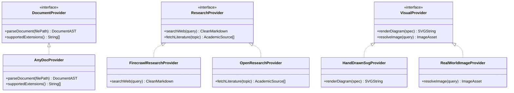
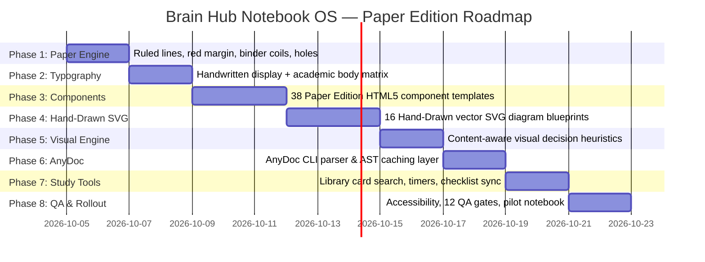

# Brain Knowledge Hub — Notebook Template 2.0 Architecture
## Provider Abstraction, AnyDoc Ingestion, Study Superpowers & Implementation Roadmap

> **System Blueprint**: Decoupled Provider Contracts, AnyDoc Intake, and Paper-First Study Superpowers  
> **Target Scope**: Orchestration Layer, Ingestion Layer, Visual Layer, and Production Pipeline  
> **Status**: Authoritative Architectural Design Specification

---

## 1. Decoupled Provider Architecture

To maintain modularity and prevent vendor lock-in, Template 2.0 isolates ingestion, literature research, and visual generation behind abstract provider contracts. The content generator interacts solely with standardized domain objects.



### Provider Responsibilities
1. **`DocumentProvider`**:
   - Single responsibility: Converts binary files (DOCX, PDF, PPTX, XLSX) into structured, LLM-ready markdown AST.
   - Primary engine: `AnyDocProvider` (`firecrawl/anydoc`).
2. **`ResearchProvider`**:
   - Single responsibility: Synthesizes external literature, market benchmarks, and case evidence.
   - Engines: `FirecrawlResearchProvider` (web crawling) and `OpenResearchProvider` (scholarly citations, deferred).
3. **`VisualProvider`**:
   - Single responsibility: Emits hand-drawn inline vector SVGs or resolves verified real-world educational photographs.
   - Primary engine: `HandDrawnSvgProvider`.

---

## 2. AnyDoc Ingestion Skill Integration

The official Firecrawl **AnyDoc** capability (`npx skills add firecrawl/anydoc`) acts as the high-throughput ingestion engine for the Brain Knowledge Hub.

```
SOURCE DOCUMENT (DOCX, PDF, PPTX, XLSX, EPUB, CSV)
      │
      ▼
  AnyDoc Engine (Sub-5ms Rust Byte Parser)
      │
      ▼
  STRUCTURED MARKDOWN AST (_source_cache/*.md)
  (Preserves multi-level tables, nested lists, outline hierarchy)
      │
      ▼
  SOURCE ANALYSIS & GROUNDING
  (Extracts FAQ questions, Course Outcomes, formulas, case entities)
      │
      ▼
  VISUAL OPPORTUNITY DETECTION
  ("Would a hand-drawn visual improve comprehension?")
      │
      ▼
  NOTEBOOK COMPONENT MAPPING
  (Maps AST nodes to 38 Paper Edition components)
      │
      ▼
  DETERMINISTIC NOTEBOOK GENERATION
  (Assembles standalone HTML + metadata with strict draft isolation)
```

### Strict Ground Truth Rules
- **No Hallucination**: AnyDoc performs byte-level extraction without generative hallucination.
- **Source Authority**: The binary file on disk remains the ultimate authority.
- **Cache Transparency**: Converted markdown files are cached in `_source_cache/<hash>.md` for instant verification.

---

## 3. Image Sourcing & Licensing Strategy

```
                          VISUAL OPPORTUNITY DETECTED
                                      │
                 ┌────────────────────┴────────────────────┐
                 ▼                                         ▼
        ABSTRACT / CONCEPTUAL                     REAL-WORLD ENTITY
   (Architecture, Flow, 2x2 Matrix,         (Factory floor, ERP software GUI,
    Formulas, Frameworks, Timelines)         physical hardware, company founder)
                 │                                         │
                 ▼                                         ▼
       Render Hand-Drawn SVG                      Curate Educational Image
     (Inline, Zero Network Load)            (Verified CC-BY license, strict alt text)
```

### Mandatory Rules for External Images
- **Prohibition of AI Stock Art**: Zero generic surreal AI imagery or generic corporate handshakes.
- **Strict Attribution**: Every external image must have an accompanying caption detailing:
  1. Author / Photographer / Corporate Source.
  2. License type (Public Domain, CC BY-SA 4.0, Fair Use educational analysis).
  3. Canonical link.
  4. Descriptive `alt` text explaining the educational insight to screen-reader users.

---

## 4. Paper-First Study Superpowers

All interactive digital capabilities are redesigned to feel like natural physical notebook accessories:

```
+-----------------------------------------------------------------------------------------------+
|                            PAPER-FIRST STUDY SUPERPOWERS                                      |
+------------------------------+-------------------------------+--------------------------------+
| 1. Library Card Search       | 2. Desk Stopwatch Timer       | 3. Spiral Binder Navigation    |
|    - Modal styled like an    |    - Styled as an analog desk |    - Sidebar styled as a       |
|      academic index card.    |      stopwatch with start/    |      ruled notebook index with |
|    - Instant fuzzy search    |      pause controls for       |      checkboxes:               |
|      highlighting matches    |      15-minute exam drills.   |      [ ] -> [✓]                |
|      in highlighter ink.     |                               |                                |
+------------------------------+-------------------------------+--------------------------------+
| 4. Physical Page Tabs        | 5. Interactive Paper Calc     | 6. Sticky Note Study Drawer    |
|    - Colored cardstock tabs  |    - Ruled formula card with  |    - "Explain Simply" drawers  |
|      sticking out of the     |      pencil input fields for  |      pop out like yellow       |
|      right paper edge for    |      real-time EOQ and        |      post-it notes with        |
|      instant jumping.        |      Safety Stock numbers.    |      intuitive analogies.      |
+------------------------------+-------------------------------+--------------------------------+
```

---

## 5. Concise Implementation Roadmap (8 Phases)



### Phase Breakdown

- **PHASE 1 — Paper Engine**: Build the CSS canvas engine (`--paper`, `--desk`, `--rule`, `--margin`, `.sheet::before` punch holes, `.sheet::after` spiral wire coils, `.nb-tabflag` physical divider tabs).
- **PHASE 2 — Typography Matrix**: Enforce strict role separation: `Caveat` & `Patrick Hand` for titles, callouts, and notes; `Source Sans 3` for continuous reading; `STIX Two Text` for formulas.
- **PHASE 3 — Notebook Components**: Build the 38 paper-first component snippets (Cover, Index, Objectives, Sticky Notes, Washi Tape, Stamps, Exam Answer Cards, Flashcards, Checklists).
- **PHASE 4 — Hand-Drawn SVG System**: Encode the 16 hand-drawn vector SVG blueprints with wobbly strokes, rounded terminals, highlighter backdrops, and handwritten labels.
- **PHASE 5 — Visual / Infographic Engine**: Wire the content-aware planning layer into Agy CLI to automatically evaluate content shape and select appropriate diagrams.
- **PHASE 6 — AnyDoc Ingestion**: Integrate `firecrawl/anydoc` to ingest multi-format office files into structured GFM AST.
- **PHASE 7 — Study Interactions**: Re-skin client-side search, progress tracking, exam countdown timers, and focus mode into tactile notebook controls.
- **PHASE 8 — QA, Accessibility & Pilot Rollout**: Validate WCAG 2.1 AA compliance, execute 184 test assertions, and generate the first official "Paper Edition" master study notebook.
