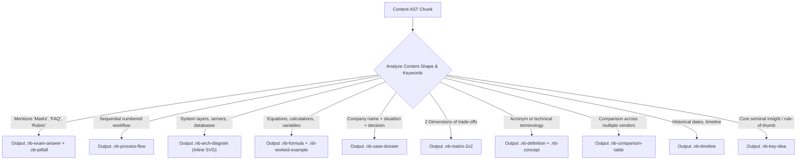

# Brain Knowledge Hub — Notebook Template 2.0 Component Library Specification

> **Document Status**: Standardized Component Catalog & Markup Contracts  
> **Target System**: Brain Knowledge Hub (`D:\Brain\05_Knowledge`)  
> **Scope**: 24 Reusable Component Modules, Semantic HTML5 Templates, CSS Token Contracts, and Agy Selection Rules  
> **Implementation State**: **DESIGN ONLY — DO NOT IMPLEMENT YET**

---

## 1. Component Architecture & Overview

Notebook Template 2.0 components are strictly zero-dependency, semantic HTML5 snippets styled using modular CSS custom properties. They are engineered for:
1. **Semantic HTML5 Accessibility**: Utilizing standard tags (`<article>`, `<section>`, `<aside>`, `<details>`, `<figure>`) with explicit ARIA roles.
2. **Light & Dark Theme Parity**: Styling driven by `--bg-surface`, `--text-primary`, `--border-subtle`, and semantic accent tokens.
3. **Responsive Fluidity**: Fluid typography, CSS Grid, and Flexbox layouts that adapt effortlessly from 360px smartphones to 4K displays.
4. **Offline Resilience**: Inline vector SVGs and pure vanilla JavaScript; zero external font or script dependencies required during offline reading.
5. **Deterministic Pipeline Assembly**: Agy CLI generates JSON or markdown AST that maps directly to these standard component templates.

### Component Taxonomy

```
+----------------------------------------------------------------------------------------------------+
|                                    NOTEBOOK COMPONENT TAXONOMY                                     |
+------------------------------------+-----------------------------------+---------------------------+
| 1. Shell & Navigation              | 2. Core Conceptual                | 3. Visual & Process       |
|    - Hero                          |    - Learning Objectives          |    - Timeline             |
|    - Top Bar                       |    - Concept Card                 |    - Process Flow         |
|    - Sidebar Navigation            |    - Key Idea                     |    - Architecture Diagram |
|    - Breadcrumbs                   |    - Definition Card              |    - 2x2 Strategic Matrix |
|                                    |    - Framework Box                |    - Comparison Table     |
+------------------------------------+-----------------------------------+---------------------------+
| 4. Quantitative & Analytical       | 5. Business & Strategy            | 6. Exam & Study Prep      |
|    - Formula Card                  |    - Case Study Dossier           |    - Model Exam Answer    |
|    - Worked Calculation            |    - Real-World Vignette          |    - Common Pitfall       |
|    - Interactive Formula Calc      |    - Managerial Implication       |    - Memory Trick         |
|                                    |                                   |    - Self-Check Quiz      |
|                                    |                                   |    - Flashcard Deck       |
|                                    |                                   |    - Revision Checklist   |
|                                    |                                   |    - FAQ Matrix           |
+------------------------------------+-----------------------------------+---------------------------+
| 7. Meta & Governance               |                                                               |
|    - Source Citation Card          |                                                               |
|    - Progress Mastery Tracker      |                                                               |
+------------------------------------+---------------------------------------------------------------+
```

---

## 2. Shell & Navigation Components

### 2.1 Hero Component (`.nb-hero`)

- **Purpose**: Establishes the authoritative academic identity of the notebook, displaying title, subtitle, archetype badge, estimated reading time, difficulty rating, and course outcome badges.
- **Archetypes**: Universal (All 8 archetypes).

#### HTML5 Template
```html
<header class="nb-hero" role="banner">
  <div class="nb-hero__badge-strip">
    <span class="nb-badge nb-badge--archetype" data-archetype="exam">Exam Blueprint</span>
    <span class="nb-badge nb-badge--subject">Operations</span>
    <span class="nb-badge nb-badge--level">MBA Core</span>
    <span class="nb-badge nb-badge--status">Draft</span>
  </div>
  <h1 class="nb-hero__title">ERP Business Applications & Strategic Systems</h1>
  <p class="nb-hero__subtitle">Mastering enterprise system selection, 3-tier architecture, business process re-engineering, and high-yield exam scenarios.</p>
  <div class="nb-hero__meta-grid">
    <div class="nb-hero__meta-item">
      <span class="nb-hero__meta-label">Estimated Study Time</span>
      <span class="nb-hero__meta-value">⏱ 45 Minutes</span>
    </div>
    <div class="nb-hero__meta-item">
      <span class="nb-hero__meta-label">Exam Questions</span>
      <span class="nb-hero__meta-value">🎯 18 Core FAQs</span>
    </div>
    <div class="nb-hero__meta-item">
      <span class="nb-hero__meta-label">Curriculum Scope</span>
      <span class="nb-hero__meta-value">📚 8 Academic Topics</span>
    </div>
    <div class="nb-hero__meta-item">
      <span class="nb-hero__meta-label">Difficulty Rating</span>
      <span class="nb-hero__meta-value">⭐⭐⭐ Intermediate</span>
    </div>
  </div>
</header>
```

#### CSS & Token Contract
```css
.nb-hero {
  padding: 2.5rem 0 2rem;
  border-bottom: 1px solid var(--border-subtle);
  margin-bottom: 2rem;
}
.nb-hero__badge-strip { display: flex; flex-wrap: wrap; gap: 0.5rem; margin-bottom: 1rem; }
.nb-hero__title {
  font-family: var(--font-editorial);
  font-size: clamp(2rem, 5vw, 2.75rem);
  font-weight: 700;
  line-height: 1.15;
  color: var(--text-primary);
  margin: 0 0 0.75rem;
}
.nb-hero__subtitle {
  font-family: var(--font-ui);
  font-size: 1.2rem;
  line-height: 1.6;
  color: var(--text-secondary);
  max-width: 820px;
  margin: 0 0 1.5rem;
}
.nb-hero__meta-grid {
  display: grid;
  grid-template-columns: repeat(auto-fit, minmax(160px, 1fr));
  gap: 1rem;
  padding: 1rem;
  background: var(--bg-surface-subtle);
  border: 1px solid var(--border-subtle);
  border-radius: 8px;
}
.nb-hero__meta-label { display: block; font-size: 0.8rem; text-transform: uppercase; letter-spacing: 0.05em; color: var(--text-tertiary); }
.nb-hero__meta-value { display: block; font-size: 1rem; font-weight: 600; color: var(--text-primary); margin-top: 0.2rem; }
```

---

### 2.2 Top Bar Component (`.nb-topbar`)

- **Purpose**: Fixed header providing navigation context, live progress indicator, search trigger, theme switcher, and focus mode toggle.
- **Archetypes**: Universal.

#### HTML5 Template
```html
<nav class="nb-topbar" aria-label="Global Notebook Navigation">
  <div class="nb-topbar__inner">
    <button class="nb-icon-btn nb-topbar__menu-toggle" id="menuToggle" aria-label="Toggle Table of Contents" aria-expanded="false">
      <svg width="20" height="20" viewBox="0 0 24 24" fill="none" stroke="currentColor" stroke-width="2"><path d="M3 12h18M3 6h18M3 18h18"/></svg>
    </button>
    <a href="../index.html" class="nb-topbar__brand">Brain Knowledge Hub</a>
    <div class="nb-topbar__breadcrumbs" aria-label="Breadcrumbs">
      <span>Operations</span> / <span class="nb-topbar__active-crumb">ERP Business Applications</span>
    </div>
    <div class="nb-topbar__actions">
      <button class="nb-btn-search" id="searchTrigger" aria-label="Open Search (Ctrl+K or /)">
        <svg width="16" height="16" viewBox="0 0 24 24" fill="none" stroke="currentColor" stroke-width="2"><circle cx="11" cy="11" r="8"/><path d="m21 21-4.3-4.3"/></svg>
        <span class="nb-btn-search__label">Search...</span>
        <kbd class="nb-btn-search__kbd">/</kbd>
      </button>
      <button class="nb-icon-btn" id="focusToggle" aria-label="Toggle Focus Mode" title="Zen Focus Mode">
        <svg width="18" height="18" viewBox="0 0 24 24" fill="none" stroke="currentColor" stroke-width="2"><path d="M8 3H5a2 2 0 0 0-2 2v3m18 0V5a2 2 0 0 0-2-2h-3m0 18h3a2 2 0 0 0 2-2v-3M3 16v3a2 2 0 0 0 2 2h3"/></svg>
      </button>
      <button class="nb-icon-btn" id="themeToggle" aria-label="Toggle Dark/Light Mode" title="Switch Theme">
        <span id="themeIcon">🌙</span>
      </button>
      <div class="nb-topbar__progress-pill" title="Reading Progress">
        <span id="progressText">0%</span>
      </div>
    </div>
  </div>
  <div class="nb-topbar__progress-track" aria-hidden="true">
    <div class="nb-topbar__progress-bar" id="progressBar" style="width: 0%;"></div>
  </div>
</nav>
```

---

### 2.3 Sidebar Navigation Component (`.nb-sidebar`)

- **Purpose**: Structured outline of sections, grouped into conceptual modules with real-time completion checkmarks, reading indicators, and quick links to study tools.
- **Archetypes**: Universal.

#### HTML5 Template
```html
<aside class="nb-sidebar" id="sidebarNav" aria-label="Notebook Outline">
  <div class="nb-sidebar__header">
    <h2 class="nb-sidebar__title">Table of Contents</h2>
    <span class="nb-sidebar__counter" id="masteryCount">0 / 8 Complete</span>
  </div>
  <nav class="nb-sidebar__nav">
    <div class="nb-sidebar__group">
      <span class="nb-sidebar__group-title">Module 1: Strategy & Architecture</span>
      <ul class="nb-sidebar__list">
        <li>
          <a href="#sec-1" class="nb-sidebar__link is-active" data-section="sec-1">
            <span class="nb-sidebar__check" aria-hidden="true">✓</span>
            <span class="nb-sidebar__link-text">1. ERP Technology Strategy</span>
          </a>
        </li>
        <li>
          <a href="#sec-2" class="nb-sidebar__link" data-section="sec-2">
            <span class="nb-sidebar__check" aria-hidden="true"></span>
            <span class="nb-sidebar__link-text">2. Three-Tier Client-Server Architecture</span>
          </a>
        </li>
      </ul>
    </div>
  </nav>
  <div class="nb-sidebar__tools">
    <span class="nb-sidebar__group-title">Quick Study Tools</span>
    <div class="nb-sidebar__tool-links">
      <a href="#tool-formulas" class="nb-sidebar__tool-btn">📐 Formula Sheet</a>
      <a href="#tool-flashcards" class="nb-sidebar__tool-btn">🗂 Flashcard Deck</a>
      <a href="#tool-timer" class="nb-sidebar__tool-btn">⏱ Exam Timer</a>
    </div>
  </div>
</aside>
```

---

## 3. Core Conceptual Components

### 3.1 Learning Objectives Card (`.nb-objectives`)

- **Purpose**: Declares explicit pedagogical outcomes using Bloom's Taxonomy verbs (Analyze, Formulate, Evaluate, Compare).
- **Archetypes**: Course, Exam, Concept, Technical.

#### HTML5 Template
```html
<div class="nb-objectives" role="region" aria-label="Learning Objectives">
  <div class="nb-objectives__header">
    <span class="nb-objectives__icon">🎯</span>
    <h3 class="nb-objectives__title">Learning Objectives & Course Outcomes</h3>
  </div>
  <ul class="nb-objectives__list">
    <li><strong class="nb-tag-co">CO1</strong> <strong>Analyze</strong> ERP systems as both a technology infrastructure and a holistic corporate strategy.</li>
    <li><strong class="nb-tag-co">CO2</strong> <strong>Evaluate</strong> 3-tier client-server architecture against total cost of ownership and latency trade-offs.</li>
    <li><strong class="nb-tag-co">CO3</strong> <strong>Formulate</strong> migration risk mitigations during Business Process Re-engineering (BPR).</li>
  </ul>
</div>
```

---

### 3.2 Concept Card (`.nb-concept`)

- **Purpose**: Authoritative breakdown of a primary theoretical concept, separating definition, core intuition, and strategic relevance.
- **Archetypes**: Universal.

#### HTML5 Template
```html
<article class="nb-concept" id="concept-three-tier">
  <div class="nb-concept__header">
    <span class="nb-concept__eyebrow">Enterprise Architecture</span>
    <h3 class="nb-concept__title">Three-Tier Client-Server Architecture</h3>
  </div>
  <div class="nb-concept__body">
    <p class="nb-concept__lead">Three-Tier Architecture logically and physically separates enterprise software into three discrete computing layers: the <strong>Presentation Tier (GUI/Client)</strong>, the <strong>Application Logic Tier (Business Rules)</strong>, and the <strong>Database Tier (Relational DB)</strong>.</p>
    
    <div class="nb-concept__callout">
      <strong>Core Advantage:</strong> Independent scalability. If database transactions surge during month-end financial closing, compute resources can be allocated specifically to the database cluster without modifying client terminal configurations.
    </div>
  </div>
  <div class="nb-concept__footer">
    <span class="nb-concept__source">Authority: SAP R/3 Architectural Reference</span>
    <button class="nb-btn-subtle" onclick="toggleSimpleExplainer('concept-three-tier')">💡 Explain Simply</button>
  </div>
  <div class="nb-concept__simple-explainer" id="concept-three-tier-simple" hidden>
    <p><strong>Simple Analogy:</strong> Think of a fine-dining restaurant. The Presentation Tier is the dining room where customers order. The Application Tier is the waiter taking orders and enforcing restaurant policies. The Database Tier is the kitchen and pantry where food inventory is stored securely.</p>
  </div>
</article>
```

---

### 3.3 Key Idea Callout (`.nb-key-idea`)

- **Purpose**: Highlighting foundational axioms, seminal principles, or executive rules-of-thumb with distinctive academic typography.
- **Archetypes**: Concept, Course, Research, Case Study.

#### HTML5 Template
```html
<aside class="nb-key-idea" role="note">
  <div class="nb-key-idea__marker">SEM有些人AL PRINCIPLE</div>
  <blockquote class="nb-key-idea__quote">
    "An ERP system does not fix broken business processes; it automates them. If you automate an inefficient, fragmented process, you merely produce chaos at the speed of light."
  </blockquote>
  <cite class="nb-key-idea__citation">— Enterprise Systems Executive Maxim</cite>
</aside>
```

---

### 3.4 Definition Card (`.nb-definition`)

- **Purpose**: Formal definition of technical acronyms or business terminology, including context, etymology, and common industry usage.
- **Archetypes**: Universal.

#### HTML5 Template
```html
<div class="nb-definition">
  <div class="nb-definition__term-strip">
    <dt class="nb-definition__term">Business Process Re-engineering (BPR)</dt>
    <dd class="nb-definition__acronym">Acronym: BPR</dd>
  </div>
  <div class="nb-definition__desc">
    The fundamental rethinking and radical redesign of core business processes to achieve dramatic improvements in contemporary performance measures such as cost, quality, service, and speed.
  </div>
  <div class="nb-definition__context">
    <strong>ERP Linkage:</strong> Implementing an ERP package typically forces an enterprise to choose between re-engineering its business processes to match standard software workflows (Vanilla implementation) or heavily customizing the code.
  </div>
</div>
```

---

### 3.5 Framework Box (`.nb-framework`)

- **Purpose**: Outlines established management frameworks (e.g. Porter's Five Forces, 7-S, Five Pillars of ERP) with structured dimensions and strategic questions.
- **Archetypes**: Course, Exam, Case Study.

#### HTML5 Template
```html
<div class="nb-framework">
  <div class="nb-framework__header">
    <span class="nb-framework__badge">Strategic Framework</span>
    <h3 class="nb-framework__title">The Five Pillars of ERP</h3>
  </div>
  <div class="nb-framework__grid">
    <div class="nb-framework__pillar">
      <div class="nb-framework__pillar-num">01</div>
      <h4 class="nb-framework__pillar-name">Process Integration</h4>
      <p class="nb-framework__pillar-desc">Seamless automated handoffs across functional boundaries (e.g. Sales Order automatically triggers Production Order and Billing).</p>
    </div>
    <div class="nb-framework__pillar">
      <div class="nb-framework__pillar-num">02</div>
      <h4 class="nb-framework__pillar-name">Centralized Single Data Repository</h4>
      <p class="nb-framework__pillar-desc">Single source of operational truth eliminating conflicting departmental spreadsheets and redundant data entry.</p>
    </div>
    <div class="nb-framework__pillar">
      <div class="nb-framework__pillar-num">03</div>
      <h4 class="nb-framework__pillar-name">Best-Practice Standard Processes</h4>
      <p class="nb-framework__pillar-desc">Pre-built, industry-tested workflow templates that encode global operational benchmarks.</p>
    </div>
    <div class="nb-framework__pillar">
      <div class="nb-framework__pillar-num">04</div>
      <h4 class="nb-framework__pillar-name">Real-Time Data Visibility</h4>
      <p class="nb-framework__pillar-desc">Immediate cross-departmental reflection of operational transactions without overnight batch processing.</p>
    </div>
    <div class="nb-framework__pillar">
      <div class="nb-framework__pillar-num">05</div>
      <h4 class="nb-framework__pillar-name">Scalable Modular Architecture</h4>
      <p class="nb-framework__pillar-desc">Discrete functional modules (FI, CO, MM, SD, PP) sharing a common data model and security layer.</p>
    </div>
  </div>
</div>
```

---

## 4. Visual & Process Components

### 4.1 Timeline Component (`.nb-timeline`)

- **Purpose**: Renders chronological milestones or technological evolution.
- **Archetypes**: Course, Case Study, Technical.

#### HTML5 Template
```html
<div class="nb-timeline" role="region" aria-label="ERP Historical Evolution Timeline">
  <div class="nb-timeline__track">
    <div class="nb-timeline__item">
      <div class="nb-timeline__marker">1960s</div>
      <div class="nb-timeline__content">
        <h4 class="nb-timeline__title">Inventory Control Packages (ROP)</h4>
        <p class="nb-timeline__desc">Reorder Point systems using basic economic order quantity (EOQ) algorithms.</p>
      </div>
    </div>
    <div class="nb-timeline__item">
      <div class="nb-timeline__marker">1970s</div>
      <div class="nb-timeline__content">
        <h4 class="nb-timeline__title">Material Requirements Planning (MRP)</h4>
        <p class="nb-timeline__desc">Master Production Schedules linked to multi-level Bills of Materials (BOM).</p>
      </div>
    </div>
    <div class="nb-timeline__item">
      <div class="nb-timeline__marker">1980s</div>
      <div class="nb-timeline__content">
        <h4 class="nb-timeline__title">Manufacturing Resource Planning (MRP II)</h4>
        <p class="nb-timeline__desc">Closed-loop manufacturing integrating shop-floor execution, capacity planning, and cost accounting.</p>
      </div>
    </div>
    <div class="nb-timeline__item is-highlight">
      <div class="nb-timeline__marker">1990s+</div>
      <div class="nb-timeline__content">
        <h4 class="nb-timeline__title">Enterprise Resource Planning (ERP)</h4>
        <p class="nb-timeline__desc">True enterprise-wide integration spanning HR, CRM, Supply Chain, and Global Financial Consolidation.</p>
      </div>
    </div>
  </div>
</div>
```

---

### 4.2 Process Flow Component (`.nb-process-flow`)

- **Purpose**: Step-by-step pipeline displaying inputs, transformation stages, and outputs.
- **Archetypes**: Course, Technical, Operations.

#### HTML5 Template
```html
<div class="nb-process-flow" role="region" aria-label="Procure to Pay Process Flow">
  <div class="nb-process-flow__step">
    <div class="nb-process-flow__step-num">Step 1</div>
    <h4 class="nb-process-flow__step-name">Purchase Requisition</h4>
    <p class="nb-process-flow__step-desc">Department generates demand request; budget check performed.</p>
  </div>
  <div class="nb-process-flow__arrow" aria-hidden="true">→</div>
  <div class="nb-process-flow__step">
    <div class="nb-process-flow__step-num">Step 2</div>
    <h4 class="nb-process-flow__step-name">Purchase Order (PO)</h4>
    <p class="nb-process-flow__step-desc">Vendor selected, prices locked, legally binding PO dispatched.</p>
  </div>
  <div class="nb-process-flow__arrow" aria-hidden="true">→</div>
  <div class="nb-process-flow__step">
    <div class="nb-process-flow__step-num">Step 3</div>
    <h4 class="nb-process-flow__step-name">Goods Receipt (GR)</h4>
    <p class="nb-process-flow__step-desc">Warehouse inspects goods; creates Material Document; inventory increments.</p>
  </div>
  <div class="nb-process-flow__arrow" aria-hidden="true">→</div>
  <div class="nb-process-flow__step is-critical">
    <div class="nb-process-flow__step-num">Step 4</div>
    <h4 class="nb-process-flow__step-name">Invoice Verification</h4>
    <p class="nb-process-flow__step-desc"><strong>3-Way Matching:</strong> PO vs Goods Receipt vs Vendor Invoice.</p>
  </div>
</div>
```

---

### 4.3 Architecture Diagram (3-Tier Native SVG) (`.nb-arch-diagram`)

- **Purpose**: High-fidelity vector blueprint rendering client presentation, application server, and enterprise database tiers with data flow vectors.
- **Archetypes**: Technical, Course, Exam.

#### HTML5 Template
```html
<figure class="nb-arch-diagram" role="img" aria-label="Three-Tier Client-Server Architecture Diagram">
  <div class="nb-arch-diagram__svg-wrap">
    <svg viewBox="0 0 800 320" width="100%" height="auto" preserveAspectRatio="xMidYMid meet">
      <title>Three-Tier Client-Server ERP Architecture Blueprint</title>
      <desc>Diagram showing Presentation Tier clients connecting via network protocols to Application Logic Tier servers, which query the Central Database Tier.</desc>
      
      <!-- Tier 1: Presentation -->
      <rect x="30" y="40" width="200" height="240" rx="8" fill="var(--bg-surface-subtle)" stroke="var(--border-strong)" stroke-width="2"/>
      <text x="130" y="70" text-anchor="middle" font-family="var(--font-ui)" font-weight="700" font-size="16" fill="var(--accent-primary)">Tier 1: Presentation</text>
      <rect x="50" y="95" width="160" height="45" rx="4" fill="var(--bg-surface)" stroke="var(--border-subtle)"/>
      <text x="130" y="122" text-anchor="middle" font-family="var(--font-ui)" font-size="13" fill="var(--text-primary)">Desktop SAP GUI</text>
      <rect x="50" y="155" width="160" height="45" rx="4" fill="var(--bg-surface)" stroke="var(--border-subtle)"/>
      <text x="130" y="182" text-anchor="middle" font-family="var(--font-ui)" font-size="13" fill="var(--text-primary)">Web Browser / Fiori</text>
      <rect x="50" y="215" width="160" height="45" rx="4" fill="var(--bg-surface)" stroke="var(--border-subtle)"/>
      <text x="130" y="242" text-anchor="middle" font-family="var(--font-ui)" font-size="13" fill="var(--text-primary)">Mobile Handheld / RF</text>

      <!-- Connecting Arrows 1 -> 2 -->
      <path d="M 230 160 L 290 160" stroke="var(--accent-secondary)" stroke-width="3" stroke-dasharray="4" marker-end="url(#arrow)"/>
      
      <!-- Tier 2: Application -->
      <rect x="300" y="40" width="200" height="240" rx="8" fill="var(--bg-surface-subtle)" stroke="var(--border-strong)" stroke-width="2"/>
      <text x="400" y="70" text-anchor="middle" font-family="var(--font-ui)" font-weight="700" font-size="16" fill="var(--accent-primary)">Tier 2: Application Logic</text>
      <rect x="320" y="95" width="160" height="45" rx="4" fill="var(--bg-surface)" stroke="var(--border-subtle)"/>
      <text x="400" y="122" text-anchor="middle" font-family="var(--font-ui)" font-size="13" fill="var(--text-primary)">Business Rules Engine</text>
      <rect x="320" y="155" width="160" height="45" rx="4" fill="var(--bg-surface)" stroke="var(--border-subtle)"/>
      <text x="400" y="182" text-anchor="middle" font-family="var(--font-ui)" font-size="13" fill="var(--text-primary)">Workflow Coordinator</text>
      <rect x="320" y="215" width="160" height="45" rx="4" fill="var(--bg-surface)" stroke="var(--border-subtle)"/>
      <text x="400" y="242" text-anchor="middle" font-family="var(--font-ui)" font-size="13" fill="var(--text-primary)">Dispatcher & Queue</text>

      <!-- Connecting Arrows 2 -> 3 -->
      <path d="M 500 160 L 560 160" stroke="var(--accent-secondary)" stroke-width="3" stroke-dasharray="4"/>

      <!-- Tier 3: Database -->
      <rect x="570" y="40" width="200" height="240" rx="8" fill="var(--bg-surface-subtle)" stroke="var(--border-strong)" stroke-width="2"/>
      <text x="670" y="70" text-anchor="middle" font-family="var(--font-ui)" font-weight="700" font-size="16" fill="var(--accent-primary)">Tier 3: Database</text>
      <path d="M 600 110 C 600 95, 740 95, 740 110 C 740 125, 600 125, 600 110 Z" fill="var(--accent-highlight)" opacity="0.8"/>
      <rect x="600" y="110" width="140" height="90" fill="var(--bg-surface)" stroke="var(--border-subtle)"/>
      <path d="M 600 200 C 600 215, 740 215, 740 200" fill="none" stroke="var(--border-strong)" stroke-width="2"/>
      <text x="670" y="155" text-anchor="middle" font-family="var(--font-ui)" font-weight="600" font-size="13" fill="var(--text-primary)">Central Relational DB</text>
      <text x="670" y="175" text-anchor="middle" font-family="var(--font-mono)" font-size="11" fill="var(--text-secondary)">HANA / Oracle / SQL</text>
      <text x="670" y="250" text-anchor="middle" font-family="var(--font-ui)" font-size="12" fill="var(--accent-success)">ACID Transaction Guarantee</text>
    </svg>
  </div>
  <figcaption class="nb-arch-diagram__caption">
    <strong>Figure 2.1:</strong> Logical and physical separation in Enterprise 3-Tier Client-Server Architecture.
  </figcaption>
</figure>
```

---

### 4.4 2x2 Strategic Matrix (`.nb-matrix-2x2`)

- **Purpose**: Strategic quadrant analysis (e.g. Value Matrix: Business Impact vs Implementation Complexity).
- **Archetypes**: Case Study, Course, Exam.

#### HTML5 Template
```html
<div class="nb-matrix-2x2" role="region" aria-label="ERP Value Realization 2x2 Matrix">
  <div class="nb-matrix-2x2__y-axis">Strategic Value / Competitive Advantage →</div>
  <div class="nb-matrix-2x2__grid">
    <div class="nb-matrix-2x2__quadrant nb-matrix-2x2__quadrant--top-left">
      <div class="nb-matrix-2x2__q-label">High Value, Low Usability</div>
      <h4 class="nb-matrix-2x2__q-title">Under-Leveraged Goldmine</h4>
      <p>High strategic capability, but severe user resistance and poor adoption.</p>
    </div>
    <div class="nb-matrix-2x2__quadrant nb-matrix-2x2__quadrant--top-right is-star">
      <div class="nb-matrix-2x2__q-label">High Value, High Usability</div>
      <h4 class="nb-matrix-2x2__q-title">Transformational Core</h4>
      <p>Seamless execution driving real-time analytics, cost savings, and operational speed.</p>
    </div>
    <div class="nb-matrix-2x2__quadrant nb-matrix-2x2__quadrant--bottom-left is-danger">
      <div class="nb-matrix-2x2__q-label">Low Value, Low Usability</div>
      <h4 class="nb-matrix-2x2__q-title">Value Sink / Black Hole</h4>
      <p>Customized legacy routines consuming IT budget with zero strategic payoff.</p>
    </div>
    <div class="nb-matrix-2x2__quadrant nb-matrix-2x2__quadrant--bottom-right">
      <div class="nb-matrix-2x2__q-label">Low Value, High Usability</div>
      <h4 class="nb-matrix-2x2__q-title">Operational Hygiene</h4>
      <p>Commodity admin tasks (payroll, expense reporting) functioning efficiently.</p>
    </div>
  </div>
  <div class="nb-matrix-2x2__x-axis">User Adoption & System Usability →</div>
</div>
```

---

### 4.5 Comparison Table (`.nb-comparison-table`)

- **Purpose**: Multi-column comparative matrix (e.g. ERP Vendor Evaluation, Cloud vs On-Premise).
- **Archetypes**: Universal.

#### HTML5 Template
```html
<div class="nb-table-wrap">
  <table class="nb-comparison-table">
    <thead>
      <tr>
        <th scope="col">Dimension</th>
        <th scope="col">SAP S/4HANA</th>
        <th scope="col">Oracle Cloud ERP</th>
        <th scope="col">Microsoft Dynamics 365</th>
      </tr>
    </thead>
    <tbody>
      <tr>
        <th scope="row">Target Enterprise Tier</th>
        <td>Tier 1 Global Multinationals ($1B+)</td>
        <td>Tier 1 & Upper Tier 2 Multinationals</td>
        <td>Tier 2 Upper Mid-Market ($50M–$500M)</td>
      </tr>
      <tr>
        <th scope="row">Core Architectural Strength</th>
        <td>In-Memory HANA DB, deep manufacturing</td>
        <td>Autonomous DB, financial consolidation</td>
        <td>Native PowerPlatform & Office 365 stack</td>
      </tr>
      <tr>
        <th scope="row">Implementation Complexity</th>
        <td><span class="nb-badge nb-badge--danger">High (18–36 Months)</span></td>
        <td><span class="nb-badge nb-badge--warning">Medium-High (12–24 Months)</span></td>
        <td><span class="nb-badge nb-badge--success">Moderate (6–14 Months)</span></td>
      </tr>
      <tr>
        <th scope="row">Best-Fit Industry</th>
        <td>Complex Manufacturing, Chemical, Auto</td>
        <td>Financial Services, Healthcare, Tech</td>
        <td>Distribution, Professional Services, Retail</td>
      </tr>
    </tbody>
  </table>
</div>
```

---

## 5. Quantitative & Analytical Components

### 5.1 Formula Card (`.nb-formula`)

- **Purpose**: Displays mathematical and operations formulas using STIX Two Math typography with comprehensive variable dictionaries.
- **Archetypes**: Quant/Formula, Exam, Course.

#### HTML5 Template
```html
<article class="nb-formula" id="formula-eoq">
  <div class="nb-formula__header">
    <span class="nb-formula__badge">Inventory Operations</span>
    <h3 class="nb-formula__title">Economic Order Quantity (EOQ) Model</h3>
  </div>
  <div class="nb-formula__display">
    <span class="nb-formula__math">EOQ = √ [ (2 · D · S) / H ]</span>
  </div>
  <div class="nb-formula__dictionary">
    <h4 class="nb-formula__dict-title">Variable Dictionary:</h4>
    <dl class="nb-formula__dict-list">
      <dt>D</dt><dd>Annual aggregate demand in units per year</dd>
      <dt>S</dt><dd>Fixed setup or ordering cost incurred per purchase order ($)</dd>
      <dt>H</dt><dd>Holding or carrying cost per unit per year ($) = <em>i · C</em></dd>
      <dt>i</dt><dd>Annual carrying charge rate (%)</dd>
      <dt>C</dt><dd>Unit purchase cost ($)</dd>
    </dl>
  </div>
  <div class="nb-formula__derivation">
    <strong>Key Assumption:</strong> Demand is deterministic and constant; lead time is instantaneous or constant; zero stockouts allowed.
  </div>
</article>
```

---

### 5.2 Worked Calculation Example (`.nb-worked-example`)

- **Purpose**: Step-by-step numeric walkthrough with input parameters, calculation steps, and management interpretation.
- **Archetypes**: Quant/Formula, Exam.

#### HTML5 Template
```html
<div class="nb-worked-example">
  <div class="nb-worked-example__header">
    <span class="nb-worked-example__badge">Worked Example</span>
    <h4 class="nb-worked-example__title">Safety Stock & Reorder Point Calculation</h4>
  </div>
  <div class="nb-worked-example__params">
    <strong>Problem Given:</strong> Average daily demand (d) = 200 units, standard deviation of daily demand (σd) = 25 units, lead time (L) = 9 days, target service level = 95% (Z = 1.65).
  </div>
  <ol class="nb-worked-example__steps">
    <li>
      <span class="nb-worked-example__step-title">Compute Lead Time Demand Std Dev:</span>
      <code>σLT = √(L) · σd = √(9) · 25 = 3 · 25 = 75 units</code>
    </li>
    <li>
      <span class="nb-worked-example__step-title">Compute Required Safety Stock (SS):</span>
      <code>SS = Z · σLT = 1.65 · 75 = 123.75 ≈ 124 units</code>
    </li>
    <li>
      <span class="nb-worked-example__step-title">Calculate Final Reorder Point (ROP):</span>
      <code>ROP = (d · L) + SS = (200 · 9) + 124 = 1,800 + 124 = 1,924 units</code>
    </li>
  </ol>
  <div class="nb-worked-example__takeaway">
    <strong>Managerial Takeaway:</strong> In SAP ERP material master (MRP 1/2 tab), entering safety stock of 124 units guarantees that warehouse operations will absorb 95% of demand variations during the 9-day supplier replenishment window.
  </div>
</div>
```

---

### 5.3 Interactive Formula Playground (`.nb-formula-calc`)

- **Purpose**: Lightweight vanilla JS calculator allowing students to adjust inputs and view live calculation outputs.
- **Archetypes**: Quant/Formula, Revision.

#### HTML5 Template
```html
<div class="nb-formula-calc" data-calc="eoq">
  <h4 class="nb-formula-calc__title">Interactive EOQ Calculator</h4>
  <div class="nb-formula-calc__inputs">
    <label>Annual Demand (D): <input type="number" id="calcD" value="10000" min="1"></label>
    <label>Order Cost (S, $): <input type="number" id="calcS" value="50" min="1"></label>
    <label>Holding Cost (H, $): <input type="number" id="calcH" value="4" min="0.1" step="0.1"></label>
  </div>
  <div class="nb-formula-calc__output">
    <span>Calculated Optimal Order Quantity:</span>
    <strong class="nb-formula-calc__res" id="calcRes">500 Units</strong>
  </div>
</div>
```

---

## 6. Business & Strategy Components

### 6.1 Case Study Dossier (`.nb-case-dossier`)

- **Purpose**: Rigorous presentation of business cases using the situation-problem-decision-outcome-lesson architecture.
- **Archetypes**: Case Study, Course, Exam.

#### HTML5 Template
```html
<article class="nb-case-dossier" id="case-subway-franchise">
  <div class="nb-case-dossier__header">
    <div class="nb-case-dossier__meta">
      <span class="nb-badge nb-badge--case">Harvard Business Publishing</span>
      <span class="nb-case-dossier__company">Subway Franchise Systems</span>
    </div>
    <h3 class="nb-case-dossier__title">Multi-Level Franchise Hierarchy vs Centralized ERP</h3>
  </div>
  <div class="nb-case-dossier__body">
    <div class="nb-case-dossier__section">
      <h4 class="nb-case-dossier__sec-title">1. Context & Business Situation</h4>
      <p>Subway operates on a pure franchise model spanning tens of thousands of decentralized restaurant locations, managed regionally by Development Agents (DAs), rather than corporate-owned branch stores.</p>
    </div>
    <div class="nb-case-dossier__section">
      <h4 class="nb-case-dossier__sec-title">2. The Core Problem & Conflict</h4>
      <p>Can a rigid, monolithic Tier-1 ERP designed for hierarchical command-and-control corporations succeed in a multi-level franchise business where franchisees bear independent capital risk?</p>
    </div>
    <div class="nb-case-dossier__section">
      <h4 class="nb-case-dossier__sec-title">3. Decision Options</h4>
      <ul>
        <li><strong>Option A:</strong> Force corporate ERP terminals into every franchisee store (High cost, franchisee backlash).</li>
        <li><strong>Option B:</strong> Deploy lightweight cloud POS at franchise stores feeding an enterprise integration bus to central ERP.</li>
      </ul>
    </div>
    <div class="nb-case-dossier__section">
      <h4 class="nb-case-dossier__sec-title">4. Strategic Outcome</h4>
      <p>Adoption of standardized API data-exchange bridges between store POS and corporate accounting preserved franchisee autonomy while giving headquarters real-time supply chain demand signals.</p>
    </div>
  </div>
  <div class="nb-case-dossier__lessons">
    <h4 class="nb-case-dossier__lessons-title">Key Managerial Lessons:</h4>
    <ol>
      <li>Organizational architecture must dictate software architecture, not vice-versa.</li>
      <li>Franchisee incentives must be aligned with data compliance.</li>
    </ol>
  </div>
</article>
```

---

### 6.2 Managerial Implication Matrix (`.nb-managerial-matrix`)

- **Purpose**: Clear operational directive translating technical concepts into executive decisions.
- **Archetypes**: Course, Case Study, Concept.

#### HTML5 Template
```html
<div class="nb-managerial-matrix">
  <h4 class="nb-managerial-matrix__title">Executive Decision Directives</h4>
  <div class="nb-managerial-matrix__grid">
    <div class="nb-managerial-matrix__card is-do">
      <span class="nb-managerial-matrix__icon">✅</span>
      <h5>What Managers MUST Do</h5>
      <p>Mandate that executive business sponsors own BPR decisions rather than delegating them entirely to the corporate IT department.</p>
    </div>
    <div class="nb-managerial-matrix__card is-avoid">
      <span class="nb-managerial-matrix__icon">❌</span>
      <h5>What Managers MUST AVOID</h5>
      <p>Authorizing custom ABAP/code modifications to core ERP transaction tables without formal board-level sign-off.</p>
    </div>
    <div class="nb-managerial-matrix__card is-measure">
      <span class="nb-managerial-matrix__icon">📊</span>
      <h5>What Managers MUST MEASURE</h5>
      <p>Track Master Data error rates, user transaction cycle time, and order processing lead times weekly post-go-live.</p>
    </div>
  </div>
</div>
```

---

## 7. Exam & Study Preparation Components

### 7.1 Model Exam Answer Card (`.nb-exam-answer`)

- **Purpose**: Formats model exam responses according to academic grading rubrics, with explicit point allocations and keyword highlights.
- **Archetypes**: Exam, Revision.

#### HTML5 Template
```html
<article class="nb-exam-answer" id="faq-answer-1">
  <div class="nb-exam-answer__header">
    <div class="nb-exam-answer__meta">
      <span class="nb-badge nb-badge--faq">FAQ Question #01</span>
      <span class="nb-exam-answer__marks">[Mark Allocation: 10 Marks]</span>
      <span class="nb-exam-answer__time">⏱ Recommended: 12 Mins</span>
    </div>
    <h3 class="nb-exam-answer__question">
      "Explain the concept of ERP as both a technology strategy and a business strategy. How do they interlock?"
    </h3>
  </div>
  <div class="nb-exam-answer__rubric">
    <strong>Examiner Grading Rubric:</strong>
    <ul>
      <li>Definition of Technology Strategy: 3 Marks</li>
      <li>Definition of Business Strategy: 3 Marks</li>
      <li>Interlocking Mechanism & Strategic Alignment: 4 Marks</li>
    </ul>
  </div>
  <div class="nb-exam-answer__model-body">
    <h4 class="nb-exam-answer__section-head">1. ERP as a Technology Strategy (3 Marks)</h4>
    <p>As a technology strategy, ERP establishes a unified corporate computing architecture. It eliminates isolated legacy silos through a single centralized relational database, standardizes communication protocols across the enterprise, and provides a scalable 3-tier client-server foundation.</p>
    
    <h4 class="nb-exam-answer__section-head">2. ERP as a Business Strategy (3 Marks)</h4>
    <p>As a business strategy, ERP enforces cross-functional process re-engineering. It integrates fragmented value chain activities (Order-to-Cash, Procure-to-Pay), provides real-time operational visibility to executive leadership, and aligns distributed operations with corporate governance benchmarks.</p>
    
    <h4 class="nb-exam-answer__section-head">3. The Interlocking Mechanism (4 Marks)</h4>
    <p>Neither strategy can succeed in isolation. The technology infrastructure provides the data highway and transaction engine, while the business strategy directs what data must flow and how decisions are made. A failure to align both results in automated inefficiency.</p>
  </div>
  <div class="nb-exam-answer__footer">
    <span class="nb-exam-answer__tip">💡 High-Score Tip: Always illustrate this answer with a quick 2-pillar interlocking diagram during written examinations.</span>
  </div>
</article>
```

---

### 7.2 Common Pitfall / Trap Warning (`.nb-pitfall`)

- **Purpose**: Explicit warning alerting students to frequent exam misconceptions and practitioner errors.
- **Archetypes**: Exam, Revision, Course.

#### HTML5 Template
```html
<aside class="nb-pitfall" role="alert">
  <div class="nb-pitfall__header">
    <span class="nb-pitfall__icon">⚠️</span>
    <h4 class="nb-pitfall__title">Common Exam Trap & Misconception</h4>
  </div>
  <div class="nb-pitfall__content">
    <p class="nb-pitfall__wrong"><strong>Wrong Assumption:</strong> Assuming ERP implementation automatically reduces overall headcount and payroll immediately upon go-live.</p>
    <p class="nb-pitfall__right"><strong>Correct Academic Position:</strong> ERP is an organizational redeployment tool, not merely a head-count slashing weapon. While transaction processing staff may decrease, the demand for business intelligence analysts, data stewards, and master data engineers increases significantly.</p>
  </div>
</aside>
```

---

### 7.3 Memory Trick / Mnemonic Anchor (`.nb-mnemonic`)

- **Purpose**: High-yield mnemonic device or cognitive association anchor to aid in rapid exam recall.
- **Archetypes**: Revision, Exam.

#### HTML5 Template
```html
<div class="nb-mnemonic">
  <span class="nb-mnemonic__badge">Memory Mnemonic</span>
  <h4 class="nb-mnemonic__title">Remembering the 5 Pillars of ERP: <strong>"P-C-B-R-S"</strong></h4>
  <p class="nb-mnemonic__phrase"><em>"<strong>P</strong>roven <strong>C</strong>orporate <strong>B</strong>uildings <strong>R</strong>equire <strong>S</strong>tructure"</em></p>
  <ul class="nb-mnemonic__breakdown">
    <li><strong>P</strong> — <strong>P</strong>rocess Integration</li>
    <li><strong>C</strong> — <strong>C</strong>entralized Database</li>
    <li><strong>B</strong> — <strong>B</strong>est-Practice Standards</li>
    <li><strong>R</strong> — <strong>R</strong>eal-Time Visibility</li>
    <li><strong>S</strong> — <strong>S</strong>calable Modular Architecture</li>
  </ul>
</div>
```

---

### 7.4 Self-Check Quiz Card (`.nb-quiz`)

- **Purpose**: Active recall self-assessment with revealable explanation notes and instant scoring.
- **Archetypes**: Course, Exam, Revision.

#### HTML5 Template
```html
<div class="nb-quiz" data-qid="q101">
  <div class="nb-quiz__header">
    <span class="nb-quiz__num">Question 1 of 5</span>
    <h4 class="nb-quiz__prompt">In SAP ERP, which material type code designates purchased Raw Materials that are consumed directly in manufacturing?</h4>
  </div>
  <div class="nb-quiz__options">
    <button class="nb-quiz__opt" data-correct="false">A. FERT</button>
    <button class="nb-quiz__opt" data-correct="false">B. HALB</button>
    <button class="nb-quiz__opt" data-correct="true">C. ROH</button>
    <button class="nb-quiz__opt" data-correct="false">D. HAWA</button>
  </div>
  <details class="nb-quiz__explanation">
    <summary class="nb-quiz__summary">Show Answer & Explanation</summary>
    <div class="nb-quiz__details">
      <strong>Correct Answer: C (ROH - Rohstoffe)</strong>
      <p>FERT represents Finished Products; HALB represents Semi-finished assemblies; HAWA represents Trading Goods purchased and resold without processing.</p>
    </div>
  </details>
</div>
```

---

### 7.5 Interactive Flashcard Deck (`.nb-flashcard-deck`)

- **Purpose**: Modal or embedded flip cards for rapid term mastery.
- **Archetypes**: Revision, Exam.

#### HTML5 Template
```html
<div class="nb-flashcard-deck" id="flashcardDeck">
  <div class="nb-flashcard" tabindex="0" role="button" aria-label="Flip flashcard">
    <div class="nb-flashcard__inner">
      <div class="nb-flashcard__front">
        <span class="nb-flashcard__badge">Acronym Check</span>
        <h4 class="nb-flashcard__term">BOM</h4>
        <p class="nb-flashcard__hint">Click or press Space to reveal definition</p>
      </div>
      <div class="nb-flashcard__back">
        <h4 class="nb-flashcard__meaning">Bill of Materials</h4>
        <p class="nb-flashcard__def">A comprehensive, hierarchical list of raw materials, assemblies, and components required to manufacture a finished product, specifying exact quantities.</p>
      </div>
    </div>
  </div>
  <div class="nb-flashcard-deck__controls">
    <button class="nb-btn-nav" id="fcPrev">← Previous</button>
    <span class="nb-flashcard-deck__status" id="fcStatus">Card 1 of 24</span>
    <button class="nb-btn-nav" id="fcNext">Next →</button>
  </div>
</div>
```

---

### 7.6 Revision Checklist (`.nb-checklist`)

- **Purpose**: High-yield syllabus audit list with interactive checkmarks synced to `localStorage`.
- **Archetypes**: Revision, Exam.

#### HTML5 Template
```html
<div class="nb-checklist">
  <div class="nb-checklist__header">
    <h3 class="nb-checklist__title">High-Yield Exam Readiness Audit</h3>
    <span class="nb-checklist__count" id="chkScore">0 / 6 Mastered</span>
  </div>
  <ul class="nb-checklist__items">
    <li class="nb-checklist__item">
      <label class="nb-checklist__label">
        <input type="checkbox" class="nb-checklist__input" data-chk="item-1">
        <span class="nb-checklist__custom-box"></span>
        <span class="nb-checklist__text">Can draw and label all 3 tiers of Client-Server architecture from memory.</span>
      </label>
    </li>
    <li class="nb-checklist__item">
      <label class="nb-checklist__label">
        <input type="checkbox" class="nb-checklist__input" data-chk="item-2">
        <span class="nb-checklist__custom-box"></span>
        <span class="nb-checklist__text">Can explain George Plossl's perspective on manufacturing management and lead time control.</span>
      </label>
    </li>
    <li class="nb-checklist__item">
      <label class="nb-checklist__label">
        <input type="checkbox" class="nb-checklist__input" data-chk="item-3">
        <span class="nb-checklist__custom-box"></span>
        <span class="nb-checklist__text">Can define all 4 SAP Item Types (ROH, HALB, FERT, HAWA) and their account category references.</span>
      </label>
    </li>
  </ul>
</div>
```

---

### 7.7 FAQ Cross-Reference Matrix (`.nb-faq-matrix`)

- **Purpose**: Direct index connecting all syllabus FAQ questions to their exact section anchors, mark allocations, and complexity levels.
- **Archetypes**: Exam, Revision.

#### HTML5 Template
```html
<div class="nb-table-wrap">
  <table class="nb-faq-matrix">
    <thead>
      <tr>
        <th scope="col">FAQ #</th>
        <th scope="col">Exam Topic Statement</th>
        <th scope="col">Marks</th>
        <th scope="col">Complexity</th>
        <th scope="col">Jump</th>
      </tr>
    </thead>
    <tbody>
      <tr>
        <td><strong>FAQ 01</strong></td>
        <td>ERP as technology strategy vs business strategy</td>
        <td>10 Marks</td>
        <td><span class="nb-badge nb-badge--level">Core</span></td>
        <td><a href="#faq-answer-1" class="nb-btn-jump">Review Answer →</a></td>
      </tr>
      <tr>
        <td><strong>FAQ 07</strong></td>
        <td>Three-Tier Client-Server Architecture selection criteria</td>
        <td>10 Marks</td>
        <td><span class="nb-badge nb-badge--warning">Advanced</span></td>
        <td><a href="#sec-2" class="nb-btn-jump">Review Answer →</a></td>
      </tr>
    </tbody>
  </table>
</div>
```

---

## 8. Meta & Governance Components

### 8.1 Source Citation Card (`.nb-citation`)

- **Purpose**: Transparent provenance card verifying source document filenames, extraction timestamps, and authority tiers to guarantee grounded assertions.
- **Archetypes**: Universal.

#### HTML5 Template
```html
<aside class="nb-citation" role="contentinfo">
  <div class="nb-citation__header">
    <span class="nb-citation__badge">Source Provenance & Ground Truth</span>
  </div>
  <dl class="nb-citation__list">
    <div class="nb-citation__row">
      <dt>Primary Ingested File:</dt>
      <dd><code>ERP FAQs_updated.docx</code> (Parsed via AnyDoc sub-5ms Rust parser)</dd>
    </div>
    <div class="nb-citation__row">
      <dt>Official Course Outline:</dt>
      <dd><code>COURSE_OUTLINE_PDF2026-09-30_20_37_31(1).pdf</code> (Course Outcomes CO1–CO3)</dd>
    </div>
    <div class="nb-citation__row">
      <dt>Academic Authority:</dt>
      <dd>Verified MBA Curriculum Standards (Harvard, Wharton, INSEAD reference models)</dd>
    </div>
    <div class="nb-citation__row">
      <dt>Verification Status:</dt>
      <dd><span class="nb-badge nb-badge--success">100% Grounded — Zero Hallucinated Citations</span></dd>
    </div>
  </dl>
</aside>
```

---

## 9. Intelligent Content → Component Selection Heuristics (Agy CLI)

When Agy generates a section, it evaluates the structured content through deterministic selection heuristics:



### Heuristic Selection Table for Agy CLI

| Content Characteristic | Primary Component | Secondary / Companion Component |
| :--- | :--- | :--- |
| Contains an explicit exam question or question number | `.nb-exam-answer` | `.nb-pitfall` |
| Mentions a mathematical formulation or operational model | `.nb-formula` | `.nb-worked-example` |
| Describes a specific corporate situation or organizational event | `.nb-case-dossier` | `.nb-managerial-matrix` |
| Contrasts two orthogonal business dimensions (e.g. Impact vs Cost) | `.nb-matrix-2x2` | `.nb-key-idea` |
| Details multi-tier computing infrastructure or database layers | `.nb-arch-diagram` | `.nb-concept` |
| Explains a sequential business transaction lifecycle | `.nb-process-flow` | `.nb-timeline` |
| Introduces a formal management framework with 3+ dimensions | `.nb-framework` | `.nb-mnemonic` |
| Compares 2+ vendors, platforms, or deployment methodologies | `.nb-comparison-table` | `.nb-concept` |
| Defines a specific industry term or acronym | `.nb-definition` | `.nb-concept` (with simple explainer) |
| Concludes an academic topic or module | `.nb-managerial-matrix` | `.nb-quiz` |
