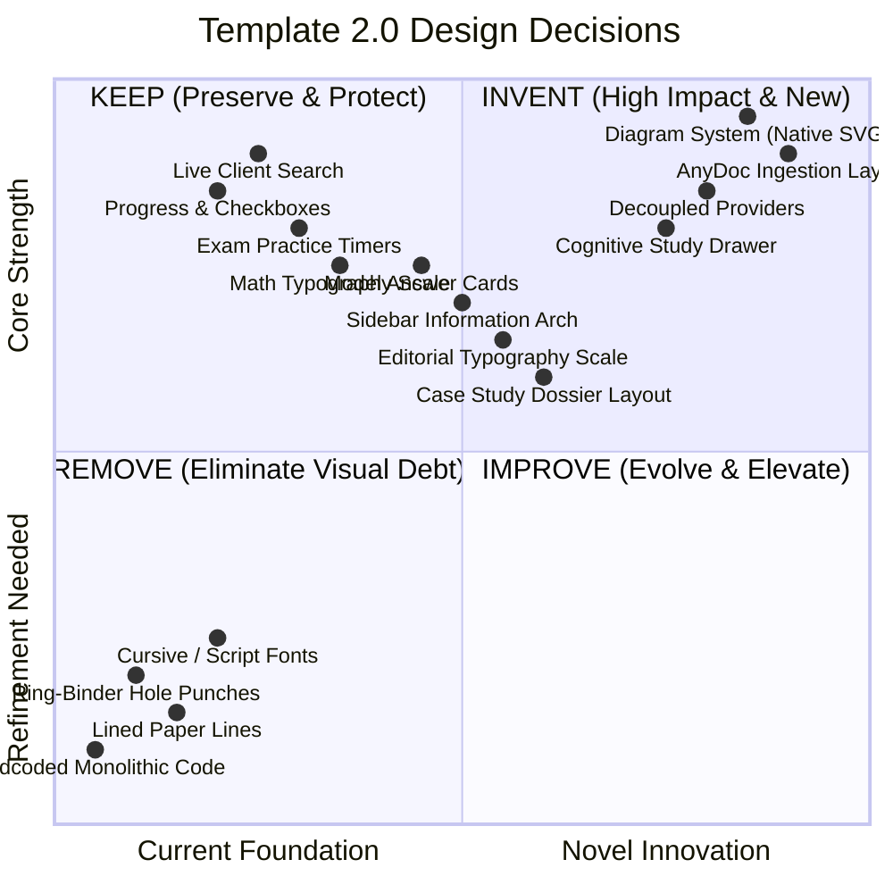
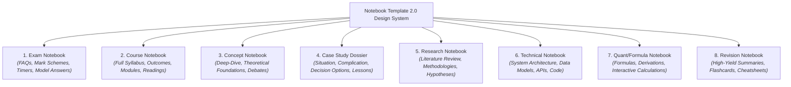
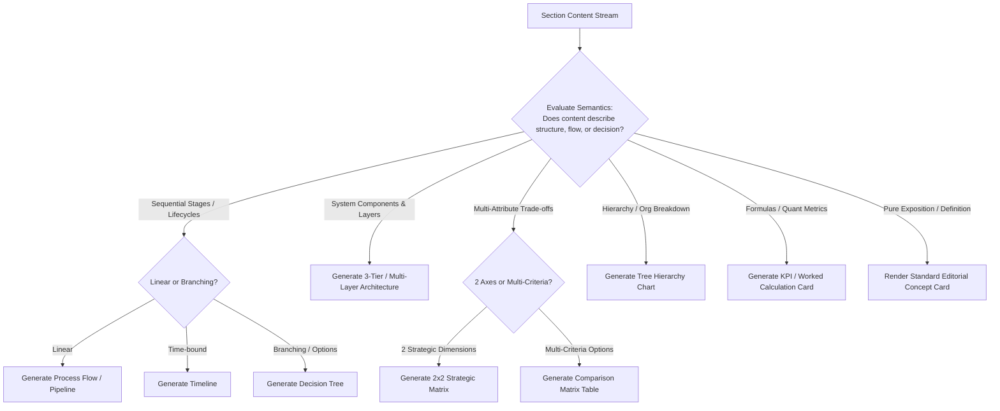
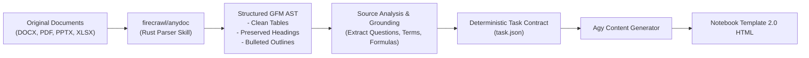
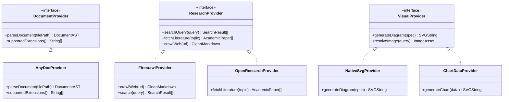
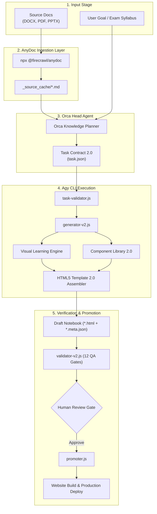
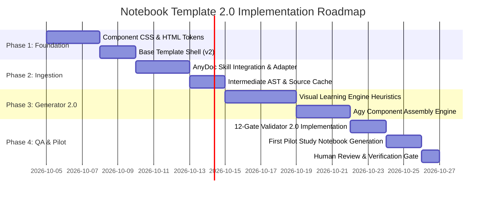

# Brain Knowledge Hub — Notebook Template 2.0 Architectural Design Specification

> **Document Status**: Comprehensive Design & Implementation Blueprint  
> **Target System**: Brain Knowledge Hub (`D:\Brain\05_Knowledge`)  
> **Scope**: Architecture, Design System, AnyDoc Ingestion, Visual Engine, Component System, and Study Capabilities  
> **Implementation State**: **DESIGN ONLY — DO NOT IMPLEMENT YET**

---

## Executive Summary

The Brain Knowledge Hub currently contains two landmark study notebooks:
1. `ERP_Exam_Notebook.html` (226,460 bytes): The original, hand-crafted master benchmark featuring rich interactive study capabilities (exam timer, interactive checklist, live search modal, sticky notes, formula cards, and print styles), but visually constrained to a simulated handwritten paper-binder aesthetic (`Caveat`, `Patrick Hand`, lined paper background, hole punch margins).
2. `Operations/ERP_Business_Applications_Notebook.html` (105,450 bytes): The first notebook generated by the Orca/Agy automated pipeline, featuring disciplined syllabus alignment, 100% FAQ question coverage, and course outcome tracking, but constrained by the inherited v1 binder layout and lacking visual diagrams and component diversity.

**Notebook Template 2.0** transitions the platform from a simulated paper binder to an **editorial academic knowledge interface**—a synthesis of a premium MBA textbook, an interactive digital study workspace, an automated visual explainer, and a rigorous exam revision engine.

This document establishes the end-to-end architectural, visual, pedagogical, and technical specification for Notebook Template 2.0.

---

## 1. Current-State Comparison: Master Benchmark vs First Generated Notebook

### 1.1 Twenty-Three Dimension Evaluation

| Dimension | `ERP_Exam_Notebook.html` (Benchmark) | `ERP_Business_Applications_Notebook.html` (Pipeline v1) | Notebook Template 2.0 Target Standard |
| :--- | :--- | :--- | :--- |
| **1. Visual Design** | Lined paper, red margins, ring-binder hole punches, tape effects. Charming but feels casual/handwritten. | Exact replica of v1 binder style; clean structure but repetitive visual rhythm. | **Premium Academic Editorial**: Clean typography, subtle elevations, structured borders, calm academic authority. No simulated paper lines. |
| **2. Typography** | Script fonts (`Caveat`, `Patrick Hand`) for all headings and callouts. Reduces legibility during sustained reading. | Inherited script fonts for titles and callouts; `Source Sans 3` for body text. | **Harmonious Tri-Font System**: Editorial serif for headings (`Newsreader` / `STIX Two`), clean sans for UI/body (`Source Sans 3` / `Inter`), monospace for data/code (`JetBrains Mono`). Zero script font fatigue. |
| **3. Navigation** | Fixed top bar, slide-out drawer, auto-generated outline, page completion checkboxes. | Fixed top bar, drawer, subject breadcrumb links, module navigation. | **Persistent Multi-Level Sidebar** on desktop (>1200px) with collapsible sections, reading progress, bookmarking, and instant section jumping. Drawer on mobile. |
| **4. Information Architecture** | Flat sequence of pages grouped loosely by module. Deep content nested in accordions. | Structured 16-section curriculum mapping directly to Course Outcomes (CO1, CO2, CO3). | **Hierarchical Module Structure**: Module Overview → Conceptual Theory → Visual Blueprint → Case Application → Quantitative Model → Model Exam Answer. |
| **5. Content Density** | High density, multi-column cards, sticky notes, formula grids. | High density, structured paragraphs, tabular comparisons. | **Adaptive Density**: Editorial layout with generous whitespace by default, with an instant "Compact / Revision Mode" toggle. |
| **6. Readability** | Good contrast, but handwriting fonts and paper rules create visual noise during long study sessions. | Better readability due to more standard body text, but script headings distract. | **Optimal Typography Ergonomics**: 68–75 character measure, 1.7 line height, 18px base font, crisp contrast ratio >= 7:1. |
| **7. Mobile Responsiveness** | Fully responsive, off-canvas navigation drawer, horizontal touch scrolling for tables. | Responsive layout, touch-friendly navigation, mobile drawer. | **Mobile-First Adaptive UI**: Sticky bottom study bar on mobile, swipeable tabs, touch-optimized flashcards and reveals. |
| **8. Dark Mode** | Dark navy paper palette (`#18202e`), high contrast, persistent via `localStorage`. | Inherited dark mode palette with adjusted highlights. | **Semantic Token Parity**: Slate & deep charcoal palette (`#0f172a`), warm muted text (`#f1f5f9`), balanced border luminance, zero eye strain. |
| **9. Search** | Client-side live search modal (`/` shortcut), multi-tag keyword matching, snippet previews with `<mark>`. | Client-side search modal matching section text with keyboard shortcuts. | **Enhanced Fuzzy Search**: Search modal with instant keyword highlighting, filter by component type (Formula, Case, FAQ, Diagram), and direct jump. |
| **10. Progress Tracking** | Page-level checkmarks, completion percentage calculation, persistent across sessions. | Section completion indicators and percentage bar. | **Granular Mastery Tracking**: Tracks section completion, quiz scores, and flashcard mastery with visual progress rings. |
| **11. Focus Mode** | Hides sidebar, centers content sheet, expands max-width (`body.focus`). | Focus mode toggles sidebar visibility. | **True Focus Mode**: Distraction-free reading view, dimming non-active paragraphs, zen study timer. |
| **12. Study Features** | Sticky notes, trap callouts, memory tricks, active recall reveal tags (`details.rv`). | Callout boxes, outcome mapping, key takeaways. | **Cognitive Learning Suite**: Active recall reveals, "Explain Simply" toggle, MBA executive takeaways, interactive flashcards, spaced-repetition prompts. |
| **13. Exam Features** | 15-minute countdown practice timer, mark allocation, model exam answers. | Model answers for 18 FAQs, exam answer breakdown cards. | **Exam Mastery Blueprint**: Countdown timers, mark-scheme rubrics, high-yield summary cards, question-to-concept matrix. |
| **14. Diagrams** | Text-based grids, ASCII-like boxes, nested borders. Few true graphics. | Nested HTML cards and tables representing architecture and pillars. | **Native SVG & CSS Engine**: High-fidelity 2x2 matrices, 3-tier architecture diagrams, process flowcharts, and causal trees rendered via inline SVG. |
| **15. Infographics** | Basic colored cards and stamp badges. | Status pills, badge tags, and styled callout boxes. | **Structured Visual Infographics**: Metric callout stats, timeline chains, value matrices, and comparison pyramids. |
| **16. Tables** | Highly detailed tables, custom striped borders, horizontal scroll wrappers. | Clean comparison tables with header highlights and clear borders. | **Interactive Data Tables**: Sticky headers, sorting, search filter per column, responsive card collapse on mobile. |
| **17. Formulas** | STIX Two math typography, variable breakdown glossaries, step-by-step working. | STIX Two font formulas with variable definitions and explanation notes. | **Interactive Formula Engine**: Clear mathematical notation, variable dictionary, interactive inputs to compute real-time values (e.g. EOQ, Safety Stock). |
| **18. Case Studies** | Rich narrative cases (Subway, FoxMeyer, Nike) with analysis accordions. | Structured Subway case analysis with organizational failure analysis. | **Dossier Case Layout**: Structured framework: Situation → Complication → Decision Options → Strategic Action → Quantitative Outcome → Managerial Lessons. |
| **19. Interactive Elements** | Accordions, timers, search, check buttons, theme toggles. | Accordions, theme toggles, search modal. | **Rich Zero-Dependency Interactivity**: Multi-step process steppers, interactive 2x2 matrix quadrant selectors, flashcard flippers, formula calculators. |
| **20. Accessibility** | Good ARIA attributes, keyboard traps avoided, focus rings styled. | ARIA attributes, semantic header levels, contrast compliant. | **WCAG 2.1 AA Certified**: Screen-reader descriptions for all SVGs, skip-to-content links, full keyboard navigability, contrast >= 7:1. |
| **21. Performance** | Fast loading (<50ms), zero heavy JS frameworks, single-file bundle. | Instant loading (<30ms), zero network requests after initial load. | **Ultra-Lightweight & Zero-Bloat**: Static HTML/CSS, zero external JS libraries, compressed inline SVGs, bundle size < 150KB. |
| **22. Print Support** | Dedicated print stylesheet (`@media print`), hides top/side nav, page breaks. | Clean print stylesheet hiding UI controls. | **Publication-Grade Print Engine**: Academic monograph formatting, page numbers, footnotes, table of contents, and clean page-break rules. |
| **23. Maintainability** | Hardcoded monolithic single file; difficult to automate or update incrementally. | Generated via automated pipeline, separated metadata, deterministic generation. | **Component-Driven Pipeline Architecture**: Modular HTML component snippets, reusable CSS token library, automated generator and validator. |

### 1.2 Synthesis: Keep, Improve, Remove, Invent



- **WHAT TO KEEP**:
  - Live client-side keyword search with instant mark highlight.
  - Page-level completion checkmarks and persistent progress calculation in `localStorage`.
  - Practice countdown timers with pause/resume and alerts.
  - Math and formula variable breakdown dictionaries (`STIX Two Text`).
  - Active recall reveals (`<details class="rv">`) for self-testing.
  - 100% offline capability and zero external JavaScript framework dependencies.
  - Strict publication gating and automated validation.

- **WHAT TO IMPROVE**:
  - **Typography**: Replace cursive handwriting fonts (`Caveat`, `Patrick Hand`) with an authoritative editorial serif for titles and headings (`Newsreader` or `STIX Two Text`) and a high-legibility sans-serif for body and UI (`Source Sans 3` or `Inter`).
  - **Information Architecture**: Deepen the hierarchy into structured modules with clear sub-navigation and progress indicators.
  - **Tables & Data**: Upgrade standard HTML tables to responsive cards on mobile, with sticky headers and column-level sorting on desktop.
  - **Model Answers**: Standardize exam answer cards with explicit mark-scheme rubrics, keyword allocations, and grading criteria.

- **WHAT TO REMOVE**:
  - The simulated lined paper backgrounds (`repeating-linear-gradient`).
  - The red margin lines and ring-binder hole punch graphics (`.sheet::before`, `.sheet::after`).
  - Skeuomorphic Scotch tape effects on cards.
  - Monolithic hardcoded templates in favor of composable component fragments.

- **WHAT TO INVENT**:
  - **Visual Learning Engine**: An automated heuristic in the pipeline that analyzes content semantics and generates inline SVG diagrams (2x2 matrices, 3-tier architectures, process flows, timelines).
  - **AnyDoc Multi-Format Ingestion**: Ingesting DOCX, PDF, PPTX, XLSX, and CSV into structured markdown AST in milliseconds using Rust-based parsing.
  - **Cognitive Study Features**: "Explain This Simply" drawer, "MBA Executive Takeaway" banner, interactive formula playgrounds, and flashcard study decks.
  - **8 Archetype Design Variations**: Dedicated visual layouts and component presets for Exam, Course, Concept, Case Study, Research, Technical, Quant, and Revision notebooks.

---

## 2. Notebook Philosophy & Archetype System

### 2.1 The Quintuple Hybrid Philosophy

Notebook Template 2.0 is built on the convergence of five distinct roles:
1. **Premium MBA Textbook**: Authoritative, rigorously researched, structured with clear conceptual definitions, business frameworks, and academic citations.
2. **Interactive Knowledge System**: Deeply interconnected, searchable, hyperlinked, with collapsible levels of detail and active recall reveal toggles.
3. **Personal Study Workspace**: Non-distracting, focused, persistent across browser sessions, tracking completion, bookmarks, and study notes.
4. **Visual Explainer**: Replacing dense walls of text with high-clarity structural diagrams, 2x2 decision matrices, architectural blueprints, and process flows.
5. **Exam Preparation Engine**: Direct mapping to university exam questions, mark-allocation rubrics, practice timers, common pitfalls, and memory anchors.

### 2.2 Anti-AI-Slop Manifesto

Every notebook produced under Template 2.0 must adhere to strict editorial standards:
- **Zero Decorative Filler**: No generic paragraphs summarizing "In today's fast-paced business environment..." or repetitive platitudes.
- **Semantic Density**: Every sentence must convey a concrete definition, framework dimension, business decision, formula variable, or verified case fact.
- **Structural Rhythm**: Content must alternate between concept exposition, visual modeling, quantitative calculation, and practical decision-making.
- **Strict Ground Truth**: No hallucinated cases, fabricated citations, or unverified statistics. All claims are grounded in source documents or established academic canon.

### 2.3 Eight Distinct Notebook Archetypes

Template 2.0 provides a single unified design system that adapts dynamically across eight archetypes:



| Archetype | Primary Focus | Hero Layout | Core Visuals | Primary Study Tool |
| :--- | :--- | :--- | :--- | :--- |
| **Exam Notebook** | 100% question mastery & scoring | Question count, total marks, exam duration badge | Question-to-topic matrix, marking rubric tables | Practice countdown timer, model answer reveals |
| **Course Notebook** | End-to-end curriculum coverage | Syllabus tree, course outcomes (COs), credit units | Modular roadmap, prerequisite dependency tree | Section completion tracker, syllabus checklist |
| **Concept Notebook** | Theoretical depth & seminal ideas | Author, seminal paper, definition card | Causal loop diagram, concept hierarchy map | "Explain Simply" toggle, cognitive anchors |
| **Case Study Dossier**| Strategic decision-making in real firms| Company profile, revenue, protagonist, timeline | Timeline of events, 2x2 decision matrix, value chain | Situation-Decision-Outcome accordion |
| **Research Notebook**| Literature synthesis & empirical findings| Research question, methodology, sample size | Hypotheses framework, regression summary charts | Citation cards, methodology comparative tables |
| **Technical Notebook**| Architectural & systems implementation | Stack tags, version, infrastructure requirements | 3-tier architecture diagram, data schema flows | Code blocks, system configuration checklists |
| **Quant/Formula Notebook**| Mathematical & operational calculations| Formula count, complexity rating, required inputs | Step-by-step calculation breakdown, sensitivity graph | Interactive formula calculation inputs |
| **Revision Notebook**| High-yield recall in minimal time | Estimated revision time, key term count | One-page visual summary infographic, comparison grids | Interactive flashcard deck, active recall checklist |

---

## 3. Notebook UX Architecture

### 3.1 Layout Shell Structure

The notebook shell is composed of four modular regions:
1. **Global App Top Bar** (Fixed, 56px height):
   - Brand link back to Knowledge Hub portal.
   - Dynamic subject and category breadcrumb path.
   - Quick search trigger (`Ctrl+K` or `/`).
   - Theme toggle (Light / Dark) and Focus Mode toggle.
   - Global reading progress bar.
2. **Persistent Desktop Sidebar / Mobile Off-Canvas Drawer** (300px width):
   - Notebook metadata overview (Archetype, Subject, Read Time, Exam Questions).
   - Collapsible Table of Contents grouped by Module / Outcome.
   - Progress mastery checklist (completed items highlighted with check indicators).
   - Quick jump to key tools (Formulas, Cases, Quizzes, Flashcards).
3. **Primary Reading Canvas** (Centered, max-width 980px):
   - Editorial Hero Banner.
   - Section Content with intelligent component composition.
   - Section navigation footer with previous/next module links and completion toggles.
4. **Contextual Study Dock / Modal Overlays**:
   - Quick Search overlay modal with fuzzy matching and keyboard navigation.
   - Interactive formula calculator modal.
   - Flashcard review overlay.

```
+---------------------------------------------------------------------------------------+
|  Top Bar: [Logo] Brain Hub > Operations > ERP Applications    [/] Search   [Dark] [Focus] [ 45% ]|
+---------------------------------------------------------------------------------------+
|  SIDEBAR (300px)           |  PRIMARY READING CANVAS (Max 980px)                      |
|  - Archetype: Exam Guide   |  ======================================================= |
|  - 18 FAQs | 6 Modules     |  HERO BANNER: Title, Description, Meta Badges            |
|  ------------------------- |  ======================================================= |
|  Module 1: Strategy        |  [Concept Card: 3-Tier Architecture]                     |
|    [x] 1.1 Tech Strategy   |  ------------------------------------------------------- |
|    [ ] 1.2 Five Pillars    |  [Native SVG Diagram: Client -> App -> DB Blueprint]     |
|  Module 2: Value Matrix    |  ------------------------------------------------------- |
|    [ ] 2.1 Plossl Theory   |  [Comparison Table: SAP vs Oracle vs Microsoft Dynamics] |
|    [ ] 2.2 Subway Case     |  ------------------------------------------------------- |
|  ------------------------- |  [Model Exam Answer: 10-Mark Answer Breakdown]           |
|  [Formula Cheat Sheet]     |  ======================================================= |
|  [Flashcard Review Deck]   |  Page Nav: [<- Prev Section]  [Mark Complete]  [Next ->] |
+---------------------------------------------------------------------------------------+
```

### 3.2 Responsive Viewport Breakpoints

| Breakpoint | Target Devices | Layout Behavior |
| :--- | :--- | :--- |
| **< 640px** | Mobile phones | Single-column canvas; sidebar hidden in off-canvas swipe drawer; compact sticky bottom navigation bar; simplified data tables with card-view toggle. |
| **640px – 1023px** | Tablets / Small Laptops | Centered reading canvas (padding 24px); slide-out sidebar via menu button; touch-optimized cards and reveals. |
| **1024px – 1439px** | Desktop / Laptops | Two-column layout: fixed 280px sidebar + centered reading canvas (max 880px); full search modal. |
| **>= 1440px** | Widescreen Desktop / 4K | Three-column layout: fixed 300px navigation sidebar + 940px reading canvas + 240px contextual right rail (active outline, sticky notes, key formulas). |

### 3.3 Four Dynamic Reading Modes

1. **Standard Editorial Mode** (Default): Full two-column layout with sidebar, rich media, and full component formatting.
2. **Focus / Zen Mode**: Automatically hides top bar clutter, collapses sidebar, centers content sheet at an optimal 780px measure, and dims unfocused sections on scroll.
3. **Revision / Cheatsheet Mode**: Collapses all narrative body paragraphs into high-yield summaries, keeping only formulas, key takeaways, diagrams, and model answers visible.
4. **Print / PDF Monograph Mode**: Triggers CSS print formatting, strips all interactive chrome, expands all `<details>` accordions, forces vector diagrams to pure monochrome/high-contrast lines, and inserts systematic page breaks between modules.

---

## 4. Visual Design System

### 4.1 Design Tokens: Color & Surfaces

Template 2.0 adopts an authoritative academic editorial palette inspired by high-end university presses (Oxford, Harvard, Cambridge) paired with modern UI clarity.

```css
:root {
  /* Light Editorial Palette */
  --bg-canvas: #f8fafc;         /* Crisp, subtle cool off-white */
  --bg-surface: #ffffff;        /* Pure white content card */
  --bg-surface-subtle: #f1f5f9; /* Subtle secondary backgrounds */
  --bg-surface-elevated: #ffffff;
  
  --text-primary: #0f172a;      /* Deep slate, high legibility (14.2:1 contrast) */
  --text-secondary: #475569;    /* Muted slate for explanatory captions */
  --text-tertiary: #94a3b8;     /* Meta timestamps and indicators */
  
  --border-subtle: #e2e8f0;     /* Delicate card and table borders */
  --border-strong: #cbd5e1;     /* Distinct structural dividers */
  
  /* Academic Accent Brand Tokens */
  --accent-primary: #1e3a8a;    /* Deep Oxford Blue */
  --accent-primary-hover: #172554;
  --accent-secondary: #0d9488;  /* Cambridge Teal */
  --accent-highlight: #d97706;  /* Warm Amber */
  --accent-danger: #b91c1c;     /* Academic Crimson */
  --accent-success: #15803d;    /* Scholarly Emerald */
  
  /* Semantic Component Surfaces */
  --callout-info-bg: #eff6ff;   --callout-info-border: #3b82f6;
  --callout-warn-bg: #fffbeb;   --callout-warn-border: #f59e0b;
  --callout-danger-bg: #fef2f2; --callout-danger-border: #ef4444;
  --callout-success-bg: #f0fdf4;--callout-success-border: #22c55e;
  
  /* Elevation Tokens */
  --shadow-sm: 0 1px 2px 0 rgb(0 0 0 / 0.05);
  --shadow-md: 0 4px 6px -1px rgb(0 0 0 / 0.08), 0 2px 4px -2px rgb(0 0 0 / 0.05);
  --shadow-lg: 0 10px 15px -3px rgb(0 0 0 / 0.08), 0 4px 6px -4px rgb(0 0 0 / 0.04);
}

html[data-theme="dark"] {
  /* Dark Slate Academic Palette */
  --bg-canvas: #090d16;         /* Deepest midnight slate */
  --bg-surface: #111827;        /* Rich dark card background */
  --bg-surface-subtle: #1f2937; /* Elevated card surface */
  --bg-surface-elevated: #374151;
  
  --text-primary: #f8fafc;      /* Crisp pure white */
  --text-secondary: #94a3b8;    /* Muted cool gray */
  --text-tertiary: #64748b;     /* Dimmed metadata */
  
  --border-subtle: #1e293b;
  --border-strong: #334155;
  
  /* Academic Accent Brand Tokens (Adjusted for Dark Contrast) */
  --accent-primary: #60a5fa;    /* Vibrant soft blue */
  --accent-primary-hover: #93c5fd;
  --accent-secondary: #2dd4bf;  /* Vibrant teal */
  --accent-highlight: #fbbf24;  /* Luminous amber */
  --accent-danger: #f87171;     /* Soft crimson */
  --accent-success: #4ade80;    /* Soft emerald */
  
  --callout-info-bg: #172554;   --callout-info-border: #60a5fa;
  --callout-warn-bg: #451a03;   --callout-warn-border: #fbbf24;
  --callout-danger-bg: #450a0a; --callout-danger-border: #f87171;
  --callout-success-bg: #052e16;--callout-success-border: #4ade80;
  
  --shadow-sm: 0 1px 3px 0 rgb(0 0 0 / 0.4);
  --shadow-md: 0 4px 6px -1px rgb(0 0 0 / 0.5);
  --shadow-lg: 0 10px 20px -3px rgb(0 0 0 / 0.6);
}
```

### 4.2 Typography Hierarchy

```css
/* Typography Scale */
--font-editorial: "Newsreader", "STIX Two Text", "Merriweather", "Georgia", serif;
--font-ui: "Source Sans 3", "Inter", -apple-system, BlinkMacSystemFont, "Segoe UI", sans-serif;
--font-mono: "JetBrains Mono", "SF Mono", "Fira Code", monospace;
--font-math: "STIX Two Math", "Cambria Math", serif;

h1, h2, h3, h4, .editorial-heading {
  font-family: var(--font-editorial);
  font-weight: 600;
  letter-spacing: -0.02em;
  color: var(--text-primary);
}

body, p, li, td, .ui-text {
  font-family: var(--font-ui);
  font-size: 1.125rem; /* 18px */
  line-height: 1.75;
  color: var(--text-primary);
}

code, pre, .mono-data {
  font-family: var(--font-mono);
  font-size: 0.95rem;
}

.math-formula {
  font-family: var(--font-math);
  font-size: 1.25rem;
}
```

---

## 5. Visual Learning Engine & Infographic Heuristics

### 5.1 Automated Visual Analysis Heuristic

When Agy generates a section, it evaluates the content structure through the **Visual Learning Engine (VLE)**. Rather than relying on arbitrary decoration, the engine asks:

> *"Does this section describe relationships, flows, architectures, decisions, or quantitative comparisons that can be understood faster visually than through prose?"*



### 5.2 Sixteen Visual Types & Selection Heuristics

1. **Timeline**: Chronological events, evolution of ERP systems (MRP → MRP II → ERP → Cloud ERP).
2. **Process Flow**: Step-by-step sequential workflow (e.g. Procure-to-Pay, Order-to-Cash, BPR lifecycle).
3. **Architecture Diagram**: Multi-tier system topologies (Client presentation tier → Application logic server → Enterprise database cluster).
4. **System Diagram**: Interconnected organizational modules (Finance, SCM, CRM, HR, Manufacturing).
5. **Concept Map**: Network of theoretical concepts showing interdependencies and feedback loops.
6. **Decision Tree**: Branching logic for system selection or architectural deployment (On-premise vs Single-tenant vs Multi-tenant SaaS).
7. **2x2 Matrix**: Strategic positioning (e.g. Value Matrix: Strategic Alignment vs System Usability).
8. **Comparison Matrix**: Multi-attribute vendor evaluation (SAP vs Oracle vs Microsoft vs Tier 2).
9. **Lifecycle**: Iterative cyclical processes (SDLC, continuous improvement, change management cycle).
10. **Hierarchy / Org Tree**: Organizational structures (e.g. Subway franchisee hierarchy vs corporate headquarters).
11. **Funnel**: Filtering and conversion stages (Lead generation, vendor shortlisting funnel).
12. **Cycle / Closed Loop**: Self-reinforcing mechanisms (Data capture → Business analytics → Decision optimization → Operational execution).
13. **Causal Diagram (Fishbone / Root Cause)**: Analysis of ERP implementation failures (Change resistance, poor data hygiene, scope creep).
14. **Sankey-Style Flow**: Material and cost flow across supply chain tiers.
15. **KPI Dashboard**: Grid of core metrics with target thresholds, definitions, and formulas (Order fill rate, inventory turns, days sales outstanding).
16. **Statistical / Worked Chart**: Visual representation of quantitative formulas (EOQ curve showing carrying cost vs ordering cost).

### 5.3 Visual Implementation Standards

- **Zero External Heavy Bundles**: No heavy third-party charting bundles loaded by default.
- **Native SVG & CSS Grid**: All diagrams are rendered directly as accessible, semantic, responsive inline SVGs or structured CSS Grid components.
- **Theme Adaptability**: SVGs use CSS variables (`var(--accent-primary)`, `var(--border-strong)`, `var(--bg-surface)`) so they seamlessly adapt between Light and Dark mode without redrawing.
- **Screen Reader Accessibility**: Every SVG includes `<title>` and `<desc>` elements, and parent containers have `role="img"` and descriptive `aria-label` attributes.

---

## 6. AnyDoc Ingestion Skill Integration

### 6.1 Capability Overview & Verification

The official **AnyDoc** capability from Firecrawl (`firecrawl/anydoc`) is an open-source Rust-based document parsing engine engineered for high-throughput, millisecond-latency conversion of complex office documents into clean, LLM-ready GitHub-Flavored Markdown (GFM).

- **Execution Command**: `npx skills add firecrawl/anydoc`
- **Underlying CLI**: `npx @firecrawl/anydoc <input-file> -o <output-markdown>`
- **Processing Performance**: Sub-5ms median processing time per document.
- **Pure Byte Parsing**: Written in pure Rust; reads raw office document structures directly without reliance on heavy machine learning inference or external OCR servers for digital documents. Zero hallucination.
- **14 Format Coverage**:
  - **Word**: `.doc`, `.docx`, `.docm`
  - **PowerPoint**: `.ppt`, `.pptx`, `.pot`, `.pps`, `.pptm`, `.ppsx`
  - **Excel**: `.xls`, `.xlsx`, `.xlsm`, `.xlsb`
  - **OpenDocument**: `.odt`, `.ods`, `.odp`
  - **Universal**: `.pdf` (text-based), `.rtf`, `.epub`, `.csv`

### 6.2 AnyDoc Ingestion Pipeline



### 6.3 Grounding Preservation Rules

1. **Source Authority**: AnyDoc is purely a conversion adapter; it never synthesizes or alters facts. The original source document remains the ultimate authority.
2. **Intermediate Markdown Artifacts**: Converted markdown files are cached in `_source_cache/<hash>.md` alongside the original binary files.
3. **Table & Hierarchy Fidelity**: AnyDoc's AST preserves complex multi-line tables, nested definition lists, and header levels (H1 through H4), ensuring that syllabus outlines and FAQ numbering are preserved with 100% fidelity.
4. **Chaining with Firecrawl OCR**: For scanned PDFs or image-based slides, the pipeline will optionally chain AnyDoc with Firecrawl's hosted OCR endpoint or `pdf-inspector`.

---

## 7. Decoupled Research & Provider Architecture

To maintain high architectural cohesion and prevent vendor lock-in, Template 2.0 isolates ingestion, external research, and visual generation behind abstract provider contracts.



### Provider Responsibilities

- **`DocumentProvider`**: Responsible solely for converting binary files into structured text/AST. The primary implementation is `AnyDocProvider`.
- **`ResearchProvider`**: Responsible for discovering external academic literature, market data, and authoritative web sources. Firecrawl handles web crawling; OpenResearch handles scholarly literature extraction (deferred to future implementation).
- **`VisualProvider`**: Responsible for producing visual artifacts. The primary engine is `NativeSvgProvider` (rendering deterministic vector diagrams) and `ChartDataProvider` (rendering responsive data charts).

### Visual Sourcing Strategy & Attribution Rules

1. **Hierarchy of Visual Preference**:
   - *Tier 1 (Preferred)*: Native HTML5/CSS Grid layouts.
   - *Tier 2 (Preferred)*: Inline vector SVG diagrams generated deterministically from structured data.
   - *Tier 3 (Permitted)*: Curated, open-access educational diagrams (Wikimedia Commons, MIT OpenCourseWare) with verified licenses.
   - *Tier 4 (Permitted)*: Official company logos or product interface screenshots where essential for case authenticity.
   - *Prohibited*: Generic stock photography, decorative AI-generated surreal art, and uncredited web images.
2. **Mandatory Visual Attribution**: Every non-native image must include an accompanying `<figcaption>` with:
   - Source title and author/organization.
   - License type (e.g. Creative Commons BY-SA 4.0, Fair Use educational analysis).
   - Direct canonical URL link.
   - Descriptive `alt` text explaining the diagram's insight to visually impaired users.

---

## 8. Cognitive Study Experience & Study Tools

Template 2.0 incorporates eight research-backed cognitive learning tools:

### 8.1 Active Recall Reveals (`<details class="study-reveal">`)
Instead of displaying all answers immediately, key exam definitions and case solutions are wrapped in accessible disclosure components:
- Keyboard navigable (`Enter` or `Space` to expand).
- Expansion state remembered in `localStorage`.
- "Reveal All / Hide All" master toggle for quick self-quizzing.

### 8.2 "Explain This Simply" Drawer
For dense theoretical frameworks (e.g. Plossl Manufacturing Theory, Relational Database Normalization), each concept card contains a discreet `"💡 Explain Simply"` toggle:
- Replaces academic jargon with intuitive real-world analogies (e.g. comparing 3-Tier ERP architecture to a restaurant: Customer = Presentation Tier, Waiter = Application Logic Tier, Kitchen/Pantry = Database Tier).

### 8.3 "MBA Executive Takeaway" Callout
A standardized callout box at the conclusion of every module answering three management questions:
1. *What decision does this enable?*
2. *What is the primary risk or trap?*
3. *What KPI must the executive monitor?*

### 8.4 Model Exam Answer Cards
For university and placement exam preparation:
- Displays target marks (e.g. `[10 Marks]`).
- Suggested time allocation (e.g. `[12 Minutes]`).
- Structured bullet answers formatted to match academic grading rubrics.
- Scoring breakdown highlighting what earns points and what loses points.

### 8.5 Interactive Formula Playground
Formulas (e.g., EOQ, Safety Stock, Inventory Turnover) feature interactive input fields allowing students to adjust variables (Demand, Setup Cost, Holding Cost) and observe real-time calculations.

### 8.6 "Test Me" Self-Assessment Micro-Quizzes
At the end of each section:
- 3–5 multiple-choice or concept check questions.
- Instant feedback with explanation notes.
- Scores aggregate into the student's mastery profile.

### 8.7 Interactive Flashcard Deck
A modal flashcard study mode:
- Covers key acronyms (BPR, MRP, EDI, BOM, S&OP).
- Keyboard controls (`Space` to flip, `1` for Hard, `2` for Good, `3` for Easy).
- Offline spaced-repetition tracking.

### 8.8 Live Fuzzy Client Search (`/` Shortcut)
- Instant modal triggered by `/` or `Ctrl+K`.
- Searches titles, text, formulas, cases, and FAQs simultaneously.
- Highlights matched terms with `<mark>`.
- Deep-links directly to the matched element and flashes it visually.

---

## 9. Content Metadata Schema 2.0

Template 2.0 expands `notebook-template.meta.json` into a comprehensive JSON Schema:

```json
{
  "$schema": "https://json-schema.org/draft/2020-12/schema",
  "title": "Brain Knowledge Hub Notebook Metadata Standard 2.0",
  "type": "object",
  "properties": {
    "title": { "type": "string" },
    "subtitle": { "type": "string" },
    "description": { "type": "string" },
    "slug": { "type": "string", "pattern": "^[a-z0-9]+(-[a-z0-9]+)*$" },
    "subject": {
      "type": "string",
      "enum": [
        "AI", "Analytics", "Business", "Finance", "General",
        "Management", "Operations", "Placement_Interview", "Technology"
      ]
    },
    "category": { "type": "string" },
    "templateVersion": { "type": "string", "enum": ["1.0.0", "2.0.0"], "default": "2.0.0" },
    "archetype": {
      "type": "string",
      "enum": [
        "exam", "course", "concept", "case-study",
        "research", "technical", "quant-formula", "revision"
      ]
    },
    "academicLevel": {
      "type": "string",
      "enum": ["mba-foundation", "mba-advanced", "executive-mba", "undergraduate", "practitioner"]
    },
    "targetAudience": {
      "type": "array",
      "items": { "type": "string" }
    },
    "contentDepth": {
      "type": "string",
      "enum": ["introductory", "intermediate", "advanced", "exhaustive"]
    },
    "difficultyRating": { "type": "integer", "minimum": 1, "maximum": 5 },
    "estimatedReadTimeMinutes": { "type": "integer" },
    "status": {
      "type": "string",
      "enum": ["draft", "published", "archived"],
      "default": "draft"
    },
    "sourceGrounding": {
      "type": "object",
      "properties": {
        "primarySources": {
          "type": "array",
          "items": {
            "type": "object",
            "properties": {
              "fileName": { "type": "string" },
              "fileType": { "type": "string" },
              "hash": { "type": "string" },
              "extractedVia": { "type": "string", "enum": ["anydoc", "manual", "firecrawl"] }
            },
            "required": ["fileName", "fileType"]
          }
        },
        "curriculumAlignment": { "type": "string" }
      }
    },
    "pedagogicalStructure": {
      "type": "object",
      "properties": {
        "learningOutcomes": { "type": "array", "items": { "type": "string" } },
        "prerequisites": { "type": "array", "items": { "type": "string" } },
        "nextTopics": { "type": "array", "items": { "type": "string" } },
        "moduleCount": { "type": "integer" }
      }
    },
    "visualManifest": {
      "type": "object",
      "properties": {
        "diagramCount": { "type": "integer" },
        "diagramTypes": { "type": "array", "items": { "type": "string" } },
        "externalImages": {
          "type": "array",
          "items": {
            "type": "object",
            "properties": {
              "src": { "type": "string" },
              "alt": { "type": "string" },
              "source": { "type": "string" },
              "license": { "type": "string" }
            },
            "required": ["src", "alt", "source"]
          }
        }
      }
    },
    "examAlignment": {
      "type": "object",
      "properties": {
        "totalQuestions": { "type": "integer" },
        "mappedFAQs": { "type": "array", "items": { "type": "string" } },
        "estimatedExamDurationMinutes": { "type": "integer" }
      }
    }
  },
  "required": ["title", "slug", "subject", "archetype", "templateVersion", "status"]
}
```

---

## 10. Quality Gates & Validation Model

Notebook Template 2.0 enforces 12 automated quality assertions in `validator.js`:

1. **WCAG 2.1 AA Contrast**: Text contrast ratios must meet >= 4.5:1 for body text and >= 7:1 for headers against surface tokens in both Light and Dark mode.
2. **Accessible SVG Elements**: Every SVG diagram must contain a `<title>`, `<desc>`, and `aria-label`.
3. **Asset Link Integrity**: Zero 404s. All referenced relative paths and media must exist on disk.
4. **SVG Viewport Scalability**: All SVGs must declare `viewBox` and `preserveAspectRatio` without hardcoded fixed pixel widths.
5. **Mandatory Source Attribution**: Any external non-SVG graphic must possess an accompanying caption with source and license.
6. **Visual Relevance Gate**: Sections flagged as "architecture", "process", or "matrix" must contain a valid corresponding visual component.
7. **Responsive Breakpoint Verification**: Layout must be verified to render without horizontal page overflow down to 360px.
8. **Print Layout Fidelity**: Print stylesheet must explicitly suppress all interactive UI elements (`.top`, `.side`, `.modal`, `.timer`) and force accordions open.
9. **Performance Budget**: Total standalone HTML file size must remain under 200KB; zero external runtime JavaScript dependencies.
10. **Anchor Integrity**: All internal anchor links (`#section-id`) in navigation, breadcrumbs, and search must resolve to real DOM IDs.
11. **Component Contract Compliance**: HTML markup must strictly conform to the CSS class contracts defined in `NOTEBOOK_TEMPLATE_2_COMPONENTS.md`.
12. **Grounded Fact Gate**: All FAQ numbers, course outcomes, and case names must cross-reference verified sources in `primarySources`.

---

## 11. Pipeline Integration Architecture



---

## 12. Migration Strategy & Backward Compatibility

1. **Zero Disruption to Existing Notebooks**:
   - `ERP_Exam_Notebook.html` (226,460 bytes) and `Operations/ERP_Business_Applications_Notebook.html` (105,450 bytes) remain completely untouched and valid.
   - `_templates/notebook-template.html` remains as the v1 legacy template.
2. **Dual-Template Support in Pipeline**:
   - The generator and validator will inspect `meta.templateVersion`:
     - If `"1.0.0"`: Uses legacy v1 binder rules.
     - If `"2.0.0"`: Enforces Template 2.0 editorial components and quality gates.
3. **Template Directory Organization**:
   ```
   _templates/
   ├── v1/
   │   ├── notebook-template.html
   │   └── notebook-template.meta.json
   └── v2/
       ├── notebook-template-2.html
       ├── notebook-template-2.meta.json
       └── components/
           ├── hero.html
           ├── concept-card.html
           ├── architecture-diagram.html
           └── model-exam-answer.html
   ```

---

## 13. Phased Implementation Roadmap



### Milestone Summary
- **Phase 1: Component CSS/HTML Standards (`_templates/v2/`)**: Build the standalone template shell, CSS custom properties, and 24 component HTML snippets.
- **Phase 2: AnyDoc Ingestion Adapter (`Website/scripts/pipeline/anydoc-adapter.js`)**: Integrate `firecrawl/anydoc` into the CLI pipeline to convert uploaded binary files into standardized markdown.
- **Phase 3: Generator 2.0 & Visual Engine (`Website/scripts/pipeline/generator-v2.js`)**: Wire Orca task contracts to the new component assembler and SVG visual engine.
- **Phase 4: Validator 2.0 & Pilot Rollout**: Implement the 12 QA validation gates and generate the first official Template 2.0 study notebook.
