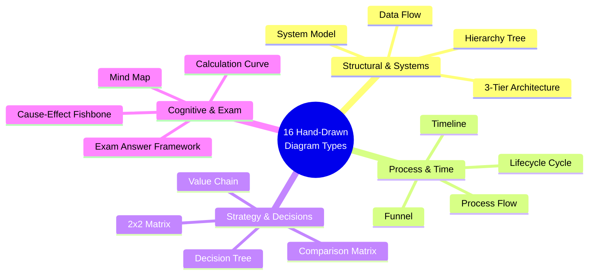

# Brain Knowledge Hub — Notebook Template 2.0 Visual Engine
## Hand-Drawn SVG Visual System & Content-Aware Infographic Heuristics

> **Visual Philosophy**: Sketches drawn directly into a student notebook by an A-grade MBA scholar  
> **Technical Medium**: Pure HTML5/CSS & Inline SVG (Zero external raster dependencies)  
> **Visual Types**: 16 Specialized Hand-Drawn Academic Diagrams  
> **Status**: Architectural Specification

---

## 1. Hand-Drawn Vector Aesthetic Philosophy

Diagrams in "Notebook OS — Paper Edition" must **never** resemble sterile corporate PowerPoint slide decks, Figma prototypes, or generic D3.js vector boxes.

Instead, they must look like:
> **"A master diagram sketched in blue fountain pen and colored highlighter markers by an exceptional MBA student studying at their desk."**

```
+-----------------------------------------------------------------------------------------------+
|                             HAND-DRAWN SVG DESIGN GRAMMAR                                     |
|                                                                                               |
|  1. Wobbly Vector Paths       2. Rounded Stroke Terminals     3. Handwritten Labels           |
|     (Subtle bézier curves        (stroke-linecap: round;         (Caveat & Patrick Hand       |
|      instead of rigid lines)      stroke-linejoin: round)         font integration)           |
|                                                                                               |
|  4. Highlighter Backdrops     5. Student Marginalia Callouts  6. Restrained Study Palette     |
|     (Soft translucent fills      ("WHY?", "REMEMBER!",           (Oxford Blue ink, Gold,      |
|      behind critical nodes)       "EXAM TRAP", "10 MARKS")        Coral, and Emerald)         |
+-----------------------------------------------------------------------------------------------+
```

### Visual Style Rules
- **Stroke Weights**: Hand-drawn lines use `stroke-width: 2.2px` to `2.8px` with `stroke-linecap: round` and `stroke-linejoin: round`.
- **Soft Imperfection**: Rectangles and boxes use subtle border radii (`rx="6" ry="6"`) or slightly wavy SVG paths (`M 10 10 Q 50 12 100 10 ...`).
- **Highlighter Underlays**: Important boxes have soft highlighter halos behind them (`fill="var(--hl-yellow)"` or `fill="var(--hl-blue)"`).
- **Fountain Pen Arrows**: Connector arrows are hand-drawn vector paths with marker heads (`marker-end="url(#hand-arrow)"`).

---

## 2. Sixteen Supported Hand-Drawn Diagram Types



### 1. Process Flow (`nb-svg--process`)
- **Use Case**: Step-by-step transaction lifecycles (Procure-to-Pay, Order-to-Cash, BPR stages).
- **Hand-Drawn Details**: Sequential sketched card nodes connected by curved marker arrows with a prominent `"CRITICAL GATE"` callout at the invoice-matching stage.

### 2. Timeline (`nb-svg--timeline`)
- **Use Case**: Historical evolution of manufacturing control (ROP → MRP → MRP II → ERP → Cloud).
- **Hand-Drawn Details**: Horizontal pencil timeline axis with handwritten milestone labels and highlighter circles marking pivotal eras.

### 3. Architecture Blueprint (`nb-svg--architecture`)
- **Use Case**: Three-Tier Client-Server Architecture (Presentation, Application Logic, Database).
- **Hand-Drawn Details**: Three vertical sketched towers with client terminals at left, application servers in center, and a cylindrical database at right, labeled in `Caveat` script with ACID transaction guarantees.

### 4. System Model (`nb-svg--system`)
- **Use Case**: Interconnected enterprise modules (Finance, SCM, CRM, HR, Manufacturing).
- **Hand-Drawn Details**: Central shared database hub with spokes radiating out to modular student cards.

### 5. 2×2 Strategic Matrix (`nb-svg--matrix2x2`)
- **Use Case**: Value Realization Matrix (Strategic Alignment vs Implementation Complexity).
- **Hand-Drawn Details**: Hand-drawn orthogonal axes with arrowheads, four quadrant zones, and handwritten executive directives (*"Quick Wins"*, *"Strategic Bets"*).

### 6. Decision Tree (`nb-svg--decision`)
- **Use Case**: ERP system selection branching (On-premise vs Single-tenant Cloud vs Multi-tenant SaaS).
- **Hand-Drawn Details**: Branching hand-drawn nodes with `"YES / NO"` handwritten decision diamonds.

### 7. Mind Map (`nb-svg--mindmap`)
- **Use Case**: Broad conceptual breakdowns (e.g. Total Cost of Ownership components: Licensing, Consulting, Training, Maintenance).
- **Hand-Drawn Details**: Organic curved branches radiating from a central boxed concept.

### 8. Hierarchy Tree (`nb-svg--hierarchy`)
- **Use Case**: Organizational structures (e.g. Subway corporate headquarters → Regional Development Agents → Independent Franchisees).
- **Hand-Drawn Details**: Vertical tree nodes linked by dotted hand-drawn relationship lines.

### 9. Funnel (`nb-svg--funnel`)
- **Use Case**: Software vendor shortlisting funnel (50 Vendors → 10 RFPs → 3 Scripted Demos → 1 Selection).
- **Hand-Drawn Details**: Concentric trapezoidal funnel bands colored with translucent highlighters.

### 10. Cycle / Closed Loop (`nb-svg--cycle`)
- **Use Case**: Closed-loop MRP II or continuous improvement cycles (Plan → Execute → Monitor → Adjust).
- **Hand-Drawn Details**: Circular hand-drawn arrows with pencil stage markers.

### 11. Comparison Matrix (`nb-svg--comparison`)
- **Use Case**: Direct architectural comparison (SAP vs Oracle vs Microsoft Dynamics).
- **Hand-Drawn Details**: Sketched table grid with handwritten tick marks (`✓`) and crosses (`✗`).

### 12. Cause-Effect Diagram (`nb-svg--fishbone`)
- **Use Case**: ERP implementation failure analysis (Ishikawa fishbone: People, Process, Technology, Governance).
- **Hand-Drawn Details**: Central spine line pointing to `"ERP FAILURE"` with angled diagnostic bones.

### 13. Value Chain (`nb-svg--value-chain`)
- **Use Case**: Porter's Value Chain operationalized inside ERP workflows.
- **Hand-Drawn Details**: Inbound Logistics → Operations → Outbound Logistics → Marketing → Service, topped by Margin arrow.

### 14. Data Flow Blueprint (`nb-svg--data-flow`)
- **Use Case**: Integration bus data exchange between store POS and corporate General Ledger.
- **Hand-Drawn Details**: Dashed data packet paths showing real-time API sync vs batch feeds.

### 15. Exam Answer Framework (`nb-svg--exam-framework`)
- **Use Case**: 10-mark examination answer scaffolding.
- **Hand-Drawn Details**: Visual 3-pillar scaffold showing how a student should organize their physical exam paper booklet to secure full marks.

### 16. Calculation Model (`nb-svg--calculation`)
- **Use Case**: Economic Order Quantity trade-off curve (Carrying Cost vs Ordering Cost).
- **Hand-Drawn Details**: Hand-sketched hyperbolic curves intersecting at optimal order quantity `Q*`, highlighted in green marker ink.

---

## 3. Hand-Drawn SVG Code Pattern: Three-Tier Architecture

Below is the production vector blueprint demonstrating how hand-drawn paths and handwritten labels are encoded cleanly into inline SVG:

```html
<figure class="nb-card nb-svg-wrap" role="img" aria-label="Hand-Drawn 3-Tier Architecture Blueprint">
  <div class="nb-tape"></div>
  <svg viewBox="0 0 800 320" width="100%" height="auto">
    <defs>
      <!-- Hand-Drawn Arrow Marker -->
      <marker id="hand-arrow" viewBox="0 0 10 10" refX="6" refY="5" markerWidth="6" markerHeight="6" orient="auto-start-reverse">
        <path d="M 0 1 L 8 5 L 0 9 z" fill="var(--ink)" />
      </marker>
    </defs>
    
    <!-- Tier 1: Presentation (Hand-Drawn Border) -->
    <path d="M 30 40 Q 130 38 230 40 Q 232 160 230 280 Q 130 282 30 280 Q 28 160 30 40 Z" 
          fill="var(--card)" stroke="var(--ink)" stroke-width="2.4" stroke-linecap="round"/>
    <text x="130" y="72" text-anchor="middle" font-family="var(--font-hand)" font-size="22" font-weight="700" fill="var(--ink)">
      Tier 1: Client GUI
    </text>
    
    <!-- Handwritten Callout Box -->
    <rect x="50" y="95" width="160" height="42" rx="6" fill="var(--hl-blue)" stroke="var(--ink)" stroke-width="1.6"/>
    <text x="130" y="122" text-anchor="middle" font-family="var(--font-hand2)" font-size="16" fill="var(--text)">
      Desktop SAP GUI
    </text>

    <!-- Connector Arrow with Student Annotation -->
    <path d="M 230 160 Q 265 155 298 160" fill="none" stroke="var(--ink)" stroke-width="2.2" stroke-dasharray="4" marker-end="url(#hand-arrow)"/>
    <text x="265" y="145" text-anchor="middle" font-family="var(--font-hand2)" font-size="13" fill="var(--red)">
      TCP/IP
    </text>

    <!-- Tier 2: Application Logic -->
    <path d="M 300 40 Q 400 38 500 40 Q 502 160 500 280 Q 400 282 300 280 Q 298 160 300 40 Z" 
          fill="var(--card)" stroke="var(--ink)" stroke-width="2.4" stroke-linecap="round"/>
    <text x="400" y="72" text-anchor="middle" font-family="var(--font-hand)" font-size="22" font-weight="700" fill="var(--ink)">
      Tier 2: App Logic
    </text>

    <!-- Connector Arrow -->
    <path d="M 500 160 Q 535 162 568 160" fill="none" stroke="var(--ink)" stroke-width="2.2" stroke-dasharray="4" marker-end="url(#hand-arrow)"/>
    <text x="535" y="145" text-anchor="middle" font-family="var(--font-hand2)" font-size="13" fill="var(--red)">
      SQL
    </text>

    <!-- Tier 3: Database (Cylinder) -->
    <path d="M 570 40 Q 670 38 770 40 Q 772 160 770 280 Q 670 282 570 280 Q 568 160 570 40 Z" 
          fill="var(--card)" stroke="var(--ink)" stroke-width="2.4" stroke-linecap="round"/>
    <text x="670" y="72" text-anchor="middle" font-family="var(--font-hand)" font-size="22" font-weight="700" fill="var(--ink)">
      Tier 3: Database
    </text>
    <rect x="590" y="110" width="160" height="90" rx="8" fill="var(--hl-yellow)" stroke="var(--ink)" stroke-width="1.8"/>
    <text x="670" y="150" text-anchor="middle" font-family="var(--font-hand)" font-size="18" font-weight="700" fill="var(--ink)">
      Single Golden Record
    </text>
    <text x="670" y="175" text-anchor="middle" font-family="var(--font-mono)" font-size="13" fill="var(--pencil)">
      ACID Guaranteed
    </text>
  </svg>
  <div class="nb-tape nb-tape--right"></div>
</figure>
```

---

## 4. Content-Aware Visual Planning Heuristics

Agy CLI must determine whether a visual improves comprehension before writing section markdown:

| Content Characteristic | Evaluator Question | Recommended Diagram Type |
| :--- | :--- | :--- |
| **Multi-Stage Workflow** | Does the student need to trace transaction handoffs? | `Process Flow` (`nb-svg--process`) |
| **Historical Evolution** | Are there 3+ chronological technology eras? | `Timeline` (`nb-svg--timeline`) |
| **Multi-Tier Technology** | Does the topic describe clients, servers, and storage? | `Architecture Blueprint` (`nb-svg--architecture`) |
| **Two Strategic Dimensions** | Are trade-offs balanced across two orthogonal axes? | `2x2 Strategic Matrix` (`nb-svg--matrix2x2`) |
| **Failure Analysis** | Does the section examine root causes of project failure? | `Cause-Effect Fishbone` (`nb-svg--fishbone`) |
| **Inventory / Cost Trade-off**| Does an equation balance two opposing cost curves? | `Calculation Model` (`nb-svg--calculation`) |
| **Complex Exam Question** | Is the question worth 10+ marks with multi-part rubrics? | `Exam Answer Framework` (`nb-svg--exam-framework`) |
| **Pure Narrative Definition** | Is it a straightforward textual concept or philosophy? | **No Visual** (Use `.nb-key-concept` + `.nb-sticky`) |
