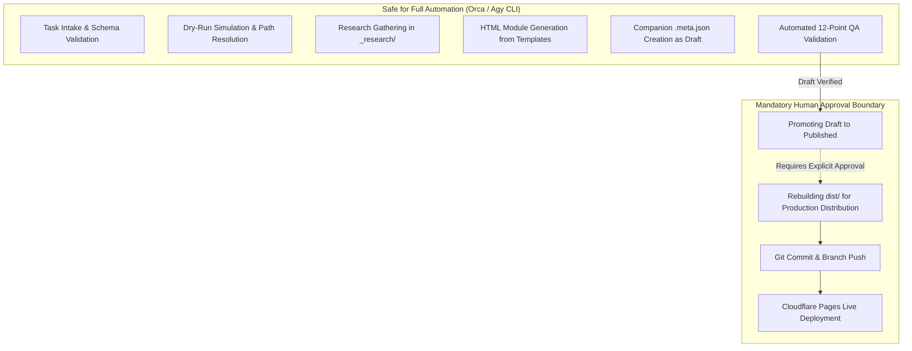

# Brain Knowledge Hub — Interface Audit: Orca ↔ Agy CLI
## Current Interface State, Automation Boundaries, and Gaps

### 1. Executive Summary

This audit assesses the readiness of the **Brain Knowledge Hub** static publishing engine (`D:\Brain\05_Knowledge`) for automated orchestration by **Orca** and execution by **Agy CLI**.

The core pipeline built in Phase 3 establishes an effective foundation:
- Content destination resolution (`resolver.js`)
- HTML binder generation from templates (`generator.js`)
- 12-point post-generation QA validation (`validator.js`)
- Manual draft promotion controller (`promoter.js`)
- Unified command-line interface (`index.js`)

However, the existing interface was designed primarily for human CLI use. It exhibits stream pollution, lacks pre-generation contract validation, has no dry-run simulation, and leaves automation boundaries implicit. This document identifies these limitations and specifies the architectural hardening required for reliable agent consumption.

---

### 2. Interface Inventory & Current Capabilities

| Component | Current Implementation | Capabilities | Gaps for Agent Consumption |
| :--- | :--- | :--- | :--- |
| **CLI Dispatcher** (`index.js`) | Node.js script using `parseArgs()` | Accepts `--task`, `--topic`, `--subject`, `--json`, `--status`, `--force` | Stdout is polluted by nested `build()` logs; lacks `--dry-run`; error handling prints to stderr only |
| **Destination Resolver** (`resolver.js`) | Alias map + slug normalization | Maps 9 canonical subjects; detects slug collisions | Throws raw Error strings; no structured error payload; does not validate full task schemas |
| **Content Generator** (`generator.js`) | Template replacement engine | Generates HTML and companion `.meta.json`; default fallback sections | Assumes valid input; does not validate research provider attributes or source reference syntax |
| **QA Validator** (`validator.js`) | 12-point post-generation validator | Checks DOCTYPE, metadata, subject placement, nav links, and draft isolation in `dist/` | Invokes `build()` directly, generating console logs that leak into agent stdout streams |
| **Draft Promoter** (`promoter.js`) | Promotion workflow | Upgrades `.meta.json` from `draft` to `published` and rebuilds `dist/` | Safe only when executed under human supervision; lacks granular audit trails |

---

### 3. Detailed Gap Analysis for Agent Workflows

#### 3.1 Stdout Stream Pollution
- **Problem**: When Orca or Agy CLI invokes `node Website/scripts/pipeline/index.js create --task task.json --json`, the internal QA validator calls `build()`. The build system emits multiple lines of human-readable text (`[1/6] Cleaned and initialized dist/...`) directly to `console.log`.
- **Impact**: Any agent parsing `stdout` via `JSON.parse(stdout)` will crash with a syntax error because the stream contains interleaved non-JSON text.
- **Remediation**: All diagnostic, build, and progress logs must be routed strictly to `stderr` or suppressed when the `--json` flag is present. `stdout` must contain *only* the single machine-readable JSON response object.

#### 3.2 Absence of Dry-Run Mode (`--dry-run`)
- **Problem**: An agent cannot query the pipeline to inspect destination folder paths, canonical slug derivation, or collision risks without actually creating files on disk.
- **Impact**: An agent cannot verify its plan or check whether a topic will collide before committing write operations.
- **Remediation**: Add a `--dry-run` flag to the pipeline CLI. Under `--dry-run`, the pipeline resolves the destination, checks for slug collisions, validates the task schema, and returns the projected outcome without touching the filesystem.

#### 3.3 Lack of Pre-Generation Contract Validation
- **Problem**: Current validation (`validator.js`) only checks the generated HTML *after* it has already been written to disk. If an input task has missing fields, an invalid subject, or invalid types, the pipeline fails mid-execution or produces malformed files.
- **Impact**: Failed runs leave orphaned files or write to unintended directories before encountering a validation error.
- **Remediation**: Introduce a pre-generation validation layer (`task-validator.js`) that validates the input contract against a strict schema *before* any file operations or directory creations occur.

#### 3.4 Unstructured Error Handling
- **Problem**: Exceptions throw generic JavaScript `Error` objects with plain text messages (e.g. `throw new Error(...)`).
- **Impact**: An orchestrator like Orca cannot easily discriminate between user errors (e.g., duplicate slug), system errors (e.g., template missing), or validation failures, making automated recovery impossible.
- **Remediation**: Standardize error reporting on a structured error schema with discrete error codes (e.g., `SLUG_COLLISION_DETECTED`, `SUBJECT_NOT_CANONICAL`, `SCHEMA_VALIDATION_FAILED`).

#### 3.5 Research Provider Abstraction Gap
- **Problem**: The pipeline currently does not formalize how research notes or synthesized references from external tools (such as OpenResearch) are structured and ingested.
- **Impact**: Risk of agents dumping ad-hoc research files directly into canonical subject directories.
- **Remediation**: Establish isolated scratch directories (`_research/<task_id>/`) for external research artifacts and support a structured `research_provider` contract field (`null` or `"openresearch"`).

---

### 4. Safe vs. Unsafe Automation Boundaries

To maintain repository integrity and prevent unauthorized publishing, strict boundaries are established:

#### Safe Operations (Fully Automated by Agents):
1. Parsing incoming user prompts into canonical task contracts.
2. Executing pipeline `--dry-run` to preview slug, subject, and file locations.
3. Conducting research and saving scratch notes in `_research/<task_id>/`.
4. Generating new HTML study notebooks with status `draft`.
5. Running automated 12-point QA validation on generated drafts.
6. Auto-healing malformed HTML tags, missing anchors, or broken responsive tags.

#### Unsafe Operations (Human-in-the-Loop Required):
1. **Promoting to `published`**: Changing notebook status to `published` causes the static build engine to output the notebook to `dist/` and include it in `search-index.json`. This requires explicit human sign-off.
2. **Deleting or Overwriting Existing Notebooks**: Overwriting with `--force` or removing notebooks must never occur autonomously.
3. **Modifying Core Architecture or Governance**: Modifying `RULE.md`, `Website/scripts/build.js`, or master templates must remain restricted to human developers.
4. **Git Operations & Live Deployment**: No automated committing, pushing to remotes, or deploying to Cloudflare Pages.

---

### 5. Failure Taxonomy & Agent Recovery Paths

The following failure modes are identified for the agent workflow:

| Failure Category | Error Code | Root Cause | Automated Recovery Strategy |
| :--- | :--- | :--- | :--- |
| **Schema Error** | `MISSING_REQUIRED_FIELD` | Task JSON omitted `topic` or `subject` | Orca re-prompts user or infers missing parameter |
| **Taxonomy Error** | `SUBJECT_NOT_CANONICAL` | Subject not one of the 9 canonical directories | Agy CLI maps alias to canonical subject using alias table |
| **Format Error** | `SLUG_INVALID_FORMAT` | Slug has uppercase or special chars | Agy CLI normalizes slug using standard `slugify()` |
| **Collision Error** | `SLUG_COLLISION_DETECTED` | Slug already exists in another subject | Orca appends topic qualifier to generate unique slug |
| **Markup Error** | `QA_VALIDATION_FAILED` | Broken nav anchor, missing DOCTYPE, or bad layout | Agy CLI repairs template tokens and re-validates |
| **Provider Error** | `MISSING_RESEARCH_PROVIDER` | `research_enabled: true` but provider is `null` | Reject task until provider is specified or disabled |

---

### 6. Audit Conclusion & Next Steps

The Brain Knowledge Hub's existing pipeline is structurally sound and adheres to the Source of Truth rule. By implementing:
1. Pure JSON stdout separation,
2. Pre-generation task schema validation (`task-validator.js`),
3. The `--dry-run` simulation capability,
4. Clear orchestrator handbooks (`ORCA_INTEGRATION.md`, `AGY_INTEGRATION.md`),

the pipeline will be fully agent-ready, robust against stream corruption, and safe from unauthorized publishing.
