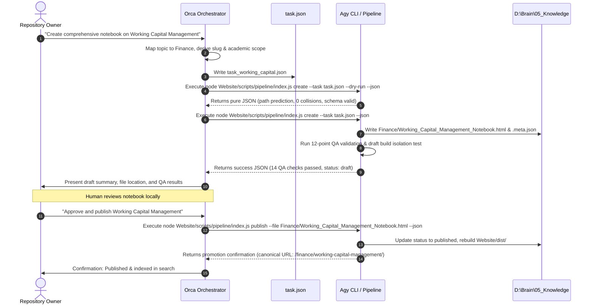

# Brain Knowledge Hub — Orca Orchestration Integration Guide

## High-Level Orchestrator Operational Guide

### 1. Overview & Architectural Role

In the **Brain Knowledge Hub** ecosystem, **Orca** serves as the **Autonomous Task Orchestrator**. 

Orca's primary responsibilities are:
1. **Intent Understanding**: Deconstructing high-level user directives into structured, validated task contracts conforming to `AGENT_CONTRACT.md`.
2. **Taxonomy Routing**: Mapping user requests to one of the 9 canonical subject divisions defined in `RULE.md`.
3. **Execution Delegation**: Invoking **Agy CLI** workers to execute research, draft generation, and QA validation.
4. **Safety & Governance**: Enforcing that all newly generated material remains strictly in `draft` status until explicitly reviewed and approved by the human repository owner.
5. **Promotion Supervision**: Executing validated promotion commands upon human authorization and verifying static build and search index updates.

Orca **never**:
- Directly commits to Git or pushes to remotes.
- Automatically promotes drafts to `published` without explicit human approval.
- Modifies canonical master notebooks (`ERP_Exam_Notebook.html`) or core governance rules (`RULE.md`).

---

### 2. End-to-End Orchestration Workflow



---

### 3. Task Contract Construction

When Orca receives a user prompt, it parses the intent and generates a task contract file (e.g. `_templates/tasks/task_20261004_wcm01.json`).

#### 3.1 Canonical Mapping Rules:
- **Operations**: Supply chain, ERP, TOC, logistics, inventory, manufacturing, procurement.
- **Finance**: Corporate finance, working capital, valuation, derivatives, cost accounting, budgeting.
- **AI**: LLMs, prompt engineering, agents, machine learning, transformer models.
- **Analytics**: Forecasting, statistics, data modeling, Power BI, time series.
- **Business**: Case frameworks, strategy, market entry, product management.
- **Management**: Leadership, organizational behavior, team dynamics.
- **Technology**: Cloud architecture, DevOps, web systems, software engineering.
- **Placement_Interview**: Coding questions, case interviews, behavioral prep.
- **General**: Study toolkits, cross-disciplinary methodology.

#### 3.2 Concrete Task Contract Example:
```json
{
  "task_id": "task_20261004_wcm01",
  "operation": "create_notebook",
  "topic": "Working Capital Management",
  "title": "Working Capital Management · Cash Conversion Cycle & Liquidity Blueprints",
  "subject": "Finance",
  "category": "Corporate Finance",
  "destination_subfolder": "Corporate_Finance",
  "slug": "working-capital-management",
  "audience": "MBA & Finance Executives",
  "academic_level": "graduate",
  "depth": "comprehensive",
  "research_enabled": false,
  "research_provider": null,
  "publication_status": "draft",
  "author": "Orca / Agy CLI",
  "tags": [
    "Finance",
    "Working Capital",
    "Cash Conversion Cycle",
    "Treasury",
    "Liquidity"
  ]
}
```

---

### 4. Executing Pipeline Operations via Subprocess

Orca invokes the pipeline CLI using child processes. When `--json` is supplied, Orca reads `stdout` directly with `JSON.parse()`.

#### 4.1 Dry-Run Simulation Command:
```bash
node Website/scripts/pipeline/index.js create --task _templates/tasks/task_20261004_wcm01.json --dry-run --json
```

**Orca Evaluation Logic**:
```javascript
const { stdout, stderr } = await exec(command);
const result = JSON.parse(stdout);

if (result.status === 'success' && result.ready_for_execution) {
  // Proceed to draft generation
} else if (result.collisions_detected.length > 0) {
  // Colliding slug: mutate slug and re-simulate
  task.slug = `${task.slug}-corporate`;
}
```

#### 4.2 Draft Generation Command:
```bash
node Website/scripts/pipeline/index.js create --task _templates/tasks/task_20261004_wcm01.json --json
```

**Expected stdout**:
```json
{
  "task_id": "task_20261004_wcm01",
  "status": "success",
  "operation": "create_notebook",
  "dry_run": false,
  "output_files": {
    "notebook_html": "D:\\Brain\\05_Knowledge\\Finance\\Corporate_Finance\\Working_Capital_Management_Notebook.html",
    "metadata_json": "D:\\Brain\\05_Knowledge\\Finance\\Corporate_Finance\\Working_Capital_Management_Notebook.meta.json"
  },
  "notebook": {
    "title": "Working Capital Management · Cash Conversion Cycle & Liquidity Blueprints",
    "subject": "Finance",
    "slug": "working-capital-management",
    "status": "draft",
    "read_time_minutes": 35
  },
  "validation_results": {
    "valid": true,
    "checks_passed": 14,
    "checks_failed": 0
  },
  "publication_status": "draft"
}
```

---

### 5. Error Handling & Automated Retries

When the pipeline exits with a non-zero code, Orca extracts the JSON error from `stdout`:

```json
{
  "task_id": "task_20261004_wcm01",
  "status": "error",
  "error_code": "SLUG_COLLISION_DETECTED",
  "message": "Slug collision detected: Slug 'working-capital-management' is already used by 'D:\\Brain\\05_Knowledge\\Finance\\WCM.html'.",
  "details": {
    "slug": "working-capital-management",
    "colliding_file": "D:\\Brain\\05_Knowledge\\Finance\\WCM.html"
  }
}
```

#### Orca Automated Recovery Matrix:

| Error Code | Orca Action |
| :--- | :--- |
| `SLUG_COLLISION_DETECTED` | Append subcategory or academic qualifier (e.g. `working-capital-management-corporate`) and retry. |
| `SUBJECT_NOT_CANONICAL` | Consult `RULE.md` alias dictionary to map input subject to canonical folder. |
| `MISSING_REQUIRED_FIELD` | Re-parse user prompt or populate defaults from schema. |
| `MISSING_RESEARCH_PROVIDER` | Set `research_enabled: false` or specify `"openresearch"`. |
| `QA_VALIDATION_FAILED` | Delegate to Agy CLI to inspect `errors` array, patch markup, and re-run `validate`. |

---

### 6. Human-in-the-Loop Approval & Promotion Protocol

Under no circumstances should Orca automatically promote drafts to production.

#### 6.1 Presenting Results to the Human:
Upon successful draft creation, Orca provides the human owner with:
- Topic and canonical subject destination.
- Local path to the generated HTML notebook.
- Summary of QA assertions passed (e.g., "14 of 14 checks passed, 0 failures").
- Confirmation that the notebook is safely excluded from `Website/dist/` and search indexing.
- Prompt requesting human review: *"Review the draft notebook locally. Say 'Approve' to promote to production."*

#### 6.2 Executing Promotion:
Upon receiving explicit human approval, Orca triggers promotion:
```bash
node Website/scripts/pipeline/index.js publish --file "D:/Brain/05_Knowledge/Finance/Corporate_Finance/Working_Capital_Management_Notebook.html" --json
```

**Promotion Result Verification**:
```json
{
  "success": true,
  "htmlFilePath": "D:\\Brain\\05_Knowledge\\Finance\\Corporate_Finance\\Working_Capital_Management_Notebook.html",
  "title": "Working Capital Management · Cash Conversion Cycle & Liquidity Blueprints",
  "subject": "Finance",
  "slug": "working-capital-management",
  "canonicalUrl": "/finance/working-capital-management/",
  "canonicalPath": "D:\\Brain\\05_Knowledge\\Website\\dist\\finance\\working-capital-management\\index.html",
  "indexedInSearch": true
}
```
Orca verifies:
1. `success === true`
2. `canonicalPath` exists on disk.
3. `indexedInSearch === true`.
Orca then reports the live canonical URL (`/finance/working-capital-management/`) to the user.
