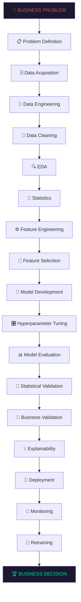
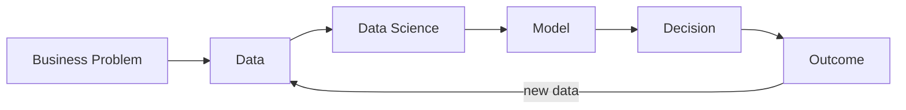

# 🧠 The Data Science Roadmap

> **One mental model to memorize:**
> every piece of your resume, every project, every interview question lives somewhere on this pipeline.



**And the loop that never closes:**



---

## 🗺️ The 8 Levels

> Data Science is not 40 disconnected subjects — it is **8 levels stacked on each other**.
> Your profile's power move: **Data Science + AI + Time Series + Operations/Inventory + Business Analytics + AI Agents** — not a generic "ML engineer who knows 50 libraries."

### Legend

| Symbol | Meaning |
|:---:|---|
| 🔴 | Critical — master first |
| 🟠 | High — build after critical |
| 🟡 | Supporting — defend on resume |
| ⚪ | Roadmap — level-up knowledge |
| ✅ | Deep-dive note exists |
| 🔗 | Existing note — cross-referenced |

---

### LEVEL 1 — 🧱 Foundation

> *Every road starts here. Your HackerRank 5★ Python lives here.*

| Topic | Deep-dive | Tier | Status |
|---|---|:---:|:---:|
| Python Fundamentals | [[../02_ANALYTICS/Python/Python_Fundamentals]] | 🔴 | ✅ |
| Pandas & NumPy | [[../02_ANALYTICS/Python/Pandas_NumPy]] | 🔴 | ✅ |
| SQL Fundamentals | [[../02_ANALYTICS/SQL/SQL_Fundamentals]] | 🔴 | ✅ |
| SQL Window Functions | [[../02_ANALYTICS/SQL/SQL_Window_Functions]] | 🔴 | ✅ |
| SQL Interview Patterns | [[../02_ANALYTICS/SQL/SQL_Interview_Patterns]] | 🔴 | ✅ |
| Git & GitHub | [[../08_TECHNOLOGY/Git_GitHub]] | 🟡 | ✅ |
| Excel Toolkit | [[../08_TECHNOLOGY/Excel_Toolkit]] | 🟡 | ✅ |

---

### LEVEL 2 — 📊 Analytics

> *Turning raw data into defensible insight. Your SIRP's statistics layer lives here.*

| Topic | Deep-dive | Tier | Status |
|---|---|:---:|:---:|
| Distributions & Probability | [[../02_ANALYTICS/Statistics/Distribution_Probability]] | 🔴 | ✅ |
| Statistical Tests | [[../02_ANALYTICS/Statistics/Statistical_Tests]] | 🔴 | ✅ |
| Hypothesis Testing | 🔗 [[../02_ANALYTICS/Statistics/Hypothesis_Testing]] | 🔴 | ✅ |
| Correlation & Causality | 🔗 [[../02_ANALYTICS/Statistics/Correlation]] · [[../02_ANALYTICS/Statistics/Causality]] | 🔴 | ✅ |
| Regression | 🔗 [[../02_ANALYTICS/Statistics/Regression]] | 🔴 | ✅ |
| Model Comparison — DM Test & Holm | [[../02_ANALYTICS/Statistics/Model_Comparison_DMHolm]] | 🟠 | ✅ |
| Exploratory Data Analysis | [[../02_ANALYTICS/EDA]] | 🟡 | ✅ |
| Power BI Fundamentals | [[../02_ANALYTICS/Power_BI/Power_BI_Fundamentals]] | 🔴 | ✅ |
| DAX | 🔗 [[../02_ANALYTICS/Power_BI/DAX_Fundamentals]] · [[../02_ANALYTICS/Power_BI/DAX_Advanced]] | 🔴 | ✅ |
| Star Schema & Modeling | 🔗 [[../02_ANALYTICS/Power_BI/Star_Schema]] · [[../02_ANALYTICS/Power_BI/Dashboard_Design]] | 🔴 | ✅ |
| Tableau Fundamentals | [[../05_GENERAL/Tableau_Fundamentals]] | 🟡 | ✅ |
| Data Visualization Principles | [[../03_BUSINESS/Data_Storytelling]] | 🟠 | ✅ |

---

### LEVEL 3 — 🤖 Core Data Science

> *Where raw data becomes model-ready — and where most interview candidates collapse.*

| Topic | Deep-dive | Tier | Status |
|---|---|:---:|:---:|
| ML Fundamentals | [[../01_AI/ML_Fundamentals]] | 🔴 | ✅ |
| Feature Engineering | [[../02_ANALYTICS/Feature_Engineering]] | ⚪ | ✅ |
| Feature Selection | [[../02_ANALYTICS/Feature_Engineering]] (§selection) | ⚪ | ✅ |
| Model Evaluation | [[../02_ANALYTICS/Model_Evaluation]] | ⚪ | ✅ |
| Data Leakage | [[../02_ANALYTICS/Data_Leakage]] | ⚪ | ✅ |
| Model Validation & Cross-Validation | [[../02_ANALYTICS/Model_Validation]] | ⚪ | ✅ |
| Unsupervised Learning & Clustering | [[../01_AI/Unsupervised_Learning]] | ⚪ | ✅ |
| Hyperparameter Tuning | [[../01_AI/ML_Fundamentals]] (§tuning) | ⚪ | ✅ |

---

### LEVEL 4 — 🌳 Advanced ML

> *Trees, ensembles, and the bias–variance war.*

| Topic | Deep-dive | Tier | Status |
|---|---|:---:|:---:|
| Decision Trees & Ensembles (RF, XGBoost) | [[../01_AI/Advanced_ML_Ensembles]] | ⚪ | ✅ |
| Bias–Variance & Regularization | [[../01_AI/ML_Fundamentals]] (§bias-variance) | 🔴 | ✅ |
| Explainable AI (SHAP, LIME) | [[../01_AI/Explainable_AI]] | ⚪ | ✅ |
| Anomaly Detection | [[../01_AI/Anomaly_Detection]] | ⚪ | ✅ |
| Experimentation / A-B Testing | [[../03_BUSINESS/AB_Testing]] | ⚪ | ✅ |

---

### LEVEL 5 — ⏱️ Specialized Analytics ⭐ *your edge*

> **This is where your SIRP becomes a weapon.** You didn't just read about the model ladder — you *ran* it end-to-end, validated it statistically, and connected it to inventory economics.

| Topic | Deep-dive | Tier | Status |
|---|---|:---:|:---:|
| Time-Series Fundamentals | [[../02_ANALYTICS/Forecasting/Time_Series_Fundamentals]] | 🔴 | ✅ |
| The Forecasting Model Ladder | [[../02_ANALYTICS/Forecasting/Forecast_Model_Ladder]] | 🔴 | ✅ |
| Forecast Metrics & MASE | [[../02_ANALYTICS/Forecasting/Forecast_Metrics_MASE]] | 🔴 | ✅ |
| Intermittent Demand (ADI · CV²) | [[../02_ANALYTICS/Forecasting/Intermittent_Demand_ADI_CV2]] | 🔴 | ✅ |
| LSTM Neural Forecasting | [[../02_ANALYTICS/Forecasting/LSTM_Neural_Forecasting]] | 🔴 | ✅ |
| Inventory Optimization | [[../02_ANALYTICS/Forecasting/Inventory_Optimization]] | 🟠 | ✅ |
| Forecast-to-Decision Framework | [[../02_ANALYTICS/Forecasting/Forecast_to_Decision]] | 🟠 | ✅ |
| Operations Analytics | 🔗 [[../07_OPERATIONS/TATA_MOTORS/Methodology]] | 🟠 | ✅ |
| Root Cause Analysis | [[../07_OPERATIONS/RCA]] | 🟠 | ✅ |
| Process Mapping | [[../07_OPERATIONS/Process_Mapping]] | 🟠 | ✅ |

---

### LEVEL 6 — 🧠 Deep Learning + AI

> *From perceptrons to attention. LSTM you did; transformers you defend.*

| Topic | Deep-dive | Tier | Status |
|---|---|:---:|:---:|
| Deep Learning Fundamentals | [[../01_AI/Deep_Learning_Fundamentals]] | ⚪ | ✅ |
| RNN / LSTM / GRU | 🔗 [[../02_ANALYTICS/Forecasting/LSTM_Neural_Forecasting]] | 🔴 | ✅ |
| NLP — Classical to Transformers | [[../01_AI/NLP]] | 🟡 | ✅ |
| Computer Vision & OCR | [[../08_TECHNOLOGY/OpenCV_EasyOCR]] | 🟡 | ✅ |

---

### LEVEL 7 — 🚀 GenAI Engineering

> *Your BTracker territory. Production-grade AI, not just chat.*

| Topic | Deep-dive | Tier | Status |
|---|---|:---:|:---:|
| LLM Fundamentals | 🔗 [[../01_AI/LLMs/LLM_Fundamentals]] | 🟠 | ✅ |
| AI Agents | 🔗 [[../01_AI/LLMs/AI_Agents]] | 🟠 | ✅ |
| Tool Calling | 🔗 [[../01_AI/LLMs/Tool_Calling]] | 🟠 | ✅ |
| MCP Architecture | 🔗 [[../01_AI/MCP/MCP_Architecture]] | 🟠 | ✅ |
| FastAPI | [[../08_TECHNOLOGY/FastAPI]] | 🟠 | ✅ |
| Streamlit | [[../08_TECHNOLOGY/Streamlit]] | 🟠 | ✅ |
| React / JavaScript | [[../08_TECHNOLOGY/React_JavaScript]] | 🟡 | ✅ |

---

### LEVEL 8 — 🏭 Production Data Science

> *What separates a notebook from a system.*

| Topic | Deep-dive | Tier | Status |
|---|---|:---:|:---:|
| PySpark & Distributed Computing | [[../08_TECHNOLOGY/PySpark]] | 🟡 | ✅ |
| SAP HANA | [[../08_TECHNOLOGY/SAP_HANA]] | 🟡 | ✅ |
| Power Automate | [[../08_TECHNOLOGY/Power_Automate]] | 🟡 | ✅ |
| Production & Software Engineering | [[../08_TECHNOLOGY/Production_Concepts]] | 🟡 | ✅ |
| Data Engineering Fundamentals | [[../08_TECHNOLOGY/Data_Engineering]] | ⚪ | ✅ |
| Docker & Deployment | [[../08_TECHNOLOGY/Docker_Deployment]] | ⚪ | ✅ |
| Cloud Fundamentals | [[../08_TECHNOLOGY/Cloud_Fundamentals]] | ⚪ | ✅ |
| MLOps | [[../08_TECHNOLOGY/MLOps]] | ⚪ | ✅ |
| Reproducibility & Governance | [[../02_ANALYTICS/Reproducibility]] | ⚪ | ✅ |

---

## 💼 The Business Layer (crosses all levels)

> Technology alone doesn't get you hired as an **analyst** — the ability to move between code and the P&L does.

| Topic | Deep-dive | Tier | Status |
|---|---|:---:|:---:|
| Business Analytics & KPI Design | [[../03_BUSINESS/Business_Analytics]] | 🟠 | ✅ |
| Business Analysis (BA Toolkit) | [[../03_BUSINESS/BA_Toolkit]] | 🟠 | ✅ |
| Consulting & Case Skills (MECE) | [[../03_BUSINESS/Consulting_Case_Skills]] | 🟠 | ✅ |
| GTM Analytics | [[../03_BUSINESS/GTM_Analytics]] | 🟠 | ✅ |
| Product Analytics | [[../03_BUSINESS/Product_Analytics]] | 🟠 | ✅ |
| Research Methodology | [[../03_BUSINESS/Research_Methodology]] | 🟠 | ✅ |
| Business Finance & SROI (HavenOS) | [[../04_FINANCE/Business_Finance_SROI]] | 🟠 | ✅ |
| Communication — Technical → Business | [[../03_BUSINESS/Data_Storytelling]] (§comms) | ⚪ | ✅ |
| Responsible AI | [[../01_AI/Responsible_AI]] | ⚪ | ✅ |

---

## 📂 Where Everything Lives

```text
Placement_Interview/
├── 00_START_HERE/     ← this roadmap · curr_plan.md · MASTER_INDEX.md
├── 01_AI/             ← Levels 3·4·6·7 (ML, DL, LLM, Agents, MCP)
├── 02_ANALYTICS/      ← Levels 1·2·5 (Python, SQL, Stats, Power BI, Forecasting ⭐)
├── 03_BUSINESS/       ← Business layer (BA, GTM, Consulting, Storytelling)
├── 04_FINANCE/        ← SROI & financial analysis
├── 05_GENERAL/        ← Tableau & misc
├── 07_OPERATIONS/     ← Tata Motors · RCA · Process Mapping
├── 08_TECHNOLOGY/     ← Levels 7·8 (FastAPI, PySpark, SAP, MLOps…)
├── 09_RESUME_PROJECTS/   ← project interview stories
├── 13_FORMULAS/       ← one formula sheet
├── 14_CHEAT_SHEETS/   ← rapid-review per 🔴 topic
└── 16_RESUME_DEFENSE/ ← 25 conceptual questions with model answers
```

---

## 🎯 The End-State Test

> You are done not when you can recite these topics — but when you can take **any business problem** and walk this chain without notes:

```text
What is the problem? → What data do I need? → How do I get it?
→ Is it trustworthy? → What does it tell me? → What statistical relationships exist?
→ Stats, ML, DL, forecasting or optimization? → How do I validate without leakage?
→ Is the improvement statistically AND practically meaningful?
→ How does it change the business decision? → How do I deploy and monitor it?
```

That is the difference between **knowing Data Science tools** and **thinking like a Data Scientist**.

---

## 🔗 Navigation

| Need | Go |
|---|---|
| What am I doing right now? | [[curr_plan]] |
| Flat topic checklist (legacy) | [[../../master_list]] |
| Resume claims & numbers | [[MASTER_INDEX]] |
| Project interview stories | [[../09_RESUME_PROJECTS/PROJECT_STORIES]] |
| Rapid revision | [[../14_CHEAT_SHEETS/CHEAT_INDEX]] |
