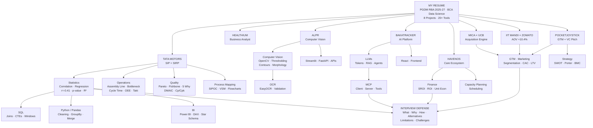

# Resume Knowledge Map

> **Source:** `05_Knowledge/Resume Shiva-7.pdf` + `04_Career/Tata Motors Internship/_srivatsa_sip_extract.txt`
> **Purpose:** Visual dependency graph — every resume claim → knowledge required to defend it

---

## Master Map



---

## Domain Coverage

| Domain | Resume Anchors | Primary Knowledge Graph |
|---|---|---|
| **01_AI** | BakaTracker (GenAI+MCP), ALPR (CV/OCR), NLP/LLMs | AI Fund → ML → NLP → LLMs → GenAI → MCP → CV → OCR |
| **02_ANALYTICS** | Python, SQL, Power BI, Tableau, Pandas, Excel | Python → Pandas → SQL → Excel → Power BI/DAX → Storytelling |
| **03_BUSINESS** | MICA×UCB, Zomato AOV, PocketJoystick GTM | Segmentation → Positioning → GTM → CAC/LTV → Funnel → Pricing |
| **04_FINANCE** | HavenOS SROI ₹6.40, ₹60K pilot, 20% cost | Revenue/Cost → Margin → ROI → SROI → NPV/IRR → Unit Econ |
| **05_GENERAL** | HR, leadership, career narrative | Tell-me-about-yourself → STAR → Why RBA → Why consulting |
| **06_MANAGEMENT** | Art Club VP, Co-Founder, team leadership | Leadership → Delegation → Conflict → Stakeholder → Decision |
| **07_OPERATIONS** | Tata Motors (96 stations, 1M records, r=-0.41) | Mfg → Quality → Workforce → Process Map → Bottleneck → KPI |
| **08_TECHNOLOGY** | FastAPI, React, Git, SAP HANA, Power Automate | HTTP/REST → FastAPI → React → Git → SAP HANA → Power Automate |

---

## Cross-Domain Dependency Graph

```text
                    MY RESUME
                        │
     ┌──────────────────┼──────────────────┐
     ↓                  ↓                  ↓
 TATA MOTORS        BAKATRACKER           ALPR
     │                  │                  │
 Statistics            LLMs               CV
 Regression            MCP                OpenCV
 SQL                   Agents             OCR
 Python                APIs               EasyOCR
 Power BI              React              Streamlit
 Operations            FastAPI            Image Processing
     │                  │                  │
     └─────────────┬────┴────────────┬─────┘
                   ↓                 ↓
              BUSINESS VALUE    INTERVIEW
                   │                 │
                   ↓                 ↓
             ROI / KPI / Impact  QUESTIONS
                                     │
                                     ↓
                               CROSS-QUESTIONS
                                     │
                                     ↓
                                STRESS TEST
```

---

## Prerequisite Chains (What Must Be Learned First)

| To Defend | You Must Know First | Then |
|---|---|---|
| r = -0.41 | Mean, variance, covariance → Pearson vs Spearman | Significance (p-value, CI) → Regression → Confounding → Causality |
| ~440 defects / 1K engines | Linear regression (slope, intercept, residuals, R²) | Effect size → Practical significance → Winsorising |
| 1M records / 96 stations | SQL (GROUP BY, JOINs, windows) → Pandas (groupby, merge) | Data cleaning → Dashboarding → KPI design |
| 70% reporting reduction | Baseline measurement → Automation workflow | SAP HANA extraction → Power Automate triggers |
| MCP + BakaTracker | LLM fundamentals → Function calling → API vs MCP | MCP architecture (client/server/tools) → Agent workflows |
| ALPR pipeline | Pixels, RGB, grayscale → Thresholding, contours | OpenCV → EasyOCR → Validation → Lighting robustness |
| ₹6.40 SROI | ROI → Social value monetization → Deadweight/attribution | SROI 6-stage methodology |
| 10.4% AOV | AOV definition → GTM funnel → Upselling/bundling | Causal attribution vs correlation |

---

## Learning Dependency Order

```text
PHASE A — Foundations
  Python fundamentals → Pandas/NumPy → SQL fundamentals → Descriptive stats
         ↓
PHASE B — Analytics Core
  Correlation → Regression → Hypothesis testing → Power BI / DAX → Excel
         ↓
PHASE C — Operations Specialization (TATA MOTORS)
  Manufacturing → Quality → Process Mapping → Workforce Analytics → KPI
         ↓
PHASE D — AI Specialization
  ML fundamentals → NLP → LLMs → RAG → Agents → MCP → CV/OCR
         ↓
PHASE E — Business + Finance
  Marketing → GTM → Strategy → Finance (ROI, SROI, unit econ)
         ↓
PHASE F — Technology + Integration
  APIs → FastAPI → React → Git → SAP HANA → Power Automate
         ↓
PHASE G — Defense Layer
  Resume claims → Numbers → Project stories → Interview engine
```

---

## One-Sentence Rule

> **Every concept in this graph exists to answer: "How could an interviewer connect this back to my resume?"**

If a topic cannot be traced to a resume claim via this graph, it is out of scope for Phase 1.

---

## Sources

- Resume: `D:/Brain/05_Knowledge/Resume Shiva-7.pdf`
- SIP/SIRP: `D:/Brain/04_Career/Tata Motors Internship/_srivatsa_sip_extract.txt`
- Vault audit: `D:/Brain/09_Inbox/VAULT_AUDIT.md`
