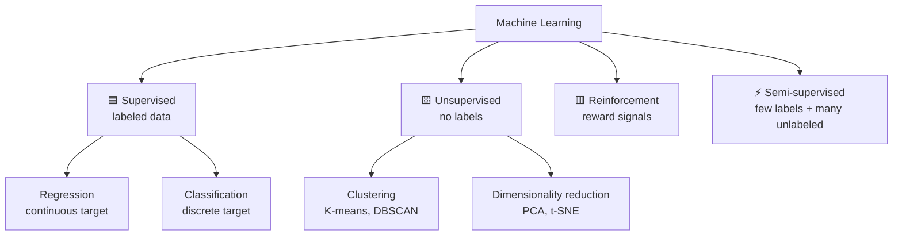

# 🤖 Machine Learning Fundamentals

> [!important] The gateway topic
> Every advanced claim on your resume — LSTM, forecasting, agents — decomposes into these fundamentals when an interviewer starts drilling. This is the note that makes "AI & Development" on your resume defensible from first principles.

---

## 1 · The Map of ML



**The framing sentence:** *"Supervised learning learns a mapping X→y from labeled examples; unsupervised finds structure without labels; reinforcement learns actions from reward."* Then volunteer where your work sits: *"My SIRP is supervised regression against future demand; the demand-archetype classification is unsupervised-flavored segmentation."*

---

## 2 · Regression — predicting numbers

| Model | Idea | When |
|---|---|---|
| Linear Regression | weighted linear sum, OLS fit | interpretable baseline |
| Ridge (L2) | shrinks coefficients | multicollinearity, keep all features |
| Lasso (L1) | zeros coefficients | automatic feature selection |
| Elastic Net | L1+L2 blend | correlated groups of features |
| Tree-based (RF/XGBoost) | nonlinear, interactions | tabular workhorse |

**Linear regression diagnostics (the level-2 connection):** R² (variance explained), residual plots (pattern = misspecification), multicollinearity (VIF), heteroscedasticity. Your SIP used OLS: *"defect rate ~ mean station skill gave ~440 fewer defects per skill point, R² ≈ 0.16, rising to 0.38 with complexity added — the skill effect survived controls."* Full treatment → [[../Statistics/Regression]].

---

## 3 · Classification — predicting categories

| Model | Idea | Strength / Weakness |
|---|---|---|
| Logistic Regression | linear → sigmoid → probability | interpretable baseline; linear boundary |
| KNN | majority vote of k nearest | no training, lazy; slow at scale, scale-sensitive |
| Decision Tree | rule splits on feature thresholds | readable; overfits alone |
| Random Forest | bagged tree ensemble | robust default; less interpretable |
| Gradient Boosting (XGBoost/LightGBM) | sequential trees correcting residuals | tabular SOTA; tuning-sensitive |
| SVM | max-margin hyperplane (+kernel) | strong on small clean data; slow big-n |
| Naive Bayes | Bayes + feature independence | fast text baseline; independence rarely true |

**Logistic regression isn't regression-as-usual:** it models P(y=1|x) via the sigmoid; coefficients are log-odds; threshold (0.5 default) is a *business decision* (fraud vs medical recall trade-offs).

**The spam-checkline:** *"Naive Bayes assumes features are conditionally independent given the class — false in reality, but fast and surprisingly strong on text."*

---

## 4 · The Training Ritual — the pipeline every model shares

```python
from sklearn.model_selection import train_test_split, cross_val_score
from sklearn.pipeline import Pipeline
from sklearn.preprocessing import StandardScaler
from sklearn.linear_model import LogisticRegression

X_train, X_test, y_train, y_test = train_test_split(
    X, y, test_size=0.2, stratify=y, random_state=42)     # stratify = keep class mix

pipe = Pipeline([
    ("scale", StandardScaler()),        # fit ONLY on train — inside the pipeline
    ("clf", LogisticRegression(max_iter=1000)),
])
scores = cross_val_score(pipe, X_train, y_train, cv=5, scoring="f1")
pipe.fit(X_train, y_train)
```

> [!important] Why the scaler lives *inside* the pipeline
> Fitting `StandardScaler` on the full dataset before splitting leaks test-set statistics into training — the classic preprocessing leakage. A Pipeline fits preprocessing on each CV fold's training portion only. This one habit is a live demonstration that you understand leakage — see [[Data_Leakage]].

---

## 5 · Bias–Variance — the theory that earns money

| | Bias (underfit) | Variance (overfit) |
|---|---|---|
| Symptom | train AND test error high | train error low, test error high |
| Cause | model too simple | model memorizes noise |
| Fix | more features, richer model, less regularization | more data, regularization, simpler model, early stopping, ensembling |

**The curve interviewers want:** total error = bias² + variance + irreducible noise; bias falls and variance grows with model complexity; the U between them is the generalization sweet spot.

**Regularization** = paying a penalty for complexity: L2 shrinks weights, L1 sparsifies, dropout randomly disables units (neural), early stopping caps training (your LSTM used it), max_depth caps trees. *"Regularization is how I spend a little bias to buy a lot of variance reduction."*

---

## 6 · Hyperparameter Tuning

| Method | How | Cost |
|---|---|---|
| Grid search | exhaustive over the grid | explodes combinatorially |
| **Random search** | sample configs | better coverage per compute (Bergstra: some params matter more) |
| Bayesian optimization | model the score surface, sample where promising | best for expensive fits (your LSTM) |
| Early stopping | validation-driven | free, always on |

**Parameters vs hyperparameters — one line:** *"Parameters are learned by the optimizer (weights); hyperparameters are chosen before training (learning rate, depth, α) — tuned by validation, never by test."* Touching the test set during tuning is test-set leakage: the test score becomes fiction.

---

## 7 · Evaluation — metric follows problem

| Task | Metrics |
|---|---|
| Regression | MAE, RMSE, R², adjusted R² (penalizes useless features) |
| Classification (balanced) | accuracy — fine when classes are balanced |
| Classification (imbalanced) | **precision, recall, F1, ROC-AUC, PR-AUC** |

**The confusion matrix economy (2×2):**

```text
                Predicted +     Predicted −
Actual +        TP              FN  (missed defect — escapes to the field)
Actual −        FP  (false alarm — rework)      TN
```

- **Precision** = TP/(TP+FP): "when I flag it, am I right?" — cost of false alarms
- **Recall** = TP/(TP+FN): "of all real cases, how many did I catch?" — cost of misses
- **F1** = harmonic mean — punishes imbalance between the two
- **Threshold tuning is a business decision:** moving the threshold slides along the precision-recall curve; pick the operating point from the *cost* of each error type (your Tata defect context: a missed defect escapes to the field — recall dominates; a false alarm costs rework)

> [!tip] The imbalanced-data line
> *"Accuracy is meaningless at 1% positives — 'all negative' scores 99%. I'd report PR-AUC (more informative than ROC-AUC under heavy imbalance), tune the threshold to the business cost, and fix the data with class weights or SMOTE — not by ignoring the problem."*

**Feature importance & interpretability:** tree importance (biased toward high-cardinality), permutation importance (model-agnostic), SHAP (additive attributions) → [[../../01_AI/Explainable_AI]]. Your SIP's complexity index and correlation matrix were manual interpretability: *"the skill–defect coefficient told the business which lever mattered."*

---

## 8 · Where Your Work Sits — the map to memorize

| Your project | ML category | Key concepts demonstrated |
|---|---|---|
| Tata defect/skill analysis | supervised regression + correlation | OLS, controls, effect size, association ≠ causation |
| SIRP demand forecasting | supervised regression (time series) | rolling-origin validation, leakage control, metric choice, DM/Holm |
| Demand archetypes | unsupervised segmentation | ADI/CV² feature engineering, per-segment evaluation |
| BTracker | AI engineering (agents) | LLM + tools — not classic ML, but say "same discipline: evaluation before deployment" |

---

## ⚡ Rapid-Fire Q&A

> **Supervised vs unsupervised?**
> Labels vs no labels — mapping X→y vs discovering structure in X.

> **Overfitting: detect and fix?**
> Train/test gap widening; fix with more data, regularization, early stopping, simpler model, ensembling.

> **Why is accuracy useless for fraud detection?**
> Class imbalance — 99% negative class means "predict never" scores 99%. Use precision/recall/PR-AUC and threshold on business cost.

> **Precision vs recall — when to sacrifice which?**
> Miss cost dominates (cancer, defect escapes) → maximize recall; false-alarm cost dominates (spam) → precision. Tune threshold, not the metric's definition.

> **Ridge vs Lasso?**
> L2 shrinks all coefficients (multicollinearity); L1 zeros some (selection). Elastic Net for correlated groups.

> **Bias-variance tradeoff in one sentence?**
> Underfit = too rigid (high bias); overfit = too memorizing (high variance); validation error's U-curve finds the balance.

> **How do you choose k in KNN?**
> Odd k avoids ties; cross-validate k — small k = flexible/overfit, large k = smooth/underfit; and features must be scaled (distance-based).

---

## 🔗 Where This Leads

| Next | Link |
|---|---|
| Ensembles & boosting in depth | [[../01_AI/Advanced_ML_Ensembles]] |
| Validation & leakage in depth | [[../02_ANALYTICS/Model_Validation]] · [[../02_ANALYTICS/Data_Leakage]] |
| Your applied instance | [[../02_ANALYTICS/Forecasting/LSTM_Neural_Forecasting]] |
| Statistics underneath | [[../02_ANALYTICS/Statistics/Statistical_Tests]] |
