# 🪜 The Forecasting Model Ladder

> [!important] The organizational idea of your SIRP
> Twelve models, arranged by **increasing complexity and data appetite** — from "tomorrow = today" to a global neural network. The ladder isn't a syllabus; it's an *experimental design*: each rung tests whether added complexity earns its keep. Your headline finding lives at the top of this ladder.

```mermaid
flowchart LR
    N["Naive<br/>1 param"] --> SN["Seasonal Naive"] --> MA["Moving Avg"] --> SES["SES<br/>1 param"] --> DES["Holt<br/>+trend"] --> TES["Holt-Winters<br/>+season"] --> ARIMA["ARIMA<br/>p,d,q"] --> SARIMA["SARIMA<br/>×seasonal"] --> CR["Croston<br/>intermittent"] --> SBA["SBA"] --> TSB["TSB"] --> LSTM["LSTM<br/>global NN"]
    style N fill:#e8f5e9
    style LSTM fill:#e3f2fd
    style CR fill:#fff3e0
    style SBA fill:#fff3e0
    style TSB fill:#fff3e0
```



---

## 1 · Baselines — rung zero (never skip them)

| Model | Forecast | Beats what |
|---|---|---|
| **Naive** | ŷ_{t+h} = y_t | "no information" benchmark |
| **Seasonal Naive** | ŷ_{t+h} = y_{t+h−m} (last season's value) | strong fixed seasonality |
| **Moving Average** | mean of last k observations | smooths noise, lags trend |

> [!important] Why baselines are non-negotiable
> *"If a 1-parameter naive forecast matches your neural network, the network has learned nothing beyond the data's inertia."* Your SIRP's baseline MASE anchors every claim on the ladder — and MASE itself is *normalized by the naive forecast* (see [[Forecast_Metrics_MASE]]).

---

## 2 · Exponential Smoothing Family

### SES — level only (no trend, no season)

$$\ell_t = \alpha y_t + (1-\alpha)\ell_{t-1}, \qquad \hat{y}_{t+1} = \ell_t$$

- α ∈ (0,1] = memory dial: α→0 stable mean, α→1 ≈ naive
- **When:** flat series, no trend/season. **One parameter** — hard to overfit.
- State: *"SES is a weighted average of the whole past with exponentially decaying weights."*

### DES / Holt — + trend

$$\ell_t = \alpha y_t + (1-\alpha)(\ell_{t-1} + b_{t-1}), \qquad b_t = \beta(\ell_t - \ell_{t-1}) + (1-\beta)b_{t-1}$$

- Second smoothing constant β damps the trend estimate; **damped trend** variant (φ) prevents explosive long-horizon forecasts — worth naming for h=28.

### TES / Holt-Winters — + seasonality

$$\text{level }(\alpha) + \text{trend }(\beta) + \text{seasonal }(\gamma)$$

- **Additive** season (constant swings) vs **multiplicative** (swings ∝ level — the retail default)
- m = seasonal period (7 for daily retail demand)
- **When:** stable trend + strong regular seasonality. Fails when seasonality *shifts* — it averages all past Decembers equally.

**ES vs ARIMA — the interview question:** ES models a *smoothed description of the level* (structural); ARIMA models the *correlation structure of the differences* (statistical). Similar accuracy in practice; ES has fewer parameters, ARIMA has richer diagnostics.

---

## 3 · ARIMA & SARIMA

### ARIMA(p, d, q)

$$\underbrace{\phi_p(B)}_{\text{AR: regress on past}} (1-B)^d y_t = c + \underbrace{\theta_q(B)}_{\text{MA: regress on past errors}} \varepsilon_t$$

- **AR(p)** — y_t depends on its own p past values (momentum)
- **I(d)** — difference d times to reach stationarity (trend removal)
- **MA(q)** — y_t depends on q past *shocks* (correction of recent surprises)
- Order selection: ACF/PACF signatures + AIC/BIC grid (auto_arima)
- **Requires stationarity after differencing** — that's the I

### SARIMA(p,d,q)(P,D,Q,m) — the seasonal extension

Adds seasonal AR/MA terms at lag m (7 for daily data) *plus* seasonal differencing (D): captures "this Monday vs last Monday" that plain ARIMA misses.

**Honest cost (say it):** SARIMA is **per-series** — one model per SKU. Your SIRP's scope decision: SARIMA on a sample of series, not the full population, for computational tractability (and it's in the Limitations chapter). Fitting thousands of SARIMAs is hours vs minutes — an operations reality, not laziness.

**SARIMA vs Holt-Winters:** SARIMA handles * correlated* seasonal deviations and richer dynamics; HW is simpler and more robust when the seasonality is stable. Ties → simpler model wins (parsimony).

---

## 4 · The Intermittent Trio — Croston, SBA, TSB

> [!important] Your specialized differentiator
> Ordinary methods (and their error metrics) fail when **most periods are zero**. Croston's insight: don't forecast the noisy series — forecast its *ingredients*.

**The decomposition:**

```text
Demand y_t = 0, 0, 5, 0, 0, 0, 3, 0, ...
              │             │
              occasion      occasion
```

| Method | Forecasts | Update on | Corrects what | Residual flaw |
|---|---|---|---|---|
| **Croston (1972)** | demand *size* (SES on z) & demand *interval* (SES on p) → rate = z/p | only non-zero periods | smoothing zeroes that bias naive SES | rate estimate biased **high** by ~α/2 |
| **SBA** (Syntetos-Boylan) | Croston × (1 − α/2) | same | removes the size bias | assumes demand *always* occurs when expected → **obsolescence risk blind** |
| **TSB** (Teunter-Syntetos-Babai, 2011) | P(demand occurs) (on ALL periods) × size (on demand periods) | **every** period for p | modern intermittency: probability, not intervals | needs tuning of two smoothing constants |

**Why TSB exists (the sharp answer):** Croston/SBA update the interval estimate *only when demand occurs* — so if demand *stops entirely*, the interval never updates and the forecast slowly becomes obsolete. TSB re-estimates occurrence probability **every period**, on every zero.

Full deep-dive → [[Intermittent_Demand_ADI_CV2]].

---

## 5 · LSTM — the top rung

- **One global network trained across all series** (not per-SKU): shares learned dynamics, scales to thousands of SKUs
- **28-day lookback** input window → next-step (recursive to horizon) prediction
- **History-only scaling** — fit scaler on training segment only; scaling on the full series leaks the future's mean/variance into training
- Strength: nonlinear interactions, cross-series patterns, no stationarity requirement
- Costs: data-hungry, opaque, slow, hyperparameter-sensitive — and *not automatically better*, which is your research's punchline

Full deep-dive → [[LSTM_Neural_Forecasting]].

---

## 6 · Choosing a Rung — the decision table

| Signal in the data | Start at |
|---|---|
| Flat, noisy | Naive → SES |
| Clear trend, no season | Holt (+ damping) |
| Trend + stable season | Holt-Winters |
| Rich autocorrelation, seasonal residuals | SARIMA |
| >30% zero periods | Croston → SBA → TSB |
| Thousands of related series, enough history | Global LSTM (vs simple baselines!) |

**The parsimony principle** — your ladder's philosophy, borrowed from Box: *"All models are wrong; some are useful"* — and the useful-est is usually the simplest one that captures the structure. Every rung must **earn** its complexity against the rung below, on rolling-origin MASE with DM+Holm significance — *and then* on inventory cost.

---

## ⚡ Rapid-Fire Q&A

> **SES vs DES vs TES?**
> Level / level+trend / level+trend+season — each adds a smoothed component and a smoothing constant; move up only when the component exists in the data.

> **ARIMA vs SARIMA?**
> SARIMA adds seasonal AR/MA/ differencing at period m; needed when residuals still show spikes at lag m.

> **Why d and D?**
> d removes non-seasonal trend; D removes seasonality — the stationarity workhorses of the I(ntegrated) part.

> **Croston vs SBA?**
> SBA multiplies Croston's rate by (1−α/2) to debias the high-rate estimate. Otherwise identical.

> **Croston vs TSB?**
> Croston models *intervals* updated only on demand; TSB models occurrence *probability* updated every period — better under obsolescence and long zero-runs.

> **Why not LSTM everywhere?**
> On dense demand it can win accuracy but still lose on inventory cost (your finding); on intermittent series it can lag the Croston family; and it costs training time, transparency, and maintenance. Complexity must be earned.

> **What do MA and AR actually mean?**
> MA: today = mean + weighted *past shocks*; AR: today = weighted *past values*. ACF/PACF signatures tell you which.

---

## 🔗 Where This Leads

| Next | Link |
|---|---|
| Foundations under the ladder | [[Time_Series_Fundamentals]] |
| Scoring the ladder | [[Forecast_Metrics_MASE]] |
| Rungs 9–11 in depth | [[Intermittent_Demand_ADI_CV2]] |
| Rung 12 in depth | [[LSTM_Neural_Forecasting]] |
| The ladder → business decision | [[Inventory_Optimization]] |
