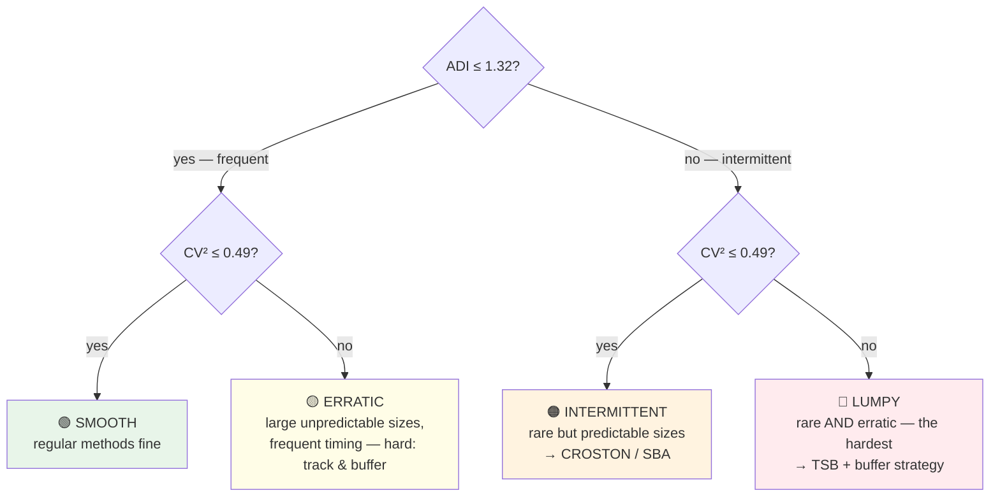

# 📦 Intermittent Demand

> [!important] Your specialized differentiator
> Most analytics candidates have never heard of ADI or CV². You classified an entire dataset by demand archetype and matched models to classes. This is the topic where you should *slow down* in the interview and enjoy it.

---

## 1 · What Is Intermittent Demand?

> [!tip] Definition
> Demand that occurs **only at certain periods**, with **zero demand in between** — and often with **variable size** when it does occur.

```text
Regular:    12, 14, 11, 15, 13, 12, 16 ...
Intermittent: 0,  0,  8,  0,  0,  0,  0,  3,  0, 12, ...
```

**Why ordinary forecasting fails on it:**
1. **SES/ARIMA smooth the zeros** → forecasts drift toward a positive constant → you *perpetually* over-order slow movers
2. **MAPE explodes** (division by zero) → you can't even score the models honestly
3. **Errors are non-normal** → significance tests and CIs need care
4. The business question isn't "how much?" but "**will there be demand at all — and if so, how much?**" — two questions, not one

**Where it lives:** spare parts, slow-moving SKUs, new products, long-tail retail — the M5 long tail is exactly this.

---

## 2 · The Classification Framework — ADI & CV²

Two dimensionless statistics (Syntetos & Babai, later Croston-classification):

| Statistic | Formula | Question it answers |
|---|---|---|
| **ADI** — Average Demand Interval | $\frac{\text{total periods}}{\text{number of non-zero demand periods}}$ | *how often* does demand occur? |
| **CV²** — squared coefficient of variation of *non-zero demand sizes* | $\left(\frac{\sigma_{\text{sizes}}}{\mu_{\text{sizes}}}\right)^2$ | *how erratic* is the size when it occurs? |

**The quadrant map** (thresholds ADI 1.32, CV² 0.49 — cite them as the standard cut-offs):



**Your SIRP's use:** ADI/CV² computed per series on M5 → demand archetypes → model-performance tables *per archetype* (so "LSTM loses on intermittent SKUs" is a per-class statement, not a hidden average). That segmentation discipline is the maturity marker.

---

## 3 · Croston's Method — the decomposition idea

### The mechanics (1972)

Split the intermittent series into two smooth streams, updated **only on demand occasions**:

```text
Demand:   0, 0, 5, 0, 0, 0, 3, 0, ...
              │        │
   z = demand SIZE, smoothed by SES(α_z) when demand ≠ 0
   p = demand INTERVAL, smoothed by SES(α_p) when demand ≠ 0

Forecast rate:  ŷ = z / p     (expected demand per period)
```

```python
if y_t != 0:
    z = alpha_z * y_t + (1 - alpha_z) * z
    p = alpha_p * interval_since_last + (1 - alpha_p) * p
forecast = z / p
```

**Why it works:** zeroes are *information about timing*, not about size. Croston refuses to let SES average them into the level; each stream gets its own memory.

**The rate-vs-sizes subtlety (say it):** Croston forecasts the **mean demand rate**, not a period-by-period demand sequence — it's flat between reviews. For *replenishment* (rate → order-up-to levels) that's exactly what's needed; for a per-day demand number it's the wrong shape.

---

## 4 · SBA — the bias fix

### The flaw in Croston

The ratio z/p of two SES-smoothed estimates is **biased high by ≈ α/2** on average — Croston systematically over-forecasts, which in inventory terms means quiet over-stocking of slow movers.

### The fix (Syntetos-Boylan Approximation, 2001)

$$\hat{y}_{SBA} = \left(1 - \frac{\alpha}{2}\right) \cdot \frac{z}{p}$$

One multiplier, bias removed, everything else identical. SBA is widely recommended as the **default** for intermittent demand — it's usually at least as good and often better.

---

## 5 · TSB — the modern method

### The flaw in Croston *and* SBA

Both update the interval estimate **only when demand occurs**. If demand *stops completely* (obsolescence, end-of-life SKU), the interval estimate **never updates again** — the forecast decays slowly toward stale positive demand that will never come.

### The fix (Teunter, Syntetos, Babai, 2011)

Reframe: forecast **occurrence probability × demand size**.

$$\hat{y}_{TSB} = P(\text{demand occurs in } t) \times E[\text{size} \mid \text{occurs}]$$

- **P(occurrence)**: Bernoulli smoothing updated **every period** — zeros *do* update it (probability decays toward 0 during dry spells)
- **Size**: SES updated only on demand occasions (unchanged)

| | Croston | SBA | TSB |
|---|---|---|---|
| Zero-demand periods update forecast? | ❌ | ❌ | ✅ |
| Corrects Croston's high bias? | — | ✅ (1−α/2) | ✅ (inherent: P ≤ 1) |
| Handles obsolescence / long dry spells | ❌ | ❌ | ✅ |
| Best regime | steady intermittency | steady intermittency (debiased) | volatile occurrence, obsolescence risk |

---

## 6 · Connecting to the Rest of Your Study

- **Metrics:** MAPE is unusable here (zeros) → the MASE justification — [[Forecast_Metrics_MASE]]
- **The ladder:** Croston family sits between statistical and neural rungs — [[Forecast_Model_Ladder]]
- **Inventory:** slow movers with rare demand drive *safety stock* logic differently; a rate forecast feeds order-up-to levels — [[Inventory_Optimization]]
- **Statistics:** non-normal errors → Wilcoxon over paired-t in comparisons — [[../Statistics/Statistical_Tests]]

> [!tip] The examiner-trap answer
> *"Why not just give LSTM the raw intermittent series?"* — Because with 90% zeros the gradient signal is dominated by predicting zero (cheap accuracy, useless forecast); the Croston family encodes the *structure* (occurrence vs size) that the network would have to discover from scratch. You can add: modern approaches *do* feed both (specialized losses / zero-inflated networks) — but the burden of proof is on the complex model.

---

## ⚡ Rapid-Fire Q&A

> **What is intermittent demand?**
> Demand occurring at irregular occasions with zero periods between, often with variable size — think spare parts and long-tail retail.

> **Define ADI and CV².**
> ADI = average gap between demand occasions (timing rarity); CV² = squared CV of non-zero sizes (size volatility). Cut-offs 1.32 / 0.49 → smooth / intermittent / erratic / lumpy.

> **Why does SES fail on intermittent series?**
> It averages the zeros into the level, producing a constant positive forecast — permanent overstock of slow movers.

> **What exactly does Croston smooth?**
> Two streams on demand occasions only: non-zero sizes (z) and intervals between occasions (p); forecast = z/p as a demand *rate*.

> **Why is Croston biased, and what's the fix?**
> The z/p ratio biases high by ≈α/2; SBA multiplies by (1−α/2).

> **When does TSB beat SBA?**
> When demand may *stop* (obsolescence) or occurrence is volatile — TSB updates occurrence probability every period; SBA can't see a demand stop until demand returns.

> **How did you use ADI/CV² in your SIRP?**
> Classified M5 series into demand archetypes, then evaluated every model *per archetype* — so conclusions like "simple models win on dense demand" are class-specific, not averaged away.

---

## 🔗 Where This Leads

| Next | Link |
|---|---|
| The full ladder context | [[Forecast_Model_Ladder]] |
| Scoring zero-heavy series honestly | [[Forecast_Metrics_MASE]] |
| From rate forecasts to order quantities | [[Inventory_Optimization]] |
