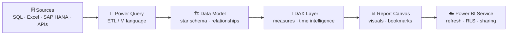

# 📈 Power BI Fundamentals

> [!important] Why this matters for YOU
> Certified **and** used in your internship — "automated Power BI dashboards providing near-real-time business insights." DAX and star schema have their own deep-dives (linked below); this note is the *platform* knowledge: architecture, data flow, visuals, governance.

---

## 1 · Architecture — the end-to-end flow



| Stage | Tool | Know this |
|---|---|---|
| Connect | connectors / gateway | Import (in-memory, fast, scheduled refresh) vs **DirectQuery** (live, no memory, slower visuals) vs **Live Connection** (pre-existing model, e.g. Analysis Services) |
| Transform | **Power Query (M)** | every step recorded, applied top-down — it's an ETL *audit log* |
| Model | relationships, cardinality | the star schema — see [[Star_Schema]] |
| Calculate | **DAX** | measures vs calculated columns — see [[DAX_Fundamentals]] |
| Deliver | Service | workspaces, apps, scheduled refresh, row-level security |

> [!tip] Import vs DirectQuery — the classic question
> *"Import = data compressed into memory: fastest visuals, but data is as fresh as the last refresh. DirectQuery = queries pass through to the source: always-current, but every visual interaction is a source query — model it for speed. Default: Import + scheduled refresh; DirectQuery when freshness beats latency."* ("Near-real-time" in your internship ⇒ this is the conversation.)

---

## 2 · Power Query — the ETL layer

- **M language**, every step a recorded transformation → reproducible by design
- Core operations: remove duplicates, change types, split/merge columns, unpivot (**the important one**), merge (join) & append (union)
- **Unpivot** — wide month-columns → tidy long rows: the single most valuable PQ skill for Excel-sourced data
- **Query folding** — PQ pushes steps back to the source as SQL; when folding stops (after certain steps), the engine pulls data locally. *Check "View Native Query" — if greyed out, folding broke.* Naming this = senior signal.

---

## 3 · Data Modeling — where dashboards live or die

### Star schema (deep-dive → [[Star_Schema]])

```text
            ┌────────────┐
            │ DimDate    │
            └─────┬──────┘
┌────────────┐    │    ┌────────────┐
│ DimProduct ├────┼────┤ DimStore   │
└─────┬──────┘    │    └─────┬──────┘
      │      ┌────┴─────┐    │
      └──────┤ FactSales ├────┘
             │ (measures)│
             └───────────┘
```

| Rule | Why |
|---|---|
| Facts = events (numeric, grain-locked) | one row per transaction/period |
| Dimensions = descriptive context | filter/slice axis |
| Single-direction filtering (Dim → Fact) | ambiguous paths break calculations |
| **Cardinality: 1-to-many from dim to fact** | many-to-many = last resort, with care |
| Conformed dimensions shared across facts | consistent slicing |

**Why not one big flat table?** *"Storage duplicates every description on every row; refresh reloads everything; and the semantic model gets ambiguous. The star schema separates concerns — dimensions change rarely, facts constantly."*

**Date dimension is mandatory** for time intelligence — contiguous days, marked as date table, or `TOTALYTD`-family functions misbehave.

---

## 4 · DAX — orientation (deep-dives linked)

| Concept | Essence |
|---|---|
| **Measure** | calculated at query time, respects filter context — 90% of your DAX |
| **Calculated column** | computed row-by-row at refresh, stored — only for slicers/categories, never big tables |
| **Filter context** | the set of filters active on a cell (slicers, rows, columns) |
| **Row context** | the current row in iterator functions (`SUMX`) |
| **Context transition** | row context → filter context via `CALCULATE` — the heart of DAX |

```dax
Total Defects   = SUM(FactQuality[DefectCount])
Defect Rate     = DIVIDE([Total Defects], [Engines Produced])     -- DIVIDE handles /0
Defects LY      = CALCULATE([Total Defects], SAMEPERIODLASTYEAR(DimDate[Date]))
YoY %           = DIVIDE([Total Defects] - [Defects LY], [Defects LY])
```

→ Full mechanics: [[DAX_Fundamentals]] · advanced context manipulation: [[DAX_Advanced]]

---

## 5 · Report Design — the business-facing craft

### Visual selection (chart-choice discipline)

| Question | Visual |
|---|---|
| Trend over time | line / area |
| Comparison across categories | bar (horizontal — labels stay readable) |
| Composition | stacked bar (avoid pies beyond ~3 slices) |
| Single KPI | card / KPI visual with target sparkline |
| Relationship | scatter |
| Distribution | histogram / box plot |
| Decomposition driver | decomposition tree, key influencers |

### Dashboard design principles

- **5-second rule:** top-left = the answer. KPI cards above detail; detail above raw tables
- **F-pattern layout:** most important top-left, filters right or top
- **Cross-filtering + drill-down** (hierarchy: year→month→day) and **drill-through** (right-click → detail page filtered to that entity) — know both terms cold
- **Slicers:** few, purposeful; sync across pages where meaningful
- **Bookmarks + tooltips:** guided storytelling without extra pages
- **Color = meaning:** one accent color for the signal, grey for context; red/green only for good/bad states

### Performance (asked more and more)

- Reduce visual count per page; avoid table visuals with 100+ rows on canvas
- Measures over calculated columns; avoid `FILTER` over whole tables in iterators
- Star schema + narrow fact tables beat wide denormalized tables
- `Performance Analyzer` in Desktop → find the slow visual, then the slow DAX

---

## 6 · Governance — the enterprise layer

| Feature | What it does |
|---|---|
| **Row-Level Security (RLS)** | `FILTER`-role on dimension (e.g. store manager sees own store) — defined on roles, tested with "View as" |
| Scheduled refresh / gateway | on-prem sources (your SAP HANA/Excel world) refresh via a data gateway |
| Workspaces & Apps | dev → test → production promotion; apps distribute read-only |
| Incremental refresh | only new partitions reload — large facts stay refreshable |
| Deployment pipelines | the CI/CD of BI |

> [!tip] The internship story arc (30 seconds)
> *"Source operational data → Power Query cleanup → star-schema model → DAX measures for KPIs (defect rates, throughput) → role-based dashboard → scheduled refresh so leadership saw near-current numbers instead of weekly email reports. The dashboard replaced manual reporting — that's the automation claim on my resume."*

---

## 7 · Power BI vs the World

| vs | The line to say |
|---|---|
| **Tableau** | Tableau: visual exploration freedom, stronger storytelling granularity. Power BI: Microsoft ecosystem (Excel/Teams/Azure), cheaper per user, stronger modeling/DAX layer. Both do BI; the model discipline transfers |
| **Excel** | Excel: ad-hoc, cell-level, universally readable. Power BI: governed, refreshable, single source of truth. *"Excel for analysis, Power BI for distribution — and Power Query is the bridge"* |
| **SQL** | SQL extracts & shapes at the source; Power BI models & serves. Push heavy aggregation down to SQL, keep the semantic layer thin |

---

## ⚡ Rapid-Fire Q&A

> **Measure vs calculated column?**
> Measure: evaluated in filter context at query time, no storage, always the right grain. Column: computed at refresh, stored per row — wastes memory and *ignores* slicer context.

> **What is context transition?**
> `CALCULATE` converts the active row context into an equivalent filter context — the mechanism that makes measures work inside iterators.

> **Why star schema over flat table?**
> Storage, refresh cost, and unambiguous filter paths. Flat tables make relationships implicit and models slow.

> **Import vs DirectQuery?**
> Memory-cached + refreshable vs pass-through live queries — latency vs freshness trade-off.

> **What is query folding?**
> Power Query steps translated back to source SQL; broken folding = local processing = slow refresh. Verify with "View Native Query."

> **What is RLS?**
> Role-based row filters (DAX on dimensions) so users see only their slice — enforced at query time in the Service.

> **Drill-down vs drill-through?**
> Drill-down: descend a hierarchy *within* a visual. Drill-through: jump to a dedicated detail page *filtered to the clicked entity*.

---

## 🔗 Where This Leads

| Next | Link |
|---|---|
| DAX mechanics | [[DAX_Fundamentals]] → [[DAX_Advanced]] |
| Modeling deep-dive | [[Star_Schema]] |
| The design craft | [[Dashboard_Design]] |
| Business storytelling layer | [[../../03_BUSINESS/Data_Storytelling]] |
