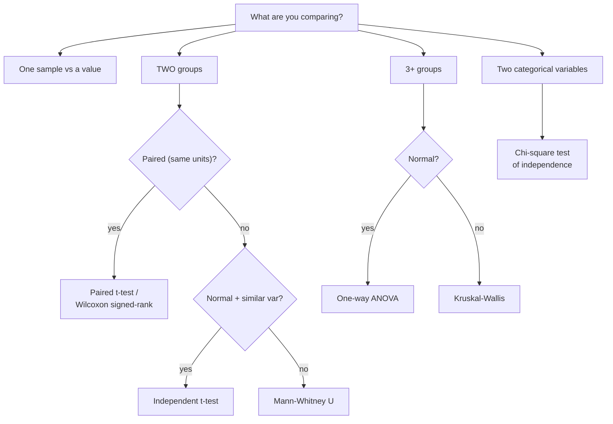

# 🧪 Statistical Tests

> [!important] Why this matters for YOU
> Your SIRP runs **91 paired statistical comparisons with Holm correction, effect sizes, and confidence intervals**. An examiner who spots that will dig — and rightly so, because "why this test?" is where most analytics candidates are shallow. This note is the chooser's guide.

---

## 1 · The Hypothesis Testing Skeleton

Every test is the same five steps:

```text
1. H₀ (no effect) vs H₁ (effect)          ← state BEFORE seeing results
2. Choose test + significance level α      ← usually 0.05
3. Compute the test statistic
4. p-value = P(data this extreme | H₀ true)
5. Reject H₀ if p < α  →  then report EFFECT SIZE + CI
```

> [!warning] The two sentences that prove you understand p-values
> 1. **A p-value is NOT the probability the null is true.** It's the probability of data at least this extreme *assuming* H₀ is true.
> 2. **p > 0.05 does not prove no effect** — it means insufficient evidence. "Absence of evidence is not evidence of absence."

**Type I error (α):** rejecting a true H₀ — false alarm. **Type II error (β):** failing to reject a false H₀ — miss.
**Power = 1 − β** — the ability to detect a real effect. Power rises with sample size and effect size. Trade-off: lowering α (stricter) costs power.

---

## 2 · The Chooser's Map



> [!tip] Your SIRP's answer
> Comparing **the same series' errors under two models** → *paired* by construction → **paired t-test** (or Wilcoxon if errors are skewed/non-normal — which forecast errors often are). That single sentence is your "why this test" answer.

---

## 3 · The Tests, One by One

### t-tests (means, small samples)

```python
from scipy import stats

# independent two-sample
stats.ttest_ind(model_a_errors, model_b_errors, equal_var=False)   # Welch — default-safe

# paired: same series, two models' errors
stats.ttest_rel(lstm_errors, arima_errors)

# one-sample: is mean error different from 0?
stats.ttest_1samp(errors, 0)
```

- Welch (`equal_var=False`) is the safe default — unequal variances handled, equal-variance case loses almost nothing
- Assumptions: roughly normal errors (CLT helps for large n), independent observations (⚠️ *see the SIRP caveat below*)

### ANOVA (3+ group means)

- Answers "do ANY means differ?" with one F-test — protects against α inflation from repeated t-tests
- **Significant F ≠ done.** Follow with *post-hoc* pairwise tests (Tukey HSD) to find *which* pairs differ
- Assumption: similar variances (else Welch ANOVA / Kruskal-Wallis)

### Chi-square (categories)

```python
chi2, p, dof, expected = stats.chi2_contingency(pd.crosstab(df.stn_class, df.shift))
```

- Tests association between two categorical variables against expected frequencies
- **Rule of thumb:** all expected cells ≥ 5, else Fisher's exact test
- Non-directional: it says "associated," never "which direction"

### Non-parametric (distribution-free)

| Test | Parametric twin | Use when |
|---|---|---|
| Mann-Whitney U | independent t | skewed/ordinal, unequal shapes |
| Wilcoxon signed-rank | paired t | paired, non-normal differences |
| Kruskal-Wallis | one-way ANOVA | 3+ groups, non-normal |
| Spearman ρ | Pearson r | monotonic but non-linear, outliers |

**Trade-off to state:** non-parametric tests sacrifice some power when parametric assumptions actually hold, but are robust when they don't. *Forecast errors (heavy-tailed, skewed) are the textbook case for Wilcoxon over paired t.*

### Correlation tests

- **Pearson r** — linear association, interval data, sensitive to outliers (your SIP: station skill vs defects, r = 0.41)
- **Spearman ρ** — rank-based, monotonic, robust
- Test H₀: ρ = 0; report r with **p AND n** — with n = 96, tiny correlations reach significance; magnitude is the story

---

## 4 · Beyond the p-value — the maturity markers

### Effect size — "is it BIG?"

| Measure | For | Benchmarks |
|---|---|---|
| Cohen's d | mean difference (pooled SD units) | 0.2 small · 0.5 med · 0.8 large |
| r | correlation | 0.1 / 0.3 / 0.5 |
| η² (eta-squared) | ANOVA variance explained | 0.01 / 0.06 / 0.14 |

> [!tip] The sentence to say in every viva
> *"With large n, p-values become almost automatic — so I report **effect size and confidence intervals** to answer whether the difference matters, not just whether it exists."*

### Practical vs statistical significance

Statistically significant ≠ business-relevant. A model 0.001 MASE better at p < 0.001 may still be worse on inventory cost — *which is literally the central finding of your SIRP*. One line, two worlds connected.

### Multiple comparisons — why 91 tests need Holm

Run 91 independent tests at α = 0.05 → expected false positives ≈ 91 × 0.05 ≈ **4–5**. Without correction, "significant" is what noise looks like.

| Correction | How | Nature |
|---|---|---|
| Bonferroni | α ÷ number of tests (0.05/91 ≈ 0.00055) | simple, conservative (loses power) |
| **Holm (step-down)** | sort p-values ascending; compare each to α/(m−i+1); stop at first failure | less conservative — *your SIRP's choice* |

Full deep-dive → [[Model_Comparison_DMHolm]].

### Bootstrap — inference without formulas

```python
boot = [np.mean(rng.choice(errors, len(errors), replace=True)) for _ in range(10_000)]
ci   = np.percentile(boot, [2.5, 97.5])
```

Resample → recompute → percentile interval. No normality assumption. Good answer to "what if assumptions fail?"

---

## 5 · Assumptions Checklist — what to verify before any test

1. **Independence** — the big one. (Honesty point from your SIRP: overlapping forecast windows make errors dependent → tests are treated as *heuristic ranking evidence* alongside Holm correction, not as strict inference. Admitting this is a strength.)
2. **Normality** (for t/ANOVA) — Shapiro-Wilk / Q-Q plot; CLT covers large n
3. **Equal variance** (for pooled tests) — Levene's test; else Welch
4. **Scale of measurement** — ordinal data → rank tests

---

## ⚡ Rapid-Fire Q&A

> **Paired vs independent t-test?**
> Paired when the same unit is measured twice (same series, two models) — it controls for unit-level variation and has far more power.

> **Why Welch over Student's t?**
> Doesn't assume equal variances; negligible cost when variances are equal.

> **Why ANOVA instead of three t-tests?**
> Three t-tests at α=0.05 → ~14% familywise Type-I error. ANOVA is one gate; post-hocs come after.

> **Chi-square assumptions?**
> Independent observations, expected count ≥ 5 per cell (else Fisher's exact).

> **Parametric vs non-parametric — the trade?**
> Parametric: more power under assumptions; non-parametric: robust without them. Forecast errors usually push you non-parametric.

> **What is statistical power?**
> P(reject H₀ | H₀ false) = 1 − β. Driven by n, effect size, α. Underpowered studies miss real effects.

> **Your SIRP used 91 comparisons — why Holm and not Bonferroni?**
> Same familywise-α control, strictly more power: step-down threshold instead of one brutal α/91 cut.

---

## 🔗 Where This Leads

| Next | Link |
|---|---|
| DM test + Holm mechanics in your SIRP | [[Model_Comparison_DMHolm]] |
| p-values & CIs fundamentals | [[Hypothesis_Testing]] |
| Correlation vs causation | [[Correlation]] · [[Causality]] |
| Where the tests get applied | [[../Forecasting/Forecast_Metrics_MASE]] |
